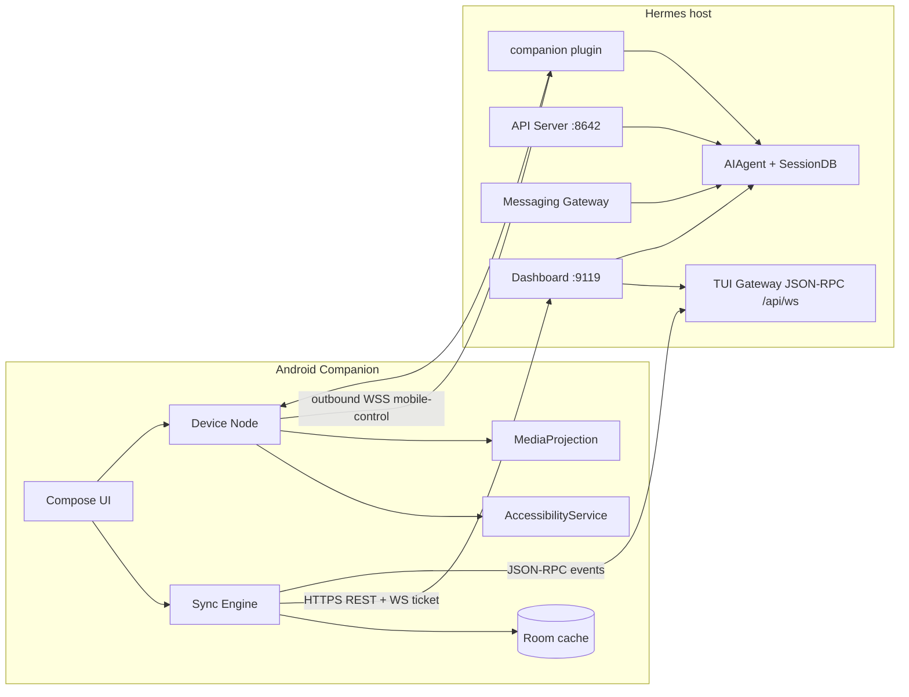
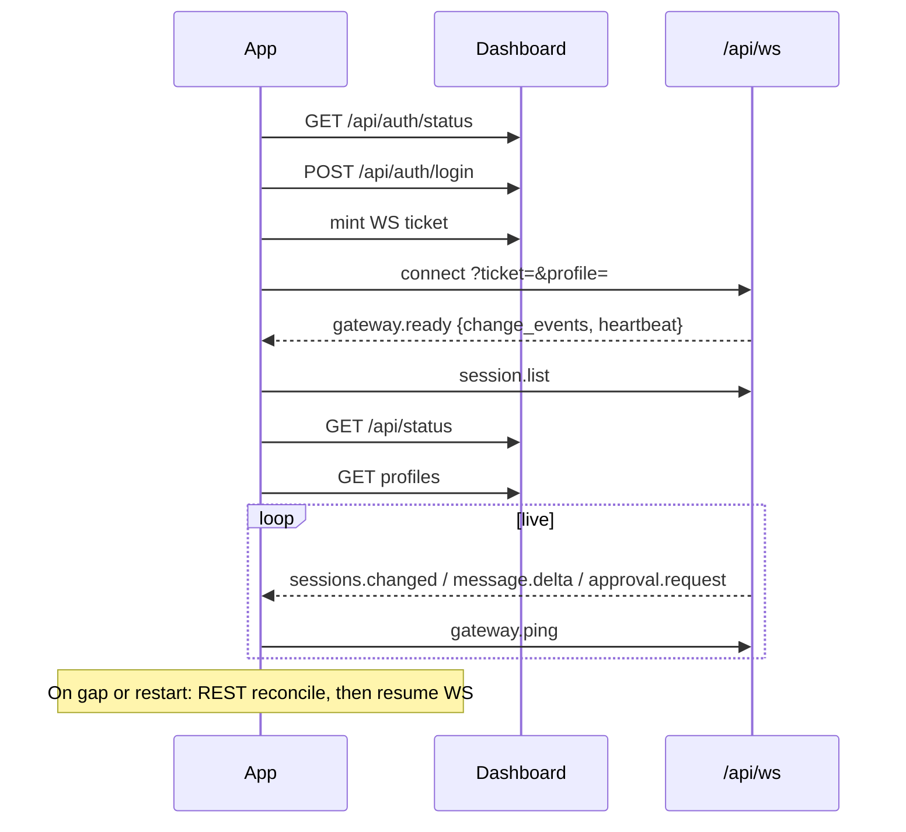
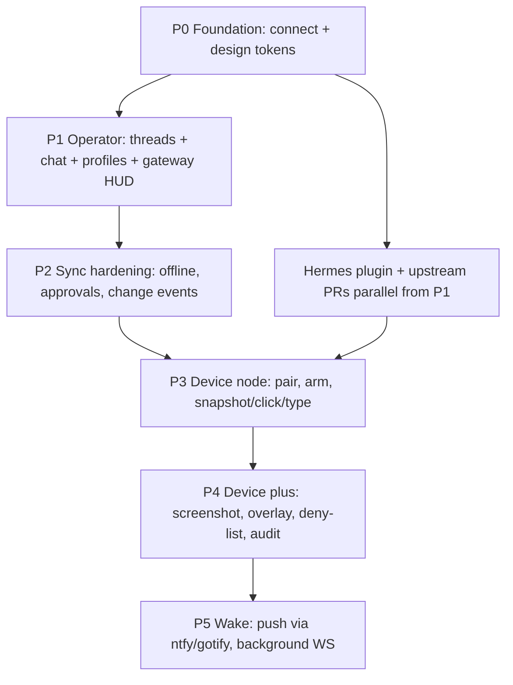

# Hermes Companion — Greenfield Plan

A native Android companion for a self-hosted [Hermes Agent](https://hermes-agent.nousresearch.com). Built from scratch in this empty workspace. Does not reuse any existing companion, bridge, or mobile client.

**Status:** Draft for approval  
**Date:** 2026-09-03  
**Workspace:** `/Users/nyx/Projects/hermes-companion-app` (empty)

---

## 0. Decisions baked into this plan

These are product calls, not leftovers. Challenge them before implementation.

| Decision | Choice | Why |
|---|---|---|
| Platform | **Android first.** iOS is a later chat-only client. | Accessibility + screen control are first-class on Android (`AccessibilityService`, `MediaProjection`). iOS cannot grant an agent equivalent hands without MDM/jailbreak. |
| Runtime | Phone is a **thin client + device node**. The agent stays on the host. | Hermes already owns sessions, memory, skills, tools, cron. Duplicating the agent on-device splits identity and credentials. |
| Stack | **Kotlin, Jetpack Compose, Coroutines, Room, OkHttp.** | Device control, foreground services, and accessibility cannot be done well in Flutter/RN/WebView. |
| Protocol | **Dashboard JSON-RPC (`/api/ws`) for operator UI.** REST for lists and admin. New **mobile-control** lane for device hands. | Official guidance: custom hosts that need sessions, slash commands, approvals, and streaming should speak TUI-gateway JSON-RPC. OpenAI `/v1` is too thin for a companion. |
| Hermes changes | **Plugin-first for device tools.** Small **upstream PRs** only where a plugin cannot hook. | Faster to ship; survives Hermes updates; still leaves a path to first-party protocol later. |
| Distribution | **Sideload / F-Droid first.** No Play Store for the control-enabled build. | Play policy rejects AccessibilityServices used for automation. |
| Design | **Minimalist cyberpunk.** One accent, hairline chrome, dense but quiet. | Matches the request. Avoids neon-city cliché. |
| Existing `hermes-companion` | **Ignored.** | Explicit: start from zero. |

---

## 1. Vision

### One-line

Hermes in your pocket: talk to the same agent, see the same threads and profiles, and — when you arm it — let that agent use the phone as a pair of hands.

### What this is

Two products in one app, one trust domain:

1. **Operator surface** — a native window onto the host Hermes. Threads (sessions), profiles, gateway health, live chat, approvals, cron. Source of truth is always Hermes. The phone caches for offline and speed; it never forks a second transcript.
2. **Device node** — an opt-in, kill-switchable control plane. Hermes can read the accessibility tree, screenshot, tap, type, swipe, open apps, and (later) watch notifications. The phone connects *out* to the host so it works behind NAT.

### What this is not

- Not an on-device LLM runtime.
- Not a Telegram/Discord replacement (those stay as messaging gateways).
- Not a full remote-desktop stream as v1 (screenshots + a11y tree first; live MediaProjection is phase 3).
- Not a Play Store “accessibility helper.”
- Not a clone of the web dashboard shoved into a WebView.

### Who it is for

A single operator who already runs Hermes on a Mac/Linux box or homelab, reaches it over Tailscale/LAN, and wants the phone to be both a console and a controllable endpoint.

### Jobs to be done

| Job | Success looks like |
|---|---|
| Continue a thread away from the desk | Open app → same session list as Desktop/TUI → resume mid-tool-call with live deltas |
| Switch agent identity | Profile pill switches `HERMES_HOME` context; threads, model, soul, skills all change |
| Know if Hermes is alive | Gateway glyph is honest: running, platforms connected, last heartbeat |
| Unstick the agent | Approve / clarify / interrupt from a notification without opening the full chat |
| Give Hermes hands on the phone | “Order the usual on the food app” → agent snapshots, taps, types, reports done |
| Take hands away instantly | Notification kill switch or volume-down chord disarms control in < 300 ms |

### North-star scenes (vision board)

Treat these as the vision board. Produce actual boards (mood, type, screens, motion) in Design Phase 0 before any UI code.

1. **Boot / pair** — void black, one QR + 6-char code, phosphor cyan hairline. No illustration, no mascot.
2. **Thread rail** — timestamps in mono, unread as a 2px cyan tick, profile as a 3-letter glyph (`COD`, `PER`, `OPS`). Empty state: `NO SESSIONS // waiting`.
3. **Live turn** — user line in dim white; assistant in slightly brighter white; tool cards as collapsed mono rows (`terminal · ls · 1.2s`); streaming cursor is a 1ch block, not a bounce spinner.
4. **Approval interrupt** — full-width strip, not a modal: `APPROVAL · rm -rf build/` with `ALLOW` / `DENY`. Hardware back = deny.
5. **Profile switcher** — horizontal fleet of squares, one accent border on the active profile, dimmed others. Switching crossfades the thread list; no page jump.
6. **Gateway HUD** — 4 glyphs: `GW`, `TG`, `DC`, `API`. On = cyan. Degraded = amber. Off = 20% white.
7. **Device armed** — persistent notification `HERMES HAS HANDS` + a 1px cyan frame around the entire screen. Overlay label top-right, always.
8. **Device live** — optional low-FPS screenshot filmstrip in a drawer, not the main chat. Chat stays text. Control is a mode, not a video call.

### Product principles

1. **Hermes is source of truth.** Local DB is a cache. Conflict rule: server wins on transcript; local wins only on unsent drafts.
2. **One profile, one world.** Never mix sessions across profiles. The active profile is always visible.
3. **Hands are off by default.** Device control is a separate armed state with a visible tell and a one-gesture disarm.
4. **Fail closed.** Unknown capability, expired ticket, missing accessibility permission → refuse the action, do not silently degrade into a different backend.
5. **Quiet chrome.** If a pixel is not status, content, or a primary action, it does not exist.

---

## 2. Application architecture

### 2.1 System context



The phone **never** requires inbound ports. Operator traffic uses the dashboard (or a tunneled equivalent). Device-node traffic is an outbound WebSocket the plugin accepts.

### 2.2 Two lanes, one pairing

| Lane | Purpose | Transport | Auth |
|---|---|---|---|
| **Operator** | Chat, threads, profiles, gateway, approvals | HTTPS + `/api/ws` JSON-RPC | Dashboard session → single-use WS ticket (gated) or token (loopback) |
| **Device** | Snapshot, gesture, type, notifications | Outbound WSS `mobile-control` | Pairing code → device credential → per-command tickets |

Pair once. Both lanes share the same device identity. Revoking the device kills both.

### 2.3 Why these Hermes surfaces (and not others)

Hermes ships three programmatic protocols. Mapping:

| Protocol | Use in this app |
|---|---|
| **TUI gateway JSON-RPC** (`tui_gateway/server.py`, `/api/ws`) | Primary operator protocol. `prompt.submit`, `session.*`, `approval.respond`, `clarify.respond`, `command.dispatch`, `gateway.ping`. `gateway.ready` already advertises `change_events` and `heartbeat`. |
| **Dashboard REST** (`hermes dashboard`) | Profile list/create/switch, gateway start/stop, cron, skills, pairing of messaging users, `/api/status`. Management routes take `?profile=`. |
| **API server** (`/v1`, `/api/sessions`) | Fallback for session CRUD and capabilities probe (`GET /v1/capabilities`). Not the main chat path — it lacks slash-command and clarify fidelity. |
| **ACP** | Unused. IDE protocol. |
| **Browser-control** | **Pattern to copy** for the device lane, not a surface to call. |

### 2.4 Sync model (threads, profiles, gateway)

Hermes already broadcasts `sessions.changed` / `cron.changed` (and related) when `change_events: true` on `gateway.ready`. The companion treats those as the live bus and REST as the catch-up.



**Invariants**

- Active profile is sent on every WS connect as `?profile=<name>` (Hermes already reads this; omitting it is a data-leak class bug).
- Session IDs are Hermes IDs. The app does not mint parallel IDs.
- A thread belongs to exactly one `(gateway_instance, profile)`.
- Gateway status is polled from `/api/status` at 15s as a backstop, plus any gateway change events.
- Local Room tables: `gateways`, `profiles`, `sessions`, `messages`, `pending_approvals`, `outbox`. Outbox holds unsent prompts; flushed on reconnect. Never rewrite server history from the outbox.

**Conflict / freshness**

- Transcript: server wins. If a rewind (`confirm_truncate`) happens on another client, drop local rows after the survivor set.
- Drafts: local-only, never uploaded until send.
- Profile list: server wins; deleted profiles disappear on next reconcile.
- Device armed state: phone is source of truth. Hermes cannot re-arm a disarmed device.

### 2.5 Device node (accessibility + screen control)

Modeled on Hermes **browser-extension control**, which already has the right shape: register → single-use ticket → WebSocket with subprotocol → command/result frames → fail closed → reconnect is identity-stable.

**Phone side**

- `CompanionAccessibilityService` — UI tree, `dispatchGesture`, `performGlobalAction`, `takeScreenshot` (API 30+).
- Optional `MediaProjection` service — higher-fidelity frames when the operator enables “screen share to agent.” Not required for v1 tools.
- `NotificationListenerService` — later phase, separate permission.
- Foreground service with a non-dismissable (until disarm) notification while armed.
- Overlay: 1px inset + `LIVE` chip. Must remain visible on top of target apps (TYPE_APPLICATION_OVERLAY, user-granted).

**Command set v1** (keep it small; browser-control’s allowlist is the lesson)

```
device.noop
device.snapshot          # a11y tree with @eN refs, like browser snapshots
device.screenshot        # PNG, downscaled, stripped EXIF
device.click             # by ref or x,y in screenshot space
device.type              # focused field; never log the text back in full
device.swipe
device.scroll
device.press             # back/home/recents
device.open_app          # package name from a prior device.apps list
device.apps
device.wait              # bounded
```

Explicitly **out of v1**: SMS send, phone call, contacts dump, notification reply, screenshot of banking packages, raw keyinjection, install/uninstall, ADB.

**Deny list (hard)**

Default-block packages: password managers, authenticators, banking, Play billing, `com.android.systemui` (except snapshot-with-flag), settings pages that grant permissions. The agent gets `denied:protected_package` rather than a fake snapshot.

**Arming state machine**

```
DISARMED → (user toggle + a11y enabled) → ARMED
ARMED → (idle 5 min / kill switch / permission revoke / WS drop) → DISARMED
ARMED → (Hermes command) → EXECUTING → ARMED
```

Hermes tools no-op with a clear error when the device is `DISARMED`. The model must not be told the phone is available if it is not.

### 2.6 App module map (greenfield)

```
hermes-companion-app/
  app/                      # Compose UI, Application, DI
  core-model/               # Session, Profile, Gateway, DeviceCommand (pure Kotlin)
  core-design/              # Theme, tokens, components — no feature imports
  data-local/               # Room, DataStore, encrypted prefs
  data-remote/              # REST + JSON-RPC client
  domain/                   # Use cases: SyncSessions, SubmitPrompt, ArmDevice
  feature-connect/          # Pairing, login, gateway book
  feature-threads/          # Session list + search
  feature-chat/             # Transcript, composer, tool cards, approvals
  feature-profiles/         # Switcher, profile inspector (read-mostly)
  feature-gateway/          # Status HUD, platform list, start/stop
  feature-device/           # Arming UI, overlay, a11y service, command executor
  hermes-plugin/            # Python plugin shipped alongside the app
  docs/                     # This plan, protocol, design tokens
```

No shared UI toolkit from other projects. Design system lives in `core-design`.

### 2.7 Auth and network assumptions

Typical operator path:

1. Hermes host on LAN or Tailscale.
2. `hermes dashboard --host 0.0.0.0` with **basic auth** (or Nous OAuth if internet-facing).
3. App stores host URL + username in encrypted prefs; password in Android Keystore-backed EncryptedSharedPreferences.
4. Each WS connect mints a fresh ticket (gated tickets are single-use, 30s).
5. API server (`:8642`) is optional. If present, used for `/v1/capabilities` and jobs. Default bind is loopback — the companion should **not** require exposing `:8642`. Prefer dashboard.

Loopback-only dashboards are reachable via Tailscale IP or SSH tunnel. The app should explain this instead of asking the user to `--host 0.0.0.0` without auth.

---

## 3. Design plan (minimalist cyberpunk)

Design happens **before** feature UI. Tokens and 8 core screens are the contract.

### 3.1 Aesthetic thesis

**Void, signal, type.** Black field. One living color for “Hermes is here.” Hairline geometry. Monospace for machine state, humanist sans for human words. No grids of magenta, no rain, no kanji watermarks, no chrome bevels, no glassmorphism.

If a mock looks like a cyberpunk *poster*, it is wrong. If it looks like a calibrated instrument, it is right.

### 3.2 Tokens

```
Color
  void            #07080A
  void-elevated   #0E1014
  line            #1A1E26
  line-strong     #2A3140
  text            #E6EDF3
  text-dim        #8B96A8
  text-mute       #5C6570
  signal          #00E5C3      // primary accent
  signal-dim      #0A3D36
  warn            #F5A524
  danger          #FF4D6A
  ok              #00E5C3      // reuse signal; do not invent a second green

Type
  display         "IBM Plex Sans"  22/28  tracking +0.5
  body            "IBM Plex Sans"  15/22
  mono            "IBM Plex Mono"  12/18  for IDs, tools, timestamps, HUD

Space
  4 / 8 / 12 / 16 / 24 / 40
  hairline        1px
  radius          0 for chrome, 2px for chips max

Motion
  snap            120ms  cubic-bezier(0.2, 0.0, 0.0, 1)
  crossfade       180ms
  no bounce, no spring, no staggered cascade > 3 items

Elevation
  none. Separation is line and dim, not shadow.
```

Dark-only v1. A “phosphor off” (amber signal `#FFB000` on void) can be a later skin; do not ship two themes in v1.

### 3.3 Type and voice

- UI copy is lowercase except machine tokens: `GATEWAY`, `ARMED`, `DENY`.
- Errors are one line plus a mono code: `ws 4401 · ticket expired`.
- No emoji in chrome. Glyphs: `● ○ ◐ ◇ ▸`.
- Numbers are tabular lining in mono.

### 3.4 Information architecture

```
Connect
  └─ Gateway book (saved hosts)
Main (bottom nav, 4)
  ├─ Threads
  │    └─ Chat (push)
  │         ├─ tool drawer
  │         └─ approval strip
  ├─ Profiles          // or a header pill instead of a tab if ≤3 profiles
  ├─ Gateway
  └─ Device            // arming, permissions, deny list
Sheets
  New thread
  Profile inspect (read-only v1)
  Settings (theme signal color, tailscale hint, danger zone)
```

Header is always: `[profile glyph]  [thread title]  [HUD dots]`.

### 3.5 Screen contract (8 screens to spec before code)

1. **Connect** — host URL, auth fields that appear after probing `/api/status` (`auth_required`, `auth_providers`).
2. **Threads** — grouped by recency; live badge; source icon (cli / telegram / companion).
3. **Chat** — transcript + composer + approval strip + interrupt.
4. **New thread** — title optional; created on Hermes, not locally.
5. **Profiles** — list with model, gateway state, session count.
6. **Gateway** — process state, platforms, last error, start/stop (destructive, confirm).
7. **Device** — permission checklist, arm toggle, last command, deny-list.
8. **Armed overlay** — system overlay + notification, not an activity.

Each screen gets: empty, loading, live, error, offline. No “happy path only” mocks.

### 3.6 Design-phase work items

| ID | Item | Output |
|---|---|---|
| D0 | Vision board (mood, type sheet, 6 north-star frames) | `docs/design/vision-board.md` + PNG frames |
| D1 | Token spec in code-ready YAML | `core-design` tokens |
| D2 | Component set: Button, Chip, Glyph, HUD, Strip, ToolRow, Composer, ProfileSquare | Compose preview catalog |
| D3 | 8-screen specs at 360×800 and 412×915 | annotated frames |
| D4 | Motion spec (armed pulse, stream cursor, profile crossfade) | 4 short references |
| D5 | Accessibility of the *app itself* (not the service): contrast, touch 48dp, TalkBack labels | checklist |

---

## 4. Hermes-side requirements

Hermes today can drive a companion **operator** surface with existing APIs. It **cannot** drive a phone as a device without new code. Split into: use as-is, plugin, upstream.

### 4.1 Use as-is (no Hermes change)

- Dashboard auth (`/api/auth/status`, login, WS tickets).
- `/api/ws` JSON-RPC: sessions, prompts, approvals, clarify, sudo, secret, steer, interrupt, `gateway.ping`.
- `gateway.ready.change_events` for `sessions.changed` (and cron).
- `?profile=` on WS and management REST.
- `/api/status` for gateway HUD.
- Profile CRUD and switcher endpoints on the dashboard.
- `/api/sessions*` for catch-up pagination and search.
- Messaging pairing UI is unrelated; do not confuse it with device pairing.

### 4.2 Companion plugin (ship in this repo as `hermes-plugin/`)

Install: `hermes plugins install ./hermes-plugin` (or a git URL later).

Responsibilities:

1. **Device pairing store** — short code, TTL, device public key, profile binding, armed-state mirror.
2. **Outbound-connect broker** — phone dials `wss://host/companion/device` (plugin HTTP/WS route via dashboard plugin API). Same ticket pattern as browser-control: register → 30s ticket → subprotocol `hermes-mobile-control-v1`.
3. **Toolset `mobile`** (off by default):

   | Tool | Maps to device frame |
   |---|---|
   | `mobile_status` | ping + armed + foreground app |
   | `mobile_snapshot` | `device.snapshot` |
   | `mobile_screenshot` | `device.screenshot` |
   | `mobile_click` | `device.click` |
   | `mobile_type` | `device.type` |
   | `mobile_swipe` / `mobile_scroll` | gestures |
   | `mobile_press` | back/home/recents |
   | `mobile_open_app` / `mobile_apps` | launcher |

4. **Fail closed** if no device, disarmed, capability missing, or protected package.
5. **Audit log** in the profile home: `companion-audit.jsonl` (command, app, result, not keystroke contents).
6. **SOUL/system hint** injected only while a device is armed: “You have a paired Android device. Use mobile_* tools. Do not attempt SMS, banking, or 2FA.”

Plugin config (profile `config.yaml`):

```yaml
companion:
  enabled: true
  idle_disarm_sec: 300
  screenshot_max_px: 1080
  deny_packages:
    - com.google.android.apps.authenticator2
    - com.android.vending
```

### 4.3 Upstream PRs to Hermes (only where a plugin is insufficient)

Priority order. Each is independently mergeable.

| PR | Why a plugin is not enough | Shape |
|---|---|---|
| **H1. Advertise companion in `/v1/capabilities` and `gateway.ready`** | Clients need a stable discovery flag | `features.companion_device: true`, protocol version, allowlist of actions |
| **H2. Native-client WS grant / audience `hermes.mobile`** | Today a dashboard ticket is full-authority (shell, env, config). A phone should not get `cli.exec` / env writes. Aligns with [issue #62857](https://github.com/NousResearch/hermes-agent/issues/62857) | Ticket audience + fail-closed method allowlist: `conversation.*`, `approval.*`, `clarify.*`, `session.list/history/create/interrupt`. Deny `cli.exec`, `config.set`, `/api/env` |
| **H3. Device-control broker in core *or* official plugin hook for authenticated controller WS** | Browser-control exists for extensions; phones need the same principal-bound broker | Copy `browser.controller.*` frames to `mobile.controller.*`; bind to `(principal, profile, device_id)` |
| **H4. `sessions.changed` payload completeness** | Companion needs `profile`, `id`, `updated_at`, op (`upsert`/`delete`) to avoid full refetch | Document and guarantee fields |
| **H5. Push hook** | Phone must wake for approval when backgrounded. Hermes has webhooks; needs a tiny “notify companion” event (approval.request, clarify, run.completed, error) with **no transcript body** | Gateway hook or plugin that POSTs `{type, session_id, profile}` to an operator-chosen endpoint (ntfy/gotify/self-hosted FCM relay). Do not put APNs keys in Hermes. |
| **H6. Profile-aware session list over JSON-RPC** | Confirm `session.list` honors the WS `profile` and cannot leak another profile’s transcripts | Test + fix if needed |

**Do not upstream:** the Android app, the accessibility implementation, FCM credentials, any Play-store listing.

### 4.4 Gaps to treat as constraints, not surprises

- Dashboard Chat tab is a **PTY TUI**, not a native widget protocol. The companion must speak JSON-RPC, not scrape ANSI.
- API server default bind is `127.0.0.1`. Do not build the app around exposing it.
- Gated WS rejects `?token=` and requires `?ticket=`. Implement both modes by probing `/api/status`.
- `change_events` exist but a process restart must reset the client’s cursor (`gateway.ready` carries instance identity for this).
- Rewind requires `confirm_truncate` + durable `row_id`. The app must not send leftover truncate params.
- Profiles are not sandboxes. Device control inherits the *profile’s* tool policy, not a phone sandbox. Deny-list is the phone’s job.
- Browser-control is **not** a mobile API. Do not try to register the phone as a browser controller.

### 4.5 Security requirements (both sides)

- Pairing code: 6–8 chars, 10 min TTL, one successful consume.
- Device credential: rotate on re-pair; store in Android Keystore.
- Operator password: never in logs, never in Room.
- TLS required off-loopback. Cleartext only for `10/8`, `172.16/12`, `192.168/16`, `100.64/10` (Tailscale) with an in-app warning.
- Command timeout: 15s default; screenshot 10s.
- Rate limit device commands on the plugin (e.g. 10/sec).
- Overlay + notification while armed — non-optional.
- Audit log retention 30 days on host.
- Companion scopes must not be able to read `.env` or set config.

---

## 5. Implementation plan

### 5.1 Phases



P3 cannot start until the plugin’s pairing + command broker works against a mock phone. App and plugin are developed in the same repo, different modules.

### 5.2 Work items (implementation DAG)

IDs are the unit of work. Each is a PR-sized slice.

#### P0 — Foundation

| ID | Work item | Notes |
|---|---|---|
| A0.1 | Repo skeleton: Gradle version catalog, ktlint, modules listed in §2.6 | Empty app that launches to a void screen using tokens |
| A0.2 | `core-design` tokens + Typography + ColorScheme + Hairline + Glyph | Compose preview |
| A0.3 | Encrypted store for host URL + credentials | Keystore |
| A0.4 | Status probe client: `GET /api/status` → auth mode detection | Drives Connect form |
| A0.5 | Login + ticket mint + `/api/ws` hello (`gateway.ready`) | Loopback token **and** gated ticket |
| A0.6 | Gateway book (multi-host, one active) | Tailscale URLs first-class |

#### P1 — Operator MVP

| ID | Work item | Hermes surface |
|---|---|---|
| A1.1 | Profile list + sticky switcher, `?profile=` on every call | Dashboard profiles + WS query |
| A1.2 | Session list (threads) from JSON-RPC `session.list` + REST catch-up | `/api/ws`, `/api/sessions` |
| A1.3 | Chat: history, `prompt.submit`, `message.delta/complete` | JSON-RPC |
| A1.4 | Composer: send, interrupt, image attach later stub | `session.interrupt` |
| A1.5 | Tool rows from `tool.start/progress/complete` | Events |
| A1.6 | Gateway HUD from `/api/status` | REST |
| A1.7 | New thread = `session.create` then navigate | JSON-RPC |
| A1.8 | Room cache for sessions/messages (read-through) | local |

#### P2 — Sync and control plane

| ID | Work item |
|---|---|
| A2.1 | Subscribe to `sessions.changed`; reconcile without full reload |
| A2.2 | `gateway.ping` heartbeat + exponential reconnect; reset on new instance id |
| A2.3 | Approvals / clarify / sudo / secret strips + `*.respond` |
| A2.4 | Outbox for offline sends; 409/busy handling |
| A2.5 | Rewind/edit with `truncate_before_row_id` + `confirm_truncate` |
| A2.6 | Profile isolation tests: never render profile B’s threads on A |
| A2.7 | Gateway start/stop with confirm (optional; HUD can be read-only in MVP) |

#### P3 — Device node (depends on plugin P3)

| ID | Work item |
|---|---|
| A3.1 | Pairing UI: show code, wait for host confirm, store device cred |
| A3.2 | Outbound WSS to plugin; identity-stable reconnect |
| A3.3 | AccessibilityService skeleton + permission onboarding |
| A3.4 | `device.snapshot` → compact a11y tree with `@eN` refs |
| A3.5 | `device.click` / `device.type` / `device.press` |
| A3.6 | Arm/disarm + persistent notification kill switch |
| A3.7 | Protected-package denylist |

#### P4 — Device plus

| ID | Work item |
|---|---|
| A4.1 | `device.screenshot` (a11y takeScreenshot; MediaProjection later) |
| A4.2 | Overlay frame + LIVE chip |
| A4.3 | Idle auto-disarm, command rate limit, audit mirror in-app |
| A4.4 | `device.swipe` / `scroll` / `open_app` / `apps` |
| A4.5 | Foreground-app + permission-state in `mobile_status` |

#### P5 — Wake and polish

| ID | Work item |
|---|---|
| A5.1 | ntfy/gotify client for `{type, session_id, profile}` pings |
| A5.2 | Deep link into the right thread + approval strip |
| A5.3 | Background WS with a user-visible “stay connected” toggle (foreground service) |
| A5.4 | Design QA against D3 frames; 360 and 412 widths |
| A5.5 | Crash-safe disarm if the service is killed |

#### Hermes plugin work items (parallel)

| ID | Work item |
|---|---|
| P3.0 | Plugin skeleton, config schema, install docs |
| P3.1 | Pairing API + CLI: `hermes companion pair` / `list` / `revoke` |
| P3.2 | WS broker + ticket + subprotocol |
| P3.3 | Toolset `mobile` wrapping command frames |
| P3.4 | Fail-closed + deny-list mirror + audit log |
| P3.5 | Mock device for tests (no phone required) |
| P3.6 | System-prompt injection only when ARMED |
| H1–H6 | Upstream PRs as in §4.3 — start H2 and H4 early; H3 if plugin WS hook is ugly |

### 5.3 Suggested PR order (app repo)

1. **chore: repo skeleton and design tokens**
2. **feat: connect, auth, websocket hello**
3. **feat: profiles and thread list**
4. **feat: chat streaming and composer**
5. **feat: approvals and change-event sync**
6. **feat(plugin): pairing and mobile toolset**
7. **feat: device node snapshot/click/type**
8. **feat: arming UX, overlay, denylist**
9. **feat: push wake and background connection**
10. **docs: protocol + install**

Hermes upstream PRs are a separate stack against `NousResearch/hermes-agent`, not this repo.

### 5.4 Testing strategy

- **Unit:** JSON-RPC codec, snapshot serializer, denylist, state machines (arm, outbox, reconnect).
- **Plugin:** mock device, pairing expiry, fail-closed when disarmed, no cross-profile command routing.
- **Android instrumented:** AccessibilityService on an emulator with a fixture app (not the system UI).
- **Manual lab:** real Hermes on Tailscale, two profiles, rewind from Desktop while the phone is open (must not diverge).
- **Security review gate** before any device-command merge: denylist, overlay, notification, no secret logging.

### 5.5 Definition of done per milestone

**M1 Operator (P0–P2):** From a cold install, pair to a gated dashboard, switch profile, resume a Desktop thread, send a turn, approve a tool, survive a WS drop without duplicate sends.

**M2 Hands (P3–P4):** Arm device, from a Telegram or companion chat tell Hermes to open a fixture app and tap a labeled button, see overlay + notification, disarm from the notification, confirm banking package is refused.

**M3 Wake (P5):** Kill the activity, trigger an approval on the host, phone notifies, tap opens the strip, respond, agent continues.

---

## 6. Risks

| Risk | Severity | Mitigation |
|---|---|---|
| Play policy / OEM killing AccessibilityService | High | Sideload; persistent notification; document OEM battery exceptions |
| Full-authority dashboard ticket on a phone | High | H2 scoped grants; until then, treat the phone as a highly privileged device and never ship “companion as a guest client” |
| Agent acts on a 2FA prompt | High | Package denylist + optional “pause on input-type password” |
| Transcript split-brain across clients | Med | Server-wins; durable row ids; no local editing of history without rewind RPC |
| Plugin breaks on Hermes update | Med | Depend on documented dashboard plugin WS helpers; pin tested Hermes versions in README |
| Live screen share as a privacy incident | Med | Screenshots on demand only in M2; MediaProjection is explicit, later, and off by default |
| Users expose `:9119` to the internet with basic auth | Med | In-app copy: Tailscale or OAuth; refuse cleartext WAN |

---

## 7. Out of scope (v1)

- iOS app
- On-device model / local Hermes runtime
- SMS, calls, contacts, notification replies
- Full remote-desktop FPS stream
- Multi-user / family sharing
- Play Store listing for the node build
- Editing `config.yaml` / `.env` from the phone
- Kanban, memory editor, skill hub (read-only “inspector” can wait)
- Voice wake word

---

## 8. Open questions (non-blocking defaults)

Defaults are in **bold**. Change them at approval time if needed.

1. Device control in the same APK as chat, vs a separate `node` flavor? → **Same APK, control off until armed.** Sideload either way.
2. Push via **ntfy/gotify (self-hosted)** vs operating an FCM relay? → **ntfy/gotify first.**
3. May the companion **start/stop the gateway**, or HUD-only? → **HUD-only in M1; start/stop in a later settings confirm.**
4. Target min SDK? → **31 (Android 12)** so `takeScreenshot` and modern a11y gestures are real.
5. Plugin-only device broker vs waiting on upstream H3? → **Plugin-only for M2; upstream in parallel.**

---

## 9. First concrete artifacts after approval

Implementation does not start with a screen. It starts with:

1. Gradle module skeleton + `core-design` tokens (A0.1–A0.2)
2. `docs/protocol/operator.md` — JSON-RPC methods we actually call
3. `docs/protocol/mobile-control.md` — frame schema cloned from browser-control
4. `hermes-plugin` skeleton with a mock device and one passing tool test
5. Connect screen against a real `hermes dashboard`

No feature UI before D1 tokens exist in code.
