# Hermes Companion — Work Item Management & Engineering Backlog

**Repository**: `hermes-companion-app`  
**Updated**: 2026-09-04 (verified against live S22 device testing & source audit)  
**Status**: Active Living Roadmap  
**Target Platform**: Android 12+ (minSdk 31, targetSdk 35) & Python 3.10+ Host Plugin  

---

## 1. Master Status Board

| Phase | Epic / Area | Work Items | Status | Priority | Target Milestone |
|---|---|:---:|:---:|:---:|:---:|
| **P0** | Foundation & Design System | A0.1 – A0.6 | ✅ **90%** | P0 | Foundation |
| **P1** | Operator MVP (Threads, Chat, HUD) | A1.1 – A1.10 | ✅ **95%** | P0 | M1 Operator |
| **P2** | Sync Hardening, Outbox & Approvals | A2.1 – A2.7 | ✅ **95%** | P0 | M1 Operator |
| **P3** | Device Node (Pairing, WSS, A11y) | A3.1 – A3.7 | ✅ **90%** | P1 | M2 Hands |
| **P4** | Device Plus (Overlay, Screenshot, Gestures) | A4.1 – A4.5 | ✅ **90%** | P1 | M2 Hands |
| **P5** | Wake, Polish & Background Sync | A5.1 – A5.5 | ⚠️ **75%** | P1 | M3 Wake |
| **P6** | Hands Rollout & Permission Onboarding | A6.1 – A6.6 | ✅ **85%** | P0 | M2 Hands |
| **P7** | Production Hardening, Security & Architecture | A7.1 – A7.12 | ✅ **90%** (10/12 done; A7.11 pending) | **P0 (Critical)** | Production Beta |
| **P8** | Multi-Host Gateway Book & Switching | A8.1 – A8.4 | ⚠️ **40%** (1.5/4 done) | P1 | v0.3.0 |
| **P9** | Model Inspector & Dynamic Model Switching | A9.1 – A9.4 | ⚠️ **50%** (2/4 done) | P1 | v0.3.0 |
| **P10** | Reminders & Scheduled Tasks Surface (Hermes Cron) | A10.1 – A10.5 | ⚠️ **40%** (2/5 done) | P1 | v0.4.0 |
| **P11** | Voice & Wake-On-Voice (Hands-Free Hermes) | A11.1 – A11.5 | ⚠️ **30%** (1.5/5 done) | P1 | v0.5.0 |
| **P12** | Locked Device Access & Secure Ambient Control | A12.1 – A12.5 | ⚠️ **25%** (1.5/5 done) | P2 | v0.6.0 |
| **P13** | Advanced Operator & Multimodal Capabilities | A13.1 – A13.5 | 🔲 **Planned** | P2 | v0.7.0 |
| **P14** | Host Machine Console & Remote Terminal Access | A14.1 – A14.5 | ⚠️ **40%** (2/5 done) | P1 | v0.8.0 |
| **P15** | Code Review, Diff Inspector & Git Workspace | A15.1 – A15.5 | ⚠️ **45%** (1 done, 3 partial) | P1 | v0.8.0 |
| **P16** | Host Workspace Files, Artifacts & Skill Hub | A16.1 – A16.4 | ⚠️ **10%** (0.5/4 done) | P2 | v0.9.0 |
| **P17** | App & Host Update Lifecycle | A17.1 – A17.3 | ⚠️ **65%** (2/3 done) | P1 | v0.3.0 |
| **P18** | Threads & Chat Polish (loading, rich text, delete, keyboard, gateway picker, profile switch) | A18.1 – A18.6 | 🔲 **Planned** | P1 | v0.3.0 |
| **P20** | Dashboard-Independent Operator Lane (plugin serves the operator API) | A20.1 – A20.3 | 🔲 **Planned** | P2 | v0.9.0 |
| **P19** | OpenClaw Gateway Support (second host kind) | A19.1 – A19.4 | 🔲 **Planned (last)** | P2 | v1.0.0 |

---

## 2. Phase P7 — Production Hardening, Security & Architecture (P0 Critical)

Remediates critical security vulnerabilities, architectural bottlenecks, and platform compliance issues identified in the production quality review.

### Work Items

#### A7.1 · ~~Hotfix: Corrupted Authorization Header~~ ✅ DONE
- **Problem**: `DashboardClient.kt` was transmitting masked auth header.
- **Resolution**: Fixed — now correctly sends `req.header("Authorization", "Bearer $token")` and `req.header("X-Hermes-Session-Token", token)`.
- **Verified**: Source audit (`DashboardClient.kt:583-584`).

#### A7.2 · ~~Network Security Hardening & LAN Cleartext Constraint~~ ✅ DONE (2026-09-04)
- **Problem**: Global cleartext traffic allowed across all domains in release APK.
- **Resolution**: Android's `network_security_config.xml` cannot express IP ranges (only literal hostnames), so the policy lives in `OriginPolicy.cleartextAllowed()` / `privateHost()` (domain, pure Kotlin): `http://`/`ws://` is allowed only for loopback, RFC 1918, CGNAT/Tailscale `100.64.0.0/10`, link-local, IPv6 ULA/link-local and LAN suffixes (`.local`, `.ts.net`, `.internal`, `.lan`, `.home.arpa`, single-label hosts). Enforced twice: at `CompanionViewModel.connect()` (error `cleartext_denied · …`) and by an OkHttp interceptor in `DashboardClient.buildHttp()` that covers REST, both WebSockets and ntfy SSE. `ConnectScreen` shows `http · cleartext, LAN/Tailscale only` for allowed private http origins and the denial text for public ones. XML now documents this, keeps system trust anchors and adds user CAs for debug builds only; redundant `usesCleartextTraffic` manifest attribute removed.
- **Verified**: `OriginPolicyTest` (25 allow/deny cases incl. IPv6), `CleartextPolicyTest` (public http refused before DNS; loopback allowed).

#### A7.3 · ~~Encrypted Operator Credential Store~~ ✅ DONE
- **Resolution**: `OperatorCredStore` implemented (176 lines) backed by `EncryptedSharedPreferences` (AES256-GCM / MasterKeys). Includes `saveGateways`/`loadGateways` for persistent multi-host switching.
- **Verified**: Source audit (`data-local/.../OperatorCredStore.kt`).

#### A7.4 · De-Monolithing `CompanionViewModel` ✅ DONE (2026-09-04) — 443 lines vs. 400 target
- **Problem**: ViewModel was a 1,716-line monolith handling UI, background daemons, accessibility bridge, and WebSockets. The idle auto-disarm timer lived in `viewModelScope`, so an armed phone whose Activity was torn down stayed armed indefinitely.
- **Resolution** (`app/src/main/java/app/hermes/companion/`):
  - `DeviceNodeCoordinator` (551 lines) — application singleton on `CompanionApp.appScope`: arm/disarm, idle timer, `HandsService` start/stop, device WSS lane + backoff, command policy/execution, audit line, pairing, custom denylist. `HandsBridge.onDisarm` now points here for the life of the process.
  - `ChatSessionManager` (509) — open/close session, paging, approvals, outbox flush/backoff, rewind, interrupt, `applyEvent`/`finishStream`.
  - `SyncManager` (201) — ntfy wake stream, HUD poll, operator WS watch/heartbeat/reconnect, `sessions.changed` bus.
  - `HostToolsController` (194) — metrics, cron, git, terminal, model catalog, Hermes update, gateway book.
  - `CompanionState.kt` (104) — state class, `MainTab`, `DeepLinkRequest`, `mirror()` from device-node state.
  - `CompanionViewModel` (443) — connect flow, profile selection, wake/deep-link handling and one-line delegates. The remaining 43 lines over target are the 117-line `connect()` orchestration; splitting it further would be artificial.
- **Verified**: full unit suite + debug/release compile green; idle timer now runs in `appScope` (survives `onCleared`). Needs one S22 arm → background → 5-min auto-disarm check before beta.

#### A7.5 · ~~Android 12+ Notification Trampoline Remediation~~ ✅ DONE (2026-09-04)
- **Resolution**: New `DisarmReceiver` (`feature-device`, non-exported `BroadcastReceiver`). `HandsService` notification body tap and the `DISARM` action both fire `PendingIntent.getBroadcast` → receiver invokes `HandsBridge.onDisarm` and `stopService(HandsService)`; nothing starts an Activity from the notification. Separate `OPEN` action launches the app via an Activity PendingIntent (allowed). Text now reads `Tap to disarm`.
- **Verified**: compiles, kept by ProGuard rules; needs S22 tap check.

#### A7.6 · ~~Dynamic & Expanded Protected Package Denylist~~ ✅ DONE (2026-09-04)
- **Resolution**: `DeviceLanePolicy.PROTECTED_PACKAGES` grown from 10 to 90 rules (platform: settings/permission controller/package installer/keychain/GMS/Knox; authenticators; password managers incl. real Bitwarden id `com.x8bit.bitwarden`, KeePassDX, Aegis; wallets/UPI; US/UK/IN/EU/AU/CA banking). Rules are exact ids or `prefix.*`. `reject(..., extraProtected)` merges user rules; `normalizePackage()` validates input. Mirrored in `hermes-plugin/broker.py` (`is_protected`). Custom list persisted in `StickyStore.protectedPackages`; editor in Device tab (`PROTECTED  N built-in · M custom`, add field, ✕ remove, inline error).
- **Verified**: `DeviceLanePolicyTest` (expanded + custom + normalization), `test_broker.py` (12 packages).

#### A7.7 · ~~Release Signing & R8/Minification Configuration~~ ✅ DONE (2026-09-04)
- **Resolution**: `app/build.gradle.kts` reads `HERMES_KEYSTORE_PATH/_PASSWORD`, `HERMES_KEY_ALIAS/_PASSWORD` (or gitignored `keystore.properties`); falls back to the debug key with a build warning so local sideload builds keep working. `HERMES_VERSION_NAME/_CODE` override version. Release: `isMinifyEnabled`, `isShrinkResources`, V2+V3 signing. `proguard-rules.pro` covers kotlinx.serialization, Room, Tink/security-crypto, OkHttp, coroutines, manifest components and wire enums.
- **Verified**: `assembleRelease` with a throwaway keystore → `apksigner` shows the custom cert, `versionCode=7 versionName=0.1.0-test`; minified APK 3.6 MB with `mapping.txt`. Without keystore → debug-signed, still minified. R8 output not yet smoke-tested on device.

#### A7.8 · ~~Automated CI/CD Workflow~~ ✅ DONE (2026-09-04)
- **Resolution**: `.github/workflows/ci.yml` — plugin job on Python 3.10 + 3.12 (`compileall` + unittest); Android job with Gradle cache running `./gradlew test`, `:app:lintRelease`, `:app:assembleRelease` (signed when `HERMES_KEYSTORE_B64` + secrets are set), uploading test/lint reports and the APK. `release.yml` decodes the keystore secret, stamps tag as `versionName` and run number as `versionCode`, publishes APK + `SHA256SUMS.txt`, and says in the release body whether the build was release-signed. ktlint is not wired (no ktlint config in repo; would fail on existing formatting) — tracked as a follow-up.
- **Not yet verified on GitHub**: workspace has no remote configured; first push will exercise it.

#### A7.9 · ~~Production Typography Integration~~ ✅ DONE
- **Resolution**: IBM Plex fonts bundled in `core-design/src/main/res/font/`: `ibm_plex_mono_bold.ttf`, `ibm_plex_mono_regular.ttf`, `ibm_plex_sans_medium.ttf`, `ibm_plex_sans_regular.ttf`.
- **Verified**: Source audit.

#### A7.11 · Relay Upstream Failure Surfacing & Host Preflight 🔲 PENDING (found live 2026-09-04)
- **Problem**: `relay.py` `_proxy()` hands the socket to `proxy_tcp()`; when the dashboard upstream (`HERMES_DASHBOARD`, default `http://127.0.0.1:9119`) refuses the connection the relay closes the client socket with no HTTP response. The phone shows `unexpected end of stream on http://100.88.4.63:9120/...` — indistinguishable from a network fault. Live case: hub-11 runs `python -m relay` (0.0.0.0:9120) but no `hermes dashboard` (9119 refused), so every login to hub-11 fails.
- **Deliverable**:
  - Relay: catch upstream connect/timeout errors and answer `502 {"error":"dashboard_unreachable","upstream":"http://127.0.0.1:9119","hint":"start `hermes dashboard --no-open` on this host or set HERMES_DASHBOARD"}`; WebSocket upgrades get a `502` before the handshake. Log one line per failure.
  - Relay `GET /companion/health` (no auth): `{relay: ok, upstream: reachable|refused, hermes_version, profiles_dir}` so the phone can tell relay-up/dashboard-down apart.
  - `hermes companion relay --check` (or on `python -m relay` start) prints upstream reachability and warns if 9119 is closed.
  - Phone: `DashboardClient` maps `502 dashboard_unreachable` to `host_dashboard_down · start hermes dashboard on <host>`; Connect screen shows it verbatim; A18.5 health dots use `/companion/health`.
- **Acceptance Criteria**: With the dashboard stopped on a host, CONNECT on the phone shows `host_dashboard_down …` within 3 s instead of an EOF; with it running, behaviour unchanged. Unit test in `tests/test_companion_extensions.py` with a closed upstream port.
- **Estimate**: 0.5 day | **Dependencies**: None

#### A7.12 · ~~Host Boot Persistence (dashboard + relay systemd user units)~~ ✅ DONE (2026-09-04)
- **Problem**: The phone needs both `hermes dashboard` (`127.0.0.1:9119`) and the companion relay (`0.0.0.0:9120`) alive on every host. On hub-11 the relay is a user unit (`hermes-agent-companion.service`, enabled, linger on) but the dashboard was started by hand; on lab both were hand-started processes, so a power cycle silently kills phone connectivity.
- **Deliverable**: `hermes-dashboard.service` user unit on every host (`hermes dashboard --host 127.0.0.1 --port 9119 --no-open --skip-build`, `Restart=always`, `After=network-online.target`), relay unit `After=/Wants=hermes-dashboard.service`, `loginctl enable-linger`, both enabled in `default.target`. Ship the unit templates + `hermes companion install-services` in `hermes-plugin/install.sh` / `cli.py` so new hosts get them from the plugin.
- **Resolution**: `hermes-dashboard.service` + `hermes-agent-companion.service` installed and enabled as user units on **hub-11** (`.venv`) and **lab** (`venv`), relay ordered `After=/Wants=hermes-dashboard.service`, `Linger=yes` on both; hand-started dashboard (lab, hub) and the lab relay running from `/tmp/hermes-plugin` retired. Lab plugin upgraded to the current tree (was the 11:29 build without persistent pairing, `/companion/device/list`, host metrics, git, terminal, fs) — **S22 must re-pair to lab** (`PAIR` on HANDS → `hermes companion approve CODE` on lab); pairing now persists in `~/.hermes/companion-devices.json`. Repo ships `hermes-plugin/systemd/*.service` templates + `install-services.sh` (venv autodetect, linger, retire hand-started copies); README documents it.
- **Verified**: `is-enabled`/`is-active` both units on both hosts; relay → dashboard 200 from the Mac on `100.85.151.99:9120` and `100.88.4.63:9120`. Reboot itself not yet exercised.

#### A7.10 · ~~Deep Link Origin & CSRF Validation~~ ✅ DONE (2026-09-04)
- **Problem**: `hermes-companion://open` deep link allowed arbitrary profile switching from external apps; the exported `MainActivity` also honoured `origin` + `autoconnect` extras from any sender.
- **Resolution**: `CompanionApp.launchNonce` (per-process random) is stamped on every PendingIntent the app mints (`WakeNotifier`, `StayConnectedService`). `MainActivity` treats an intent as trusted only if the nonce matches: trusted deep links open immediately (unchanged UX for own notifications); external ones park in `CompanionState.pendingDeepLink` and render a `open <session> · <profile>?  OPEN / DISMISS` strip under the header. Untrusted `origin`/`autoconnect` extras are ignored. Consumed deep links are cleared so config changes don't replay them.
- **Verified**: compiles; needs an `adb shell am start -d hermes-companion://open?session=x&profile=y` check on S22.

---

## 3. Phase P8 — Multi-Host Gateway Book & Switching (P1)

Allows the companion to connect to multiple Hermes installations and seamlessly switch between them.

### Work Items

#### A8.1 · Multi-Host Storage Schema ⚠️ PARTIAL
- **Done**: Gateway saving implemented via `OperatorCredStore` using EncryptedSharedPreferences with JSON serialization of `SavedGateway` list.
- **Pending**: Room `hosts` table with `HostDao` for proper relational queries and per-host metadata (last_seen_ms, tls_verified, auth_mode). Currently no database migration.
- **Estimate**: 1 day remaining | **Dependencies**: A7.3 ✅

#### A8.2 · ~~Gateway Book UI & Switcher~~ ✅ DONE
- **Resolution**: `GatewayScreen.kt` (405 lines) with fleet/installations section, saved hosts list with active indicator, `[+ ADD GATEWAY]` dialog, and 1-tap host switching.
- **Verified**: Live on S22 — shows `Primary Host http://100.85.151.99:9120 ACTIVE`.

#### A8.3 · Per-Host Cache & Credential Isolation 🔲 PENDING
- **Deliverable**: Partition `TranscriptCache`, `OutboxStore`, and `DeviceCredStore` by `(host_id, profile_id)`.
- **Acceptance Criteria**: Zero cross-host data leakage; offline history for Host A is isolated from Host B.
- **Estimate**: 1.5 days | **Dependencies**: A8.1

#### A8.4 · Multi-Host Health Monitor 🔲 PENDING
- **Deliverable**: Background probe checking `/api/status` across all saved hosts every 60 seconds (when app is foregrounded).
- **Acceptance Criteria**: Gateway book displays live status chips (Online, Offline, Gated) for all hosts.
- **Estimate**: 1 day | **Dependencies**: A8.2 ✅

---

## 4. Phase P9 — Model Inspector & Dynamic Model Switching (P1)

Enables operators to inspect the active LLM model and switch models per profile or per thread.

### Work Items

#### A9.1 · ~~Host Model Discovery Endpoint Integration~~ ✅ DONE
- **Resolution**: `DashboardClient.getModelCatalog()` calls `GET /api/model/options`, returns `ModelCatalog` with current model and available options list.
- **Verified**: Live on S22 — shows `current model: minimax-oauth / MiniMax-M3` with available model chips.

#### A9.2 · ~~Model Switcher UI~~ ✅ DONE
- **Resolution**: `GatewayScreen.kt` has `ModelSwitcherSection` showing current model display and tappable chips for switching. `DashboardClient.switchModel()` calls `POST /api/model/set`.
- **Verified**: Live on S22 — model chips rendered (`anthropic/claude-fable-5.1`, etc.).

#### A9.3 · Protocol Model Override Parameter 🔲 PENDING
- **Deliverable**: Include `model` parameter in `session.create` and `prompt.submit` JSON-RPC frames where supported by Hermes host.
- **Acceptance Criteria**: Turns are generated by the selected model override; assistant responses reflect the target model.
- **Estimate**: 1 day | **Dependencies**: A9.2 ✅

#### A9.4 · Model Sampling Parameters Drawer 🔲 PENDING
- **Deliverable**: Optional settings drawer for adjusting temperature, top_p, and max tokens per session.
- **Acceptance Criteria**: Parameters are persisted in Room and passed to Hermes host.
- **Estimate**: 1.5 days | **Dependencies**: A9.3

---

## 5. Phase P10 — Reminders & Scheduled Tasks Surface (Hermes Cron) (P1)

Surfaces Hermes cron capabilities as an intuitive Reminders and Scheduled Actions dashboard on the phone.

### Work Items

#### A10.1 · ~~Hermes Cron Protocol Client~~ ✅ DONE
- **Resolution**: `DashboardClient` implements `getCronJobs()` (GET `/api/cron/jobs`), `triggerCronJob()` (POST `.../trigger`), `toggleCronJob()` (POST `.../pause` or `.../resume`).
- **Verified**: Live on S22 — loads 16 active cron jobs from host.

#### A10.2 · ~~Reminders Screen / Tab~~ ✅ DONE
- **Resolution**: `RemindersScreen.kt` (229 lines) with cron job cards showing name, cron expression, profile, next run time, last status, `[PAUSE]`/`[TRIGGER NOW]` action buttons.
- **Verified**: Live on S22 — shows `Daily System Maintenance`, `journal-db-watcher`, `memory-dream` (with error status), `Weekly Comics Newsletter`, `Daily Hermes Backup`.

#### A10.3 · Natural Language Reminder Creation 🔲 PENDING
- **Deliverable**: Quick composer in Reminders screen ("Remind me to check deployment logs at 5pm") that dispatches to Hermes agent for parsing and registration.
- **Acceptance Criteria**: Agent generates cron schedule and returns registered job ID.
- **Estimate**: 1.5 days | **Dependencies**: A10.2 ✅

#### A10.4 · Android System Alarms & High-Priority Notifications 🔲 PENDING
- **Deliverable**: Integrate with Android `AlarmManager` (`SCHEDULE_EXACT_ALARM`) and `NotificationManager` to sound device alarms when scheduled tasks fire.
- **Acceptance Criteria**: Phone rings/notifies even when backgrounded or asleep at the exact scheduled timestamp.
- **Estimate**: 2 days | **Dependencies**: A10.1 ✅

#### A10.5 · Interactive Notification Actions (Snooze / Done / Chat) 🔲 PENDING
- **Deliverable**: Fired reminder notification features action buttons: `+15m`, `Done`, and `Open Thread`.
- **Acceptance Criteria**: Tapping `+15m` reschedules the cron job on Hermes host.
- **Estimate**: 1 day | **Dependencies**: A10.4

---

## 6. Phase P11 — Voice & Wake-On-Voice (Hands-Free Hermes) (P1)

Transforms the phone into an ambient, hands-free conversational endpoint for Hermes.

### Work Items

#### A11.1 · ~~Push-to-Talk Speech-to-Text (STT)~~ ✅ DONE
- **Resolution**: `VoiceInputManager.kt` (103 lines) uses Android `SpeechRecognizer`. MIC button integrated in `ChatScreen.kt` composer row next to SEND button.
- **Verified**: Source audit; MIC button visible on S22.

#### A11.2 · Agent Text-to-Speech (TTS) Voice Engine 🔲 PENDING
- **Deliverable**: Assistant responses can be read aloud using Android `TextToSpeech` or streamed audio from Hermes host TTS (ElevenLabs, Piper, Kokoro).
- **Acceptance Criteria**: Audio playback starts as assistant streams; includes mute toggle in header.
- **Estimate**: 2.5 days | **Dependencies**: None

#### A11.3 · On-Device Wake Word Spotter ("Hey Hermes") ⚠️ PARTIAL
- **Done**: `WakeWordService.kt` (137 lines) exists as a foreground service with `RECORD_AUDIO` + `WAKE_LOCK` permissions, foregroundServiceType="microphone", listens for "hermes"/"hey hermes" via continuous `SpeechRecognizer`, vibrates + wakes screen on detection.
- **Pending**: Current implementation uses continuous Android speech recognition (battery-heavy). Should migrate to offline low-power keyword spotting (Vosk keyword model or Porcupine wake word) for <2%/hr battery drain and <250ms detection latency.
- **Estimate**: 2 days remaining | **Dependencies**: None

#### A11.4 · Continuous Hands-Free Conversational Loop 🔲 PENDING
- **Deliverable**:
  1. User says "Hey Hermes"
  2. Audio chime acknowledges wake
  3. User speaks prompt → transcribed → submitted
  4. Agent streams response → spoken via TTS
  5. 5-second follow-up window listens for continuation without re-speaking wake word.
- **Acceptance Criteria**: Full conversational turn executes hands-free from across a room.
- **Estimate**: 3 days | **Dependencies**: A11.1 ✅, A11.2, A11.3

#### A11.5 · Microphone Privacy & Power Management 🔲 PENDING
- **Deliverable**: Persistent system notification with mic-active indicator; automatic wake-word suspension when device battery is < 15% or Battery Saver is active.
- **Acceptance Criteria**: Complies with Android privacy guidelines; mic hardware access cleanly released when disarmed.
- **Estimate**: 1.5 days | **Dependencies**: A11.3

---

## 7. Phase P12 — Locked Device Access & Secure Ambient Control (P2)

Enables safe interaction and emergency controls when the phone screen is locked.

### Work Items

#### A12.1 · Lock-Screen Activity Presentation ⚠️ PARTIAL
- **Done**: `MainActivity.kt` has `setShowWhenLocked(true)`, `setTurnScreenOn(true)`, and `KeyguardManager.requestDismissKeyguard()`.
- **Pending**: Dedicated `AmbientHandsActivity` for minimal lock-screen surface. Current implementation presents the full app over lock screen.
- **Verified**: Source audit (`MainActivity.kt`).

#### A12.2 · Keyguard State Machine & Privacy Shield 🔲 PENDING
- **Deliverable**: Monitor `KeyguardManager.isKeyguardLocked`. In locked state, redact transcript text, displaying only essential action cards (`APPROVAL`, `CLARIFY`, `DISARM`).
- **Acceptance Criteria**: No private chat history visible on lock screen without user unlock.
- **Estimate**: 2 days | **Dependencies**: A12.1

#### A12.3 · Biometric & PIN Dismissal for High-Privilege Actions 🔲 PENDING
- **Deliverable**: Integrate Android `BiometricPrompt` and `requestDismissKeyguard()` before executing destructive actions or disabling denylist checks.
- **Acceptance Criteria**: Destructive tool approvals (e.g. `rm -rf`, credential input) require fingerprint/face/PIN unlock.
- **Estimate**: 2 days | **Dependencies**: A12.2

#### A12.4 · Safe Lock-Screen Device Automation 🔲 PENDING
- **Deliverable**: Allow device automation to wake screen and interact with allowed ambient surfaces; fail closed (`locked_device_restricted`) if screen is securely locked and action requires user presence.
- **Acceptance Criteria**: Automated hands will not attempt to bypass lockscreen credentials.
- **Estimate**: 2 days | **Dependencies**: A12.3

#### A12.5 · Ambient HUD & Hardware Chord Disarm 🔲 PENDING
- **Deliverable**: Ambient lockscreen status chip; double volume-down hardware chord works reliably while screen is locked and asleep.
- **Acceptance Criteria**: Device can be disarmed blindly in pocket in < 300ms.
- **Estimate**: 1 day | **Dependencies**: None

**UI Toggles**: `DeviceScreen.kt` has `AWAKE ON VOICE` and `LOCKED ACCESS` toggles in the HANDS tab (verified live on S22).

---

## 8. Phase P13 — Advanced Operator & Multimodal Capabilities (P2)

Expands power-user and multimodal features.

### Work Items

#### A13.1 · Multimodal Camera & Image Attachments 🔲 PENDING
- **Deliverable**: Photo picker and direct camera snapshot button in composer. Images downscaled and encoded into `prompt.submit` JSON-RPC frames.
- **Acceptance Criteria**: Hermes vision models receive and reason over camera snapshots.
- **Estimate**: 2.5 days | **Dependencies**: None

#### A13.2 · Notification Listener Service 🔲 PENDING
- **Deliverable**: Opt-in `NotificationListenerService`. Forwards selected incoming Android notifications to Hermes agent memory or wake bus.
- **Acceptance Criteria**: Agent can monitor SMS, messaging, or system alerts when explicitly enabled by user.
- **Estimate**: 3 days | **Dependencies**: None

#### A13.3 · Slash Command Autocomplete Palette 🔲 PENDING
- **Deliverable**: Typing `/` in `MarkdownComposer` opens command suggestions (`/model`, `/new`, `/clear`, `/status`, `/help`, `/skills`).
- **Acceptance Criteria**: Tab/Enter autocompletes command with arguments.
- **Estimate**: 1.5 days | **Dependencies**: None

#### A13.4 · Expanded Tool Inspection Drawer 🔲 PENDING
- **Deliverable**: Tapping any `ToolRow` opens a bottom sheet showing complete input arguments JSON, execution duration, terminal stdout/stderr, and exit code.
- **Acceptance Criteria**: Clean monospace viewer with text copy button.
- **Estimate**: 2 days | **Dependencies**: None

#### A13.5 · Full-Text Search (FTS) in Room 🔲 PENDING
- **Deliverable**: Room FTS4 virtual table for cached sessions and messages with search bar in Threads screen.
- **Acceptance Criteria**: Instant sub-50ms search results highlighting matched keywords across all threads.
- **Estimate**: 2 days | **Dependencies**: None

---

## 9. Phase P14 — Host Machine Console & Remote Terminal Access (P1)

Provides direct, secure interactive terminal (PTY) access to the host machine running Hermes Agent.

### Work Items

#### A14.1 · PTY WebSocket Transport & Host Daemon Relay 🔲 PENDING
- **Problem**: Current terminal uses one-shot HTTP POST to `/companion/terminal/exec` which returns 404 on native Hermes hosts (requires companion plugin).
- **Deliverable**: Implement PTY lifecycle broker via `/api/profiles/{name}/open-terminal` or WebSocket channel:
  - Frames: `terminal.spawn`, `terminal.input`, `terminal.resize`, `terminal.data`, `terminal.kill`.
  - Spawns host PTY via Python `pty.openpty()` / `os.forkpty()` with session token auth.
- **Acceptance Criteria**: Bi-directional streaming with < 30ms latency over LAN/Tailscale; handles shell process exit gracefully.
- **Estimate**: 3 days | **Dependencies**: A7.1 ✅, A7.3 ✅

#### A14.2 · Console Command Runner UI ✅ DONE (Basic) / ⚠️ PARTIAL (Full)
- **Done**: `ConsoleScreen.kt` (285 lines) with monospace terminal output, preset command chips (`hermes status`, `uptime`, `free -m`, `df -h`, `git status`, `top`, `ps aux | grep hermes`), command input field with `> ` prompt, `RUN` button, and `CLEAR` action.
- **Pending**: Full ANSI terminal rendering (xterm-256 colors, cursor blinking, scrollback buffer, pinch-to-zoom, text selection/copy).
- **Verified**: Live on S22 — renders correctly, but backend 404 on native Hermes host.

#### A14.3 · Virtual Programmer Keyboard & Modifier Bar 🔲 PENDING
- **Deliverable**: Monospace modifier toolbar docked above Android soft keyboard (IME):
  - Keys: `[Esc]`, `[Tab]`, `[Ctrl]`, `[Alt]`, `[|]`, `[~]`, `[/]`, `[-]`, `[^]`, `[<]`, `[>]`.
  - D-pad cursor navigators and signal chips: `SIGINT`, `EOF`, `Clear`, `Suspend`.
- **Estimate**: 2 days | **Dependencies**: A14.2

#### A14.4 · ~~Host System Diagnostics HUD~~ ✅ DONE
- **Resolution**: `GatewayScreen.kt` has `HostTelemetrySection` showing CPU%, load averages, memory (used/total/%), disk (used/total/%), platform, uptime, and Hermes PID with online status. Data from `DashboardClient.getHostMetrics()` with fallback from `/companion/host/metrics` to native `/api/system/stats`.
- **Verified**: Live on S22 — shows CPU 30.8% (4 cores), load 0.18/0.24/0.28, memory 3.4G/7.4G · 46.2%, disk 230.6G/474.4G · 49.0%, platform Linux (lab), uptime 20h 23m, hermes pid 212883 (online).

#### A14.5 · Live Journalctl & Gateway Log Streamer 🔲 PENDING
- **Deliverable**: Streaming log view for `journalctl -u hermes -f` or Hermes file logs.
- **Features**: Color-coded log level chips, instant regex search & highlight, auto-scroll toggle, pause/resume buffer.
- **Estimate**: 2 days | **Dependencies**: A14.1

---

## 10. Phase P15 — Code Review, Diff Inspector & Git Workspace (P1)

Enables operators to inspect code modifications made by Hermes, review diffs, and manage git commits.

### Work Items

#### A15.1 · Unified Diff Engine & Grammar Lexer ⚠️ PARTIAL
- **Done**: `DashboardClient.getGitDiff()` fetches raw diff string from host API. Basic diff rendering with line coloring (green `+`, red `-`) in `CodeReviewScreen.kt`.
- **Pending**: Pure Kotlin unified diff parser with structured `DiffFile`, `DiffHunk`, `DiffLine` models. Intra-line token diffing algorithm.
- **Estimate**: 1.5 days remaining | **Dependencies**: None

#### A15.2 · ~~Git Workspace & Changes Overview~~ ✅ DONE
- **Resolution**: `CodeReviewScreen.kt` (350 lines) shows current branch name, staged/modified/untracked file counts, file list with status indicators, and `REFRESH` button. Uses `DashboardClient.getGitStatus()` with fallback from `/companion/git/status` to native `/api/git/status`.
- **Verified**: Live on S22 — shows `BRANCH // main`, `STAGED: 0`, `MODIFIED: 0`, `UNTRACKED: 0`, `WORKING TREE CLEAN // NO CHANGES`.

#### A15.3 · Mobile-Optimized Syntax-Highlighted Diff Viewer ⚠️ PARTIAL
- **Done**: Basic unified diff viewer with color-coded lines (additions green, deletions red) in `CodeReviewScreen.kt`.
- **Pending**: Split mode (side-by-side), syntax highlighting per-language (20+ languages), line number gutters (old vs new), collapsible unchanged context blocks.
- **Estimate**: 2 days remaining | **Dependencies**: A15.1, A15.2 ✅

#### A15.4 · Interactive Line Review Comments & Agent Fix Loop 🔲 PENDING
- **Deliverable**: Tap on any diff line/hunk to open inline review comment dialog. "Prompt Hermes with Diff & Review" action button. Granular hunk operations: "Stage Hunk", "Discard Hunk".
- **Acceptance Criteria**: Hermes receives the review prompt and immediately generates a corrective tool call.
- **Estimate**: 2.5 days | **Dependencies**: A15.3

#### A15.5 · Git Commit Composer & Branch Manager ⚠️ PARTIAL
- **Done**: Commit message input field and `COMMIT` button at the bottom of `CodeReviewScreen.kt`. `DashboardClient.commitGit()` and `DashboardClient.stageGitFile()` implemented.
- **Pending**: AI-generated commit message button ("Generate with Hermes"). Branch manager (list, create, checkout, stash). Stage/unstage all. Discard changes.
- **Estimate**: 1.5 days remaining | **Dependencies**: A15.2 ✅

---

## 11. Phase P16 — Host Workspace Files, Artifacts & Skill Hub (P2)

Extends the companion with rich workspace inspection, artifact galleries, skill configuration, and ambient Android OS integration.

### Work Items

#### A16.1 · Remote Workspace File Browser & Code Viewer ⚠️ PARTIAL
- **Done**: `DashboardClient.listWorkspaceFiles()` and `DashboardClient.readWorkspaceFile()` client methods implemented (fetching from `/companion/fs/tree` and `/companion/fs/read`).
- **Pending**: UI screen — hierarchical file tree explorer, file metadata display, syntax-highlighted read-only viewer, Markdown/SVG/image preview tabs.
- **Estimate**: 2 days remaining | **Dependencies**: None

#### A16.2 · Agent Artifacts & Output Gallery 🔲 PENDING
- **Deliverable**: Gallery screen collecting all artifacts produced by Hermes sessions.
- **Estimate**: 2 days | **Dependencies**: A16.1

#### A16.3 · Hermes Skills & Tool Registry Inspector 🔲 PENDING
- **Deliverable**: Matrix displaying all installed Hermes skills and tools with documentation and per-profile activation toggles.
- **Estimate**: 2 days | **Dependencies**: None

#### A16.4 · Quick Settings Tile & Ambient Voice Widget 🔲 PENDING
- **Deliverable**:
  - Android Quick Settings Tile (`Hermes Quick Prompt`).
  - Home screen Glance/Compose widget: gateway health, active profile & model, armed toggle, push-to-talk microphone.
- **Estimate**: 2 days | **Dependencies**: A11.1 ✅, A12.1

---

## 12. Phase P17 — App & Host Update Lifecycle (P1) ✨ NEW

Manages updates for both the host Hermes Agent installation and the companion Android app itself.

### Work Items

#### A17.1 · ~~Hermes Host Update Check & Apply~~ ✅ DONE
- **Resolution**: `DashboardClient.checkHermesUpdate()` (GET `/api/hermes/update/check`) returns `HermesUpdateStatus` with current version, commits behind, and latest commit message. `DashboardClient.applyHermesUpdate()` (POST `/api/hermes/update`) triggers host update.
- **UI**: `GatewayScreen.kt` has `UpdateSection` showing current version, commits behind, latest commit, `[CHECK NOW]` and `[APPLY UPDATE]` buttons.
- **Verified**: Live on S22 — shows `current version 0.20.6`, `behind 1262 commits`.

#### A17.2 · ~~Hermes Host Update UI~~ ✅ DONE
- **Resolution**: Integrated in HOST tab with real-time update status display.
- **Verified**: Live on S22.

#### A17.3 · Companion App Self-Update Mechanism 🔲 PENDING
- **Deliverable**: Companion app checks for new APK versions from a configured source (GitHub releases, custom server, or Hermes host plugin). In-app download and `ACTION_INSTALL_PACKAGE` intent. Version comparison and changelog display.
- **Acceptance Criteria**: User can update the companion app from within the app without sideloading manually.
- **Estimate**: 2 days | **Dependencies**: None

---

## 13. Phase P18 — Threads & Chat Polish (P1) ✨ NEW (2026-09-04)

Operator-side polish requested after the first P7 device pass: the thread rail gives no feedback while it loads, assistant markdown renders as raw text, and threads cannot be removed from the phone.

### Work Items

#### A18.1 · Thread List & Chat Loading States 🔲 PENDING
- **Problem**: `ThreadsScreen` shows `NO SESSIONS // waiting` both while the roster is loading and when it is genuinely empty; profile switches and reconnects give no progress cue. Opening a chat shows an empty transcript until the first page lands.
- **Deliverable**: Pass `loading` into `ThreadsScreen` → `LOADING THREADS` row (mono, dim) above cached rows, distinct empty state only when `!loading`. `ChatScreen` gets a `loading` flag → `loading transcript` row while the first history page is in flight (cached tail still shown). Pull-to-refresh not in scope.
- **Acceptance Criteria**: On profile switch the rail shows the loading row until `listSessions` resolves; an empty profile shows `NO SESSIONS` only after the fetch completes; opening a thread with an empty cache shows the loading row, never a blank screen.
- **Estimate**: 0.5 day | **Dependencies**: None

#### A18.2 · Rich Text Rendering in Chat Threads 🔲 PENDING
- **Problem**: Assistant (and user) messages render `message.text` verbatim; Hermes replies are markdown (headings, `**bold**`, `*italic*`, `` `code` ``, fenced code blocks, bullet/numbered lists, links, blockquotes) and currently show their syntax characters.
- **Deliverable**: Pure-Kotlin `MarkdownRender` in `domain` (no library): block parser → paragraphs / headings / bullets / ordered items / fenced code / quote, inline parser → bold / italic / code / links, output as a small block model with span ranges. `feature-chat` renders blocks with `AnnotatedString` (Plex Sans body, Plex Mono for code, `SignalDim` code-block background, hairline quote bar, tappable links via `LinkAnnotation`). Streaming deltas re-render incrementally; an unterminated fence renders as code. User turns render inline styles only.
- **Acceptance Criteria**: Unit tests for the parser (nested inline, unterminated fence, list after paragraph, escaped `\*`); an S22 screenshot of a knight thread shows headings/bullets/code blocks styled and no stray `**` / `` ` `` characters; long code lines scroll horizontally inside the block rather than wrapping the page.
- **Estimate**: 1.5 days | **Dependencies**: None

#### A18.3 · Delete Threads 🔲 PENDING
- **Problem**: No way to remove a thread from the phone; the rail fills with `[Note: model was just switched…]` and `bg_*` sessions.
- **Deliverable**: Dashboard already exposes `DELETE /api/sessions/{id}?profile=` (and `POST /api/sessions/bulk-delete {ids, profile}`, `PATCH /api/sessions/{id} {title}`). Add `DashboardClient.deleteSession(origin, id, profile)` (profile-scoped, 403 on foreign session honoured), long-press a thread row → `DELETE  thread-title?  [DELETE] [CANCEL]` strip (same pattern as approvals/deep link), optimistic removal + Room cache purge (`sessions`, `messages`, `outbox` rows for that session), refetch on failure with error in the shared error slot. Deleting the open thread closes chat. `sessions.changed op=delete` from the bus already reconciles other clients. Mock dashboard gains the DELETE route for tests.
- **Acceptance Criteria**: Long-press → confirm → row disappears and does not return after reconnect; the Hermes dashboard Sessions page no longer lists it; deleting a session from another profile is refused client-side (`ProfileScope.requireOwnedSession`).
- **Estimate**: 1 day | **Dependencies**: None

#### A18.4 · Keyboard & Text Field Handling 🔲 PENDING
- **Problem**: Only `ChatScreen` applies `imePadding()`. Fields inside the scrolling Device and Gateway tabs (protected-package input, add-gateway name/origin) and the Console command line can sit under the IME, and nothing scrolls them into view on focus. The add-gateway form uses raw `BasicTextField`s with no `KeyboardOptions`, so Samsung Keyboard autocapitalises and autocorrects URLs (seen live: `hub-11g…` junk in the name field). ADD / SAVE & SWITCH / SEND leave the keyboard open; there is no tap-outside-to-dismiss; IME action keys are unwired outside `HairlineField`; password field has no `ImeAction.Done`; the composer's Enter behaviour (newline) is not discoverable and hardware-keyboard Enter is not handled.
- **Deliverable**:
  - `HairlineField`: `KeyboardOptions(autoCorrect = false, capitalization = None)` for `Uri`/`Ascii`/`Password` types, `BringIntoViewRequester` on focus, `onDone` clears focus and hides the IME via `LocalSoftwareKeyboardController`.
  - Wrap every tab body (not just chat) in `imePadding()`; scrolling tabs add `Modifier.imeNestedScroll()`.
  - Gateway add form migrates to `HairlineField` (name: `Text`, origin: `Uri`, IME Next → Done); SAVE & SWITCH / ADD / CANCEL hide the keyboard and clear focus.
  - Console command field: `ImeAction.Send` executes; Console tab gets `imePadding()`.
  - Tap on empty surface clears focus (`pointerInput` on the shell body); BackHandler closes the IME before popping chat (already partly done via `isImeVisible`).
  - Composer: keep Enter = newline; add `Shift/Ctrl + Enter` = send on hardware keyboards; hint text `enter ↵ newline · SEND to submit` shown while focused and empty.
- **Acceptance Criteria**: On the S22 with Samsung Keyboard, focusing any field keeps it fully visible above the IME; URL/package fields receive no autocapitalisation or autocorrect; every submit action dismisses the keyboard; the Device tab's PROTECTED input, REVOKE and ADD remain reachable while the IME is open.
- **Estimate**: 1 day | **Dependencies**: None

#### A18.5 · Gateway Picker on the Connect (Login) Screen 🔲 PENDING
- **Problem**: The Connect screen is a single origin field. Saved gateways (`OperatorCredStore.loadGateways()`, HOST tab "fleet / installations") and the paired device credential's origin (`DeviceCredStore`) are only reachable after a successful connect, so when the last-used origin is down (seen live: `http://100.88.4.63:9120` → `unexpected end of stream`) the user has to retype the working host. A failed origin also overwrites `sticky.origin`, so the next cold start retries the dead host.
- **Deliverable**:
  - `ConnectScreen` gains a `gateways: List<GatewayChoice>` rail above the origin field: one hairline chip per saved gateway (name + host), the **paired** origin marked `PAIRED`, the last successful origin marked `LAST OK`. Tapping fills the origin field and connects; saved username is prefilled when the origin has a stored password credential.
  - Per-gateway health dot: `DashboardClient.probe()` with a 3 s timeout run in parallel on screen entry (reuses A8.4's health monitor once it exists; until then a one-shot probe). Unreachable chips stay tappable but show `down`.
  - `StickyStore` gains `lastGoodOrigin`, written only after a successful connect; `initialOrigin` prefers it over the last attempted origin.
  - Long-press a chip → `FORGET` (removes from the gateway book; the paired origin cannot be forgotten here, revoke lives on HANDS).
  - Error text stays under the field, with the failing host name kept (already mono-clipped).
- **Acceptance Criteria**: With two saved gateways and one down, the Connect screen shows both, marks the dead one `down`, and a single tap on the other connects; killing the app and relaunching auto-connects to the last **successful** origin, not the last attempted one; the paired origin is always offered even if it was never saved as a gateway.
- **Estimate**: 1 day | **Dependencies**: A7.3 ✅, A8.2 ✅

#### A18.6 · ~~Restore Profile Switching UI~~ ✅ DONE (2026-09-04)
- **Problem**: The committed shell had a 4-item nav (`THREADS · PROFILES · GATEWAY · DEVICE`). The uncommitted TERM / DIFF / CRON tabs replaced it with `CHAT · TERM · DIFF · CRON · HOST · HANDS` and the `PROFILES` entry was dropped. `ProfilesScreen`, `MainTab.PROFILES`, `selectProfile()` and the header glyph (`KNI` / `DEF`) all still exist, but nothing navigates to the profiles tab, so the phone is stuck on the sticky profile (knight on lab, default on hub) with no way to switch.
- **Resolution**: Header glyph (`testTag("header.profile")`) toggles an inline picker row under the header (`CompanionShell.ProfilePicker`): one glyph + name chip per profile, active one in signal, `ALL ▸` opens the full `ProfilesScreen` tab. Picking a profile from the profiles tab now returns to the thread rail. Nav bar unchanged at six items.
- **Verified**: S22, R8 release APK — tapping `DEF` shows `DEF default · COD coder · KNI knight · ALL ▸`; picking `coder` swaps the rail and glyph, picking `default` swaps back.

---

## 14. Phase P20 — Dashboard-Independent Operator Lane (P2) ✨ NEW (2026-09-04)

Today the relay proxies every `/api/*` and `/auth/*` call to the Hermes dashboard on `127.0.0.1:9119`; without a running dashboard the phone cannot log in at all (hub-11 outage, 2026-09-04). The plugin already runs inside the Hermes process via `register_*` hooks, so it can serve the operator surface itself and make the dashboard optional. This also produces the `HostAdapter` seam that P19 (OpenClaw) needs.

### Work Items

#### A20.1 · Operator API Served by the Plugin 🔲 PENDING
- **Deliverable**: Relay routes for the operator protocol in `docs/protocol/operator.md` implemented against Hermes internals / `state.db` instead of proxying: `GET /api/status`, `GET /api/profiles`, `GET /api/sessions?profile=`, `GET /api/sessions/{id}/messages`, `POST /api/sessions`, `DELETE /api/sessions/{id}`, `POST /api/sessions/{id}/chat/stream` (SSE), approval GET/POST, and the `/api/ws` JSON-RPC subset the app uses (`session.list/create/history/interrupt`, `prompt.submit`, `sessions.changed`, heartbeat). Auth: relay-issued session token + password login reusing `HERMES_DASHBOARD_BASIC_AUTH_*`. Feature flag `HERMES_COMPANION_STANDALONE=1`; when unset and the dashboard is reachable the relay keeps proxying (zero behaviour change).
- **Acceptance Criteria**: With the dashboard stopped and the flag on, the S22 connects, lists sessions, streams a turn, answers an approval and deletes a thread; the existing `DashboardClientTest` fixtures pass against the standalone relay via the mock harness.
- **Estimate**: 3 days | **Dependencies**: A7.11, A18.3

#### A20.2 · Host Tools Without the Dashboard 🔲 PENDING
- **Deliverable**: HOST / CRON tab endpoints the app currently takes from the dashboard (`/api/cron/*`, model catalog + switch, `/api/hermes/update/*`) served by the plugin from Hermes internals; `/companion/host/*` already is.
- **Acceptance Criteria**: HOST and CRON tabs fully populated on a host with no dashboard.
- **Estimate**: 1.5 days | **Dependencies**: A20.1

#### A20.3 · Version Drift Guard 🔲 PENDING
- **Deliverable**: Standalone mode pins the Hermes internal APIs it touches; on Hermes upgrade the relay self-tests those imports at start and falls back to proxy mode (with a `/companion/health` warning) if anything moved. CI job runs the standalone relay against the latest Hermes release.
- **Acceptance Criteria**: A Hermes upgrade never leaves the phone with a dead relay; the fallback is visible on the Connect screen.
- **Estimate**: 1 day | **Dependencies**: A20.1

---

## 15. Phase P19 — OpenClaw Gateway Support (P2, last) ✨ NEW (2026-09-04)

Second host kind. OpenClaw (the open-source personal assistant gateway) runs the same shape of self-hosted deployment as Hermes — a gateway with a WebSocket control plane, per-agent sessions, exec approvals and a node/device concept — so the companion should be able to point at an OpenClaw gateway from the same host book. Scheduled last: it depends on the multi-host book (P8) being real and on the operator/device code being behind interfaces (P7 A7.4 ✅).

### Work Items

#### A19.1 · OpenClaw Protocol Discovery & Adapter Spec 🔲 PENDING
- **Deliverable**: Spike against a live OpenClaw gateway (`ws://<host>:18789`): auth (gateway token / device identity + `openclaw devices approve` pairing), the request/response + event frames for agent list, session list, history, `chat.send` streaming deltas, exec-approval prompts and interrupt, node registration and node command set. Output `docs/protocol/openclaw.md` mirroring `docs/protocol/operator.md`, plus a fixture server in `mock-dashboard/` (`openclaw_mock.py`) for unit tests.
- **Acceptance Criteria**: Every operator-lane feature the app uses against Hermes has a documented OpenClaw equivalent or an explicit "unsupported" note.
- **Estimate**: 1.5 days | **Dependencies**: None

#### A19.2 · `HostAdapter` Abstraction 🔲 PENDING
- **Deliverable**: `domain` interface `HostAdapter` (probe/HUD, profiles→agents, sessions, history page, send/stream, approvals, interrupt, delete session) with `HermesHostAdapter` wrapping the existing `DashboardClient` and a `HostKind` (`hermes` | `openclaw`) on `SavedGateway` + `OperatorCredStore`. `ChatSessionManager` / `SyncManager` / `HostToolsController` take the adapter, not `DashboardClient`. Connect screen auto-detects kind by probing `/api/status` (Hermes) then the OpenClaw gateway handshake.
- **Acceptance Criteria**: Hermes behaviour unchanged (full unit suite + S22 pass); adapter interface has no Hermes-specific names.
- **Estimate**: 2 days | **Dependencies**: A7.4 ✅, A8.1, A8.3

#### A19.3 · OpenClaw Operator Lane 🔲 PENDING
- **Deliverable**: `OpenClawHostAdapter` in `data-remote`: WS connect with token/device auth, agents as profiles, sessions rail, streaming chat with tool events, exec-approval strip mapped to ALLOW/DENY, interrupt, HUD from gateway health/channels (Telegram/Discord/WhatsApp). Reuse Room cache and outbox unchanged (partitioned by origin already).
- **Acceptance Criteria**: Switching the active gateway between a Hermes host and an OpenClaw host in the HOST tab swaps the rail and chat with no restart; outbox flush and reconnect backoff work on both.
- **Estimate**: 3 days | **Dependencies**: A19.1, A19.2

#### A19.4 · OpenClaw Node Lane (Hands on OpenClaw) 🔲 PENDING
- **Deliverable**: Register the phone as an OpenClaw node and map its node commands onto the existing `device.*` executor behind the same arm state, idle disarm, denylist and audit (`DeviceNodeCoordinator` gains a lane adapter). Host-side: an OpenClaw skill equivalent to the bundled `hermes-companion` skill.
- **Acceptance Criteria**: Arm/disarm, `protected_package` and rate limiting behave identically regardless of host kind; no second accessibility service.
- **Estimate**: 3 days | **Dependencies**: A19.3, A6.x ✅

---

## 16. Pending Items Summary (Prioritized Backlog)

### 🔴 P0 Critical — Must Fix Before Production Beta

| ID | Item | Est. | Status |
|---|---|:---:|:---:|
| A7.2 | Network Security Config (LAN-only cleartext) | 1d | ✅ |
| A7.4 | De-Monolith CompanionViewModel | 3d | ✅ (443 lines; device re-verify) |
| A7.5 | Android 12+ Notification Trampoline | 1d | ✅ |
| A7.6 | Expanded Protected Package Denylist | 2d | ✅ |
| A7.7 | Release Signing & R8/Minification | 2d | ✅ |
| A7.8 | CI/CD Workflow | 1d | ✅ (ktlint follow-up) |
| A7.10 | Deep Link CSRF Validation | 1d | ✅ |
| A7.11 | Relay 502 on dashboard-down + `/companion/health` preflight | 0.5d | 🔲 |
| A7.12 | Host boot persistence (dashboard + relay units, plugin installer) | 0.5d | ✅ |

**P0 Total Remaining**: 0.5 day of code (A7.11). Before beta: one S22 pass over the R8 release APK (arm → background → 5-min auto-disarm, notification tap disarm, external deep-link strip, denylist editor), push to GitHub to exercise CI, add ktlint.

### 🟡 P1 High — Next Release Features

| ID | Item | Est. | Status |
|---|---|:---:|:---:|
| A8.1 | Multi-Host Room Schema (upgrade from SharedPrefs) | 1d | ⚠️ |
| A8.3 | Per-Host Cache & Credential Isolation | 1.5d | 🔲 |
| A8.4 | Multi-Host Health Monitor | 1d | 🔲 |
| A9.3 | Protocol Model Override Parameter | 1d | 🔲 |
| A9.4 | Model Sampling Parameters Drawer | 1.5d | 🔲 |
| A10.3 | Natural Language Reminder Creation | 1.5d | 🔲 |
| A10.4 | Android System Alarms for Cron | 2d | 🔲 |
| A10.5 | Interactive Notification Actions | 1d | 🔲 |
| A11.2 | Agent TTS Voice Engine | 2.5d | 🔲 |
| A11.3 | Low-Power Wake Word (Vosk/Porcupine) | 2d | ⚠️ |
| A11.4 | Continuous Hands-Free Loop | 3d | 🔲 |
| A11.5 | Mic Privacy & Power Management | 1.5d | 🔲 |
| A14.1 | PTY WebSocket Transport (fix TERM 404) | 3d | 🔲 |
| A14.2 | Full ANSI Terminal Renderer | 2d | ⚠️ |
| A14.3 | Programmer Keyboard & Modifier Bar | 2d | 🔲 |
| A14.5 | Journalctl & Log Streamer | 2d | 🔲 |
| A15.1 | Unified Diff Engine & Lexer | 1.5d | ⚠️ |
| A15.3 | Syntax-Highlighted Diff Viewer | 2d | ⚠️ |
| A15.4 | Line Review Comments & Fix Loop | 2.5d | 🔲 |
| A15.5 | Commit Composer & Branch Manager | 1.5d | ⚠️ |
| A17.3 | Companion App Self-Update | 2d | 🔲 |
| A18.1 | Thread list & chat loading states | 0.5d | 🔲 |
| A18.2 | Rich text (markdown) rendering in chat | 1.5d | 🔲 |
| A18.3 | Delete threads (long-press + confirm) | 1d | 🔲 |
| A18.4 | Keyboard & text field handling | 1d | 🔲 |
| A18.5 | Gateway picker on Connect screen (saved + paired, health, last-good origin) | 1d | 🔲 |
| A18.6 | Restore profile switching (header glyph → inline picker + profiles tab) | 0.5d | ✅ |

**P1 Total Remaining**: ~43 days

### 🔵 P2 Future — Planned Features

| ID | Item | Est. | Status |
|---|---|:---:|:---:|
| A12.1 | Lock-Screen Activity (dedicated) | 1d | ⚠️ |
| A12.2 | Keyguard Privacy Shield | 2d | 🔲 |
| A12.3 | Biometric Dismissal | 2d | 🔲 |
| A12.4 | Safe Lock Automation | 2d | 🔲 |
| A12.5 | Ambient HUD & Hardware Chord | 1d | 🔲 |
| A13.1 | Camera & Image Attachments | 2.5d | 🔲 |
| A13.2 | Notification Listener Service | 3d | 🔲 |
| A13.3 | Slash Command Autocomplete | 1.5d | 🔲 |
| A13.4 | Tool Inspection Drawer | 2d | 🔲 |
| A13.5 | Full-Text Search (FTS) | 2d | 🔲 |
| A16.1 | Workspace File Browser UI | 2d | ⚠️ |
| A16.2 | Artifact Gallery | 2d | 🔲 |
| A16.3 | Skills & Tool Inspector | 2d | 🔲 |
| A16.4 | Quick Settings Tile & Widget | 2d | 🔲 |
| A20.1 | Plugin serves operator API (dashboard optional) | 3d | 🔲 |
| A20.2 | Host tools without the dashboard | 1.5d | 🔲 |
| A20.3 | Version drift guard + proxy fallback | 1d | 🔲 |
| A19.1 | OpenClaw protocol discovery & spec | 1.5d | 🔲 |
| A19.2 | HostAdapter abstraction | 2d | 🔲 |
| A19.3 | OpenClaw operator lane | 3d | 🔲 |
| A19.4 | OpenClaw node lane (Hands) | 3d | 🔲 |

**P2 Total Remaining**: ~42 days (OpenClaw last)

---

## 17. Implementation Dependencies (DAG)

```mermaid
graph TD
    A7.1[A7.1 Fix Auth Header ✅] --> A7.4[A7.4 De-Monolith ViewModel ✅]
    A7.2[A7.2 Network Security Config ✅] --> A7.7[A7.7 Release Signing & R8 ✅]
    A7.3[A7.3 Operator Keystore ✅] --> A7.4
    A7.3 --> A8.1[A8.1 Multi-Host Schema ⚠️]
    A7.3 --> A14.1[A14.1 PTY Transport]
    A7.4 --> A11.4[A11.4 Hands-Free Loop]
    A7.7 --> A7.8[A7.8 CI/CD Workflow ✅]

    A8.1 --> A8.2[A8.2 Host Book UI ✅]
    A8.1 --> A8.3[A8.3 Host Cache Isolation]
    A8.2 --> A8.4[A8.4 Multi-Host Health]

    A9.1[A9.1 Model Discovery ✅] --> A9.2[A9.2 Model Switcher UI ✅]
    A9.2 --> A9.3[A9.3 Protocol Model Override]
    A9.3 --> A9.4[A9.4 Parameter Drawer]

    A10.1[A10.1 Cron Protocol ✅] --> A10.2[A10.2 Reminders Tab ✅]
    A10.1 --> A10.4[A10.4 System Alarms]
    A10.2 --> A10.3[A10.3 Natural Language Cron]
    A10.4 --> A10.5[A10.5 Interactive Actions]

    A11.1[A11.1 Push-to-Talk STT ✅] --> A11.4
    A11.2[A11.2 Agent TTS] --> A11.4
    A11.3[A11.3 Wake-on-Voice ⚠️] --> A11.4
    A11.3 --> A11.5[A11.5 Privacy & Power]
    A11.1 --> A16.4[A16.4 Quick Tile & Widget]

    A12.1[A12.1 Lock-Screen ⚠️] --> A12.2[A12.2 Keyguard State Machine]
    A12.2 --> A12.3[A12.3 Biometric Dismissal]
    A12.3 --> A12.4[A12.4 Safe Lock Automation]
    A12.1 --> A16.4

    A14.1 --> A14.2[A14.2 Terminal Compose UI ⚠️]
    A14.2 --> A14.3[A14.3 Programmer Keyboard]
    A14.1 --> A14.5[A14.5 Journalctl Streamer]

    A15.1[A15.1 Diff Engine ⚠️] --> A15.2[A15.2 Git Workspace ✅]
    A15.1 --> A15.3[A15.3 Mobile Diff Viewer ⚠️]
    A15.2 --> A15.3
    A15.3 --> A15.4[A15.4 Line Comments & Fix Loop]
    A15.2 --> A15.5[A15.5 Commit Composer ⚠️]

    A16.1[A16.1 Workspace Browser ⚠️] --> A16.2[A16.2 Artifact Gallery]

    A18.1[A18.1 Loading States] --> A18.3[A18.3 Delete Threads]
    A18.2[A18.2 Markdown Rendering] --> A13.3[A13.3 Slash Autocomplete]
    A18.4[A18.4 Keyboard Handling] --> A13.3
    A8.2 --> A18.5[A18.5 Connect Gateway Picker]
    A18.5 --> A8.4

    A7.11[A7.11 Relay 502] --> A20.1[A20.1 Standalone Operator API]
    A18.3 --> A20.1
    A20.1 --> A20.2[A20.2 Host Tools Standalone]
    A20.1 --> A20.3[A20.3 Drift Guard]
    A20.1 --> A19.2
    A7.4 --> A19.2[A19.2 HostAdapter]
    A8.1 --> A19.2
    A8.3 --> A19.2
    A19.1[A19.1 OpenClaw Spec] --> A19.3[A19.3 OpenClaw Operator Lane]
    A19.2 --> A19.3
    A19.3 --> A19.4[A19.4 OpenClaw Node Lane]

    style A7.1 fill:#1a472a,stroke:#2ea043
    style A7.3 fill:#1a472a,stroke:#2ea043
    style A7.2 fill:#1a472a,stroke:#2ea043
    style A7.4 fill:#1a472a,stroke:#2ea043
    style A7.7 fill:#1a472a,stroke:#2ea043
    style A7.8 fill:#1a472a,stroke:#2ea043
    style A8.2 fill:#1a472a,stroke:#2ea043
    style A9.1 fill:#1a472a,stroke:#2ea043
    style A9.2 fill:#1a472a,stroke:#2ea043
    style A10.1 fill:#1a472a,stroke:#2ea043
    style A10.2 fill:#1a472a,stroke:#2ea043
    style A11.1 fill:#1a472a,stroke:#2ea043
    style A15.2 fill:#1a472a,stroke:#2ea043
```

---

## 18. Verification Evidence (2026-09-04)

### P7 release-APK pass on S22 (2026-09-04, R8-minified `app-release.apk`, debug-signed)

| Check | Result |
|---|---|
| Install over existing build, cold start, auto-connect to `http://100.85.151.99:9120` (knight) | ✅ threads rail + TG/API HUD live → Tink/EncryptedSharedPreferences and kotlinx.serialization survive R8 |
| A7.10 external deep link `adb shell am start -a VIEW -d "hermes-companion://open?session=external-test&profile=coder"` | ✅ `open external-test · coder?  OPEN  DISMISS` strip; profile did **not** switch; DISMISS clears it |
| A7.6 denylist editor on HANDS tab | ✅ `PROTECTED  78 built-in · 0 custom`, input + ADD render (78 = deduplicated rule count; doc figure of 90 corrected) |
| A7.2 cleartext gate | ✅ existing `http://100.85.151.99:9120` (CGNAT) still connects; no regression |
| Accessibility | was bound to the **old** `com.hermes.companion.debug` service only; `app.hermes.companion/.device.CompanionAccessibilityService` re-enabled via `settings put secure enabled_accessibility_services` (appended) → A11Y on, ARM offered |
| A7.5 notification-tap disarm, A7.4 5-min idle auto-disarm | ⏸ **not completed** — the phone was receiving concurrent input during the pass (old companion's accessibility service still enabled and in the foreground; add-gateway form got junk text), so adb-driven arming was stopped to avoid interference. Re-run when the device is idle; disable the old app's accessibility service first. |
| A7.7 signing | ✅ verified locally with a throwaway keystore (apksigner cert + versionCode/Name injection) |

All live verifications performed on **Samsung Galaxy S22** (`SM-S901E`, Android 16, `100.105.213.54:33443`) connected to **Hermes v0.20.6** at `http://100.85.151.99:9120`.

| Tab | Screenshot | Live Data Verified |
|---|---|---|
| CHAT | Threads list | ✅ 18+ threads from `knight` profile |
| TERM | Console ready, presets | ✅ UI renders; backend 404 (needs companion plugin or PTY WS) |
| DIFF | Code review | ✅ Branch `main`, clean tree, git status from `/api/git/status` |
| CRON | Reminders | ✅ 16 active cron jobs, real statuses, error messages |
| HOST | Gateway & telemetry | ✅ CPU 30.8%, RAM 3.4G/7.4G, disk 230.6G/474.4G, model switcher, update checker |
| HANDS | Device control | ✅ Paired, LANE live, A11Y/OVERLAY/NOTIFY on, voice/lock toggles |
