# Hermes Companion — Work Item Management & Engineering Backlog

**Repository**: `hermes-companion-app`  
**Updated**: 2026-09-08 (P28 Hermes ↔ OpenClaw agent room bridge added)
**Status**: Active Living Roadmap  
**Target Platform**: Android 12+ (minSdk 31, targetSdk 35) & Python 3.10+ Host Plugin  

---

## 1. Master Status Board

| Phase | Epic / Area | Work Items | Status | Priority | Target Milestone |
|---|---|:---:|:---:|:---:|:---:|
| **P0** | Foundation & Design System | A0.1 – A0.6 | ✅ **90%** | P0 | Foundation |
| **P1** | Operator MVP (Threads, Chat, HUD) | A1.1 – A1.10 | ✅ **95%** | P0 | M1 Operator |
| **P2** | Sync Hardening, Outbox & Approvals | A2.1 – A2.7 | ✅ **95%** | P0 | M1 Operator |
| **P3** | Device Node (Pairing, WSS, A11y) | A3.1 – A3.7 | ✅ **90%** | P1 | M2 Hands |
| **P4** | Device Plus (Overlay, Screenshot, Gestures) | A4.1 – A4.5 | ✅ **90%** | P1 | M2 Hands |
| **P5** | Wake, Polish & Background Sync | A5.1 – A5.5 | ⚠️ **75%** | P1 | M3 Wake |
| **P6** | Hands Rollout & Multi-Device Control | A6.1 – A6.7 | ⚠️ **80%** (A6.1–A6.5 done, A6.6 pending check, A6.7 planned) | P1 | M2 Hands |
| **P7** | Production Hardening, Security & Architecture | A7.1 – A7.12 | ✅ **100%** (A7.11 done 2026-09-05) | **P0 (Critical)** | Production Beta |
| **P8** | Multi-Host Gateway Book & Switching + host-scoped everything | A8.1 – A8.5 | ⚠️ **80%** (A8.4 done; A8.3 leftover isolation pending) | **P0** | v0.3.0 |
| **P9** | Model Inspector & Dynamic Model Switching | A9.1 – A9.5 | ⚠️ **60%** (3/5 done) | P1 | v0.3.0 |
| **P10** | Reminders & Scheduled Tasks Surface (Hermes Cron) | A10.1 – A10.5 | ⚠️ **40%** (2/5 done) | P1 | v0.4.0 |
| **P11** | Voice & Wake-On-Voice (Hands-Free Hermes) | A11.1 – A11.5 | ⚠️ **30%** (1.5/5 done) | P1 | v0.5.0 |
| **P12** | Locked Device Access & Secure Ambient Control | A12.1 – A12.5 | ⚠️ **50%** (A12.3 done; A12.1 partial) | P2 | v0.6.0 |
| **P13** | Advanced Operator & Multimodal Capabilities | A13.1 – A13.5 | ⚠️ **20%** (A13.1 done 2026-09-05) | P2 | v0.7.0 |
| **P14** | Host Machine Console & Remote Terminal Access | A14.1 – A14.5 | ⚠️ **40%** (2/5 done) | P1 | v0.8.0 |
| **P15** | Code Review, Diff Inspector & Git Workspace | A15.1 – A15.5 | ⚠️ **45%** (1 done, 3 partial) | P1 | v0.8.0 |
| **P16** | Host Workspace Files, Artifacts & Skill Hub | A16.1 – A16.4 | ⚠️ **10%** (0.5/4 done) | P2 | v0.9.0 |
| **P17** | App & Host Update Lifecycle | A17.1 – A17.3 | ⚠️ **65%** (2/3 done) | P1 | v0.3.0 |
| **P18** | Threads & Chat Polish (keyboard, history bug, loading, rich text, bottom bar, delete, gateway picker, rail ordering + sort/filter) | A18.1 – A18.13 | ⚠️ **95%** (A18.9–A18.13 done 2026-09-08; S22 pass on lab + hub-11 + raj-13766) | P1 | v0.3.0 |
| **P20** | Dashboard-Independent Operator Lane (plugin serves the operator API) | A20.1 – A20.3 | ✅ **100%** (A20.1–A20.3 done 2026-09-05; standalone default ON) | P2 | v0.9.0 |
| **P19** | OpenClaw Gateway Support (second host kind) | A19.1 – A19.4 | 🔲 **Planned (last)** | P2 | v1.0.0 |
| **P21** | Agent Rooms — multi-profile group chat (plan: `docs/superpowers/plans/2026-09-07-agent-group-chat.md`) | A21.1 – A21.6 | ✅ **v1 code done (2026-09-07)** — A21.1–A21.5 landed, S22 pass vs mock dashboard; A21.6 later | P1 | v0.3.0 |
| **P22** | Rooms v2 — approvals in rooms, resync/unread, **conversation policy** (converse/moderated, budgets not round caps, operator interleaving), participants & rename in-room, standalone (text-only) rooms, **cross-host participants** (peer links, ASH@lab + BISHOP@hub-11), operator wake, summaries, templates, hands participant (plan: `docs/superpowers/plans/2026-09-08-rooms-v2-and-agent-sessions.md` §1) | A22.1 – A22.11 | ✅ **Done + S22 pass (2026-09-08)** — lab room ASH+COD conversed 6 turns → quiet; operator interleaved posts and added KNI live; cross-host room COD@lab + BIS@hub-11 (text-only) ran to the budget pause; peer link brokered from the phone after pairing with hub-11. **Awaiting Nyx approval before P23.** | P1 | v0.4.0 |
| **P23** | Coding-Agent Sessions — run Claude Code / Codex (PTY via tmux first, structured adapters second) from the phone; Agent console in the `term` tab; rooms convergence (plan: same file §2) | A23.1 – A23.7 | ⚠️ **A23.1–A23.4 done (2026-09-08), S22 pass** — `agents.py`: discovery, cwd allow-list, tmux runner, **structured runners** (`StructuredProcess` = Claude `-p --input-format stream-json --output-format stream-json --permission-prompt-tool stdio`, `can_use_tool` → phone approval; `CodexStructuredProcess` = per-turn `codex exec --json` + `exec resume <thread>`), routes `prompt`/`approval`/`transcript`, replay ws; phone `AgentTranscript` reducer + chat view (CHAT/TERMINAL mode chips), **directory picker** (`GET /companion/agents/dirs`, BROWSE → roots/recents/`..`/rows/USE; S22 pass). S22: Write approval ALLOW → file created; Bash `rm` DENY → survived; cost/idle/needs-you pills. Left: A23.5 safety, A23.6 wake pings, A23.7 rooms convergence. hub-11 lacks tmux (chat mode works without it) and has no claude/codex. | P1 | v0.4.0 |
| **P24** | Workspace Resolution — per-profile workspace (`profile config cwd → <profile>/workspace → profile home → HERMES_WORKSPACE`), `profile=`/`cwd=` on git/terminal/fs routes, workspace picker on Review/Console (plan: same file §4) | A24.1 – A24.3 | 🔲 **Planned (2026-09-08)** — today the relay uses one `HERMES_WORKSPACE=/home/nyx` for every profile | P1 | v0.4.0 |
| **P25** | Plugin Web Console — single static page at `/companion/ui/`: health, pairing approvals, devices, peers, rooms live view, agent sessions, audit, workspace map (plan: same file §5) | A25.1 – A25.3 | 🔲 **Planned (2026-09-08)** | P2 | v0.4.0 |
| **P26** | Agent Memory Maintenance & Modifications Module — mobile memory inspector (search, view, edit, prune, add), memory dream consolidation, agent persona (`SOUL.md`), prompt directives, skill toggles (plan: `docs/superpowers/plans/2026-09-08-rooms-v2-and-agent-sessions.md` §6) | A26.1 – A26.4 | 🔲 **Planned (2026-09-08)** | P1 | v0.4.0 |
| **P27** | Notification System v2 — notification enrichment (MessagingStyle, direct reply, inline approvals), thread subscriptions & muting, host & agent routing matrix in settings (plan: `docs/superpowers/plans/2026-09-08-rooms-v2-and-agent-sessions.md` §7) | A27.1 – A27.4 | 🔲 **Planned (2026-09-08)** | P1 | v0.4.0 |
| **P28** | Hermes ↔ OpenClaw Agent Room Bridge — native OpenClaw peer plugin, persistent room participants, reciprocal room tools and protocol v2 (plan: `docs/superpowers/plans/2026-09-08-openclaw-hermes-room-bridge.md`) | A28.1 – A28.4 | 🔲 **Planned (2026-09-08)** | P1 | v0.5.0 |

---

## 2. Phase P7 — Production Hardening, Security & Architecture (P0 Critical)

Remediates critical security vulnerabilities, architectural bottlenecks, and platform compliance issues identified in the production quality review.

### Work Items

#### A7.1 · ~~Hotfix: Corrupted Authorization Header~~ ✅ DONE
- **Problem**: `DashboardClient.kt` was transmitting masked auth header.
- **Resolution**: Fixed — now correctly sends `req.header("Authorization", "Bearer $token")` and `req.header("X-Hermes-Session-Token", token)`.
- **Verified**: Source audit (`DashboardClient.kt:583-584`).

#### A7.2 · ~~Network Security Hardening & LAN Cleartext Constraint~~ ✅ DONE (2026-09-04)
- **Problem**: Global cleartext traffic allowed across all domains in release APK.
- **Resolution**: Android's `network_security_config.xml` cannot express IP ranges (only literal hostnames), so the policy lives in `OriginPolicy.cleartextAllowed()` / `privateHost()` (domain, pure Kotlin): `http://`/`ws://` is allowed only for loopback, RFC 1918, CGNAT/Tailscale `100.64.0.0/10`, link-local, IPv6 ULA/link-local and LAN suffixes (`.local`, `.ts.net`, `.internal`, `.lan`, `.home.arpa`, single-label hosts). Enforced twice: at `CompanionViewModel.connect()` (error `cleartext_denied · …`) and by an OkHttp interceptor in `DashboardClient.buildHttp()` that covers REST, both WebSockets and ntfy SSE. `ConnectScreen` shows `http · cleartext, LAN/Tailscale only` for allowed private http origins and the denial text for public ones. XML now documents this, keeps system trust anchors and adds user CAs for debug builds only; redundant `usesCleartextTraffic` manifest attribute removed.
- **Verified**: `OriginPolicyTest` (25 allow/deny cases incl. IPv6), `CleartextPolicyTest` (public http refused before DNS; loopback allowed).

#### A7.3 · ~~Encrypted Operator Credential Store~~ ✅ DONE
- **Resolution**: `OperatorCredStore` implemented (176 lines) backed by `EncryptedSharedPreferences` (AES256-GCM / MasterKeys). Includes `saveGateways`/`loadGateways` for persistent multi-host switching.
- **Verified**: Source audit (`data-local/.../OperatorCredStore.kt`).

#### A7.4 · De-Monolithing `CompanionViewModel` ✅ DONE (2026-09-04) — 443 lines vs. 400 target
- **Problem**: ViewModel was a 1,716-line monolith handling UI, background daemons, accessibility bridge, and WebSockets. The idle auto-disarm timer lived in `viewModelScope`, so an armed phone whose Activity was torn down stayed armed indefinitely.
- **Resolution** (`app/src/main/java/app/hermes/companion/`):
  - `DeviceNodeCoordinator` (551 lines) — application singleton on `CompanionApp.appScope`: arm/disarm, idle timer, `HandsService` start/stop, device WSS lane + backoff, command policy/execution, audit line, pairing, custom denylist. `HandsBridge.onDisarm` now points here for the life of the process.
  - `ChatSessionManager` (509) — open/close session, paging, approvals, outbox flush/backoff, rewind, interrupt, `applyEvent`/`finishStream`.
  - `SyncManager` (201) — ntfy wake stream, HUD poll, operator WS watch/heartbeat/reconnect, `sessions.changed` bus.
  - `HostToolsController` (194) — metrics, cron, git, terminal, model catalog, Hermes update, gateway book.
  - `CompanionState.kt` (104) — state class, `MainTab`, `DeepLinkRequest`, `mirror()` from device-node state.
  - `CompanionViewModel` (443) — connect flow, profile selection, wake/deep-link handling and one-line delegates. The remaining 43 lines over target are the 117-line `connect()` orchestration; splitting it further would be artificial.
- **Verified**: full unit suite + debug/release compile green; idle timer now runs in `appScope` (survives `onCleared`). Needs one S22 arm → background → 5-min auto-disarm check before beta.

#### A7.5 · ~~Android 12+ Notification Trampoline Remediation~~ ✅ DONE (2026-09-04)
- **Resolution**: New `DisarmReceiver` (`feature-device`, non-exported `BroadcastReceiver`). `HandsService` notification body tap and the `DISARM` action both fire `PendingIntent.getBroadcast` → receiver invokes `HandsBridge.onDisarm` and `stopService(HandsService)`; nothing starts an Activity from the notification. Separate `OPEN` action launches the app via an Activity PendingIntent (allowed). Text now reads `Tap to disarm`.
- **Verified**: compiles, kept by ProGuard rules; needs S22 tap check.

#### A7.6 · ~~Dynamic & Expanded Protected Package Denylist~~ ✅ DONE (2026-09-04)
- **Resolution**: `DeviceLanePolicy.PROTECTED_PACKAGES` grown from 10 to 90 rules (platform: settings/permission controller/package installer/keychain/GMS/Knox; authenticators; password managers incl. real Bitwarden id `com.x8bit.bitwarden`, KeePassDX, Aegis; wallets/UPI; US/UK/IN/EU/AU/CA banking). Rules are exact ids or `prefix.*`. `reject(..., extraProtected)` merges user rules; `normalizePackage()` validates input. Mirrored in `hermes-plugin/broker.py` (`is_protected`). Custom list persisted in `StickyStore.protectedPackages`; editor in Device tab (`PROTECTED  N built-in · M custom`, add field, ✕ remove, inline error).
- **Verified**: `DeviceLanePolicyTest` (expanded + custom + normalization), `test_broker.py` (12 packages).

#### A7.7 · ~~Release Signing & R8/Minification Configuration~~ ✅ DONE (2026-09-04)
- **Resolution**: `app/build.gradle.kts` reads `HERMES_KEYSTORE_PATH/_PASSWORD`, `HERMES_KEY_ALIAS/_PASSWORD` (or gitignored `keystore.properties`); falls back to the debug key with a build warning so local sideload builds keep working. `HERMES_VERSION_NAME/_CODE` override version. Release: `isMinifyEnabled`, `isShrinkResources`, V2+V3 signing. `proguard-rules.pro` covers kotlinx.serialization, Room, Tink/security-crypto, OkHttp, coroutines, manifest components and wire enums.
- **Verified**: `assembleRelease` with a throwaway keystore → `apksigner` shows the custom cert, `versionCode=7 versionName=0.1.0-test`; minified APK 3.6 MB with `mapping.txt`. Without keystore → debug-signed, still minified. R8 output not yet smoke-tested on device.

#### A7.8 · ~~Automated CI/CD Workflow~~ ✅ DONE (2026-09-04)
- **Resolution**: `.github/workflows/ci.yml` — plugin job on Python 3.10 + 3.12 (`compileall` + unittest); Android job with Gradle cache running `./gradlew test`, `:app:lintRelease`, `:app:assembleRelease` (signed when `HERMES_KEYSTORE_B64` + secrets are set), uploading test/lint reports and the APK. `release.yml` decodes the keystore secret, stamps tag as `versionName` and run number as `versionCode`, publishes APK + `SHA256SUMS.txt`, and says in the release body whether the build was release-signed. ktlint is not wired (no ktlint config in repo; would fail on existing formatting) — tracked as a follow-up.
- **Not yet verified on GitHub**: workspace has no remote configured; first push will exercise it.

#### A7.9 · ~~Production Typography Integration~~ ✅ DONE
- **Resolution**: IBM Plex fonts bundled in `core-design/src/main/res/font/`: `ibm_plex_mono_bold.ttf`, `ibm_plex_mono_regular.ttf`, `ibm_plex_sans_medium.ttf`, `ibm_plex_sans_regular.ttf`.
- **Verified**: Source audit.

#### A7.11 · ~~Relay Upstream Failure Surfacing & Host Preflight~~ ✅ DONE (2026-09-05)
- **Problem**: `relay.py` `_proxy()` handed the socket to `proxy_tcp()`; when the dashboard upstream refused, the relay closed the client with no HTTP response. The phone showed EOF, indistinguishable from a network fault.
- **Resolution**: Proxy mode (`HERMES_COMPANION_STANDALONE=0`) answers `502 {"error":"dashboard_unreachable"}` when upstream is down. `GET /companion/health` reports relay/mode/upstream. `hermes companion relay --check` exits 2 if proxy + unreachable. Phone `DashboardClient.httpError` maps 502 + that error to `host_dashboard_down · start hermes dashboard on <host>` (shown via `toMonoError`). Default standalone (`STANDALONE!=0`) does not need the dashboard.
- **Verified**: plugin tests (`test_relay.py` 502 + health; `test_companion_extensions.py` health); `DashboardClientTest.fiveOhTwoDashboardUnreachableMapsHostDown`. S22 proxy-mode 502 still needs a live host with `STANDALONE=0`.

#### A7.12 · ~~Host Boot Persistence (dashboard + relay systemd user units)~~ ✅ DONE (2026-09-04)
- **Problem**: The phone needs both `hermes dashboard` (`127.0.0.1:9119`) and the companion relay (`0.0.0.0:9120`) alive on every host. On hub-11 the relay is a user unit (`hermes-agent-companion.service`, enabled, linger on) but the dashboard was started by hand; on lab both were hand-started processes, so a power cycle silently kills phone connectivity.
- **Deliverable**: `hermes-dashboard.service` user unit on every host (`hermes dashboard --host 127.0.0.1 --port 9119 --no-open --skip-build`, `Restart=always`, `After=network-online.target`), relay unit `After=/Wants=hermes-dashboard.service`, `loginctl enable-linger`, both enabled in `default.target`. Ship the unit templates + `hermes companion install-services` in `hermes-plugin/install.sh` / `cli.py` so new hosts get them from the plugin.
- **Resolution**: `hermes-dashboard.service` + `hermes-agent-companion.service` installed and enabled as user units on **hub-11** (`.venv`) and **lab** (`venv`), relay ordered `After=/Wants=hermes-dashboard.service`, `Linger=yes` on both; hand-started dashboard (lab, hub) and the lab relay running from `/tmp/hermes-plugin` retired. Lab plugin upgraded to the current tree (was the 11:29 build without persistent pairing, `/companion/device/list`, host metrics, git, terminal, fs) — **S22 must re-pair to lab** (`PAIR` on HANDS → `hermes companion approve CODE` on lab); pairing now persists in `~/.hermes/companion-devices.json`. Repo ships `hermes-plugin/systemd/*.service` templates + `install-services.sh` (venv autodetect, linger, retire hand-started copies); README documents it.
- **Verified**: `is-enabled`/`is-active` both units on both hosts; relay → dashboard 200 from the Mac on `100.85.151.99:9120` and `100.88.4.63:9120`. Reboot itself not yet exercised.

#### A7.10 · ~~Deep Link Origin & CSRF Validation~~ ✅ DONE (2026-09-04)
- **Problem**: `hermes-companion://open` deep link allowed arbitrary profile switching from external apps; the exported `MainActivity` also honoured `origin` + `autoconnect` extras from any sender.
- **Resolution**: `CompanionApp.launchNonce` (per-process random) is stamped on every PendingIntent the app mints (`WakeNotifier`, `StayConnectedService`). `MainActivity` treats an intent as trusted only if the nonce matches: trusted deep links open immediately (unchanged UX for own notifications); external ones park in `CompanionState.pendingDeepLink` and render a `open <session> · <profile>?  OPEN / DISMISS` strip under the header. Untrusted `origin`/`autoconnect` extras are ignored. Consumed deep links are cleared so config changes don't replay them.
- **Verified**: compiles; needs an `adb shell am start -d hermes-companion://open?session=x&profile=y` check on S22.

---

## 3. Phase P8 — Multi-Host Gateway Book & Switching (P1)

Allows the companion to connect to multiple Hermes installations and seamlessly switch between them.

### Work Items

#### A8.1 · Multi-Host Storage Schema ⚠️ PARTIAL
- **Done**: Gateway saving implemented via `OperatorCredStore` using EncryptedSharedPreferences with JSON serialization of `SavedGateway` list.
- **Pending**: Room `hosts` table with `HostDao` for proper relational queries and per-host metadata (last_seen_ms, tls_verified, auth_mode). Currently no database migration.
- **Estimate**: 1 day remaining | **Dependencies**: A7.3 ✅

#### A8.2 · ~~Gateway Book UI & Switcher~~ ✅ DONE
- **Resolution**: `GatewayScreen.kt` (405 lines) with fleet/installations section, saved hosts list with active indicator, `[+ ADD GATEWAY]` dialog, and 1-tap host switching.
- **Verified**: Live on S22 — shows `Primary Host http://100.85.151.99:9120 ACTIVE`.

#### A8.3 · Per-Host Cache & Credential Isolation 🔲 PENDING
- **Problem (seen live 2026-09-04)**: `DeviceCredStore` holds **one** device credential with the origin that issued it. Connected to hub-11 the HANDS tab shows UNPAIRED / PAIR because the stored credential is lab's; pairing on hub would overwrite it. Each relay keeps its own pairing store, so one phone should hold one credential **per host**.
- **Deliverable**: Partition `TranscriptCache`, `OutboxStore`, and `DeviceCredStore` by `(host_id, profile_id)`; `DeviceCredStore` becomes a map keyed by origin (migration: existing record → its own origin). `DeviceNodeCoordinator.bind(origin)` picks the credential for that origin; HANDS shows `PAIRED` per host and REVOKE only revokes that host's record.
- **Acceptance Criteria**: Zero cross-host data leakage; offline history for Host A is isolated from Host B; the S22 can be paired to lab and hub-11 at the same time and switching gateways flips the device lane without re-pairing.
- **Estimate**: 1.5 days | **Dependencies**: A8.1

#### A8.5 · Host-Scoped Everything (cross-cutting) ✅ CODE DONE (2026-09-04) — review + S22 pass pending
- **Requirement (2026-09-04)**: every endpoint call, store, socket, background job, notification and UI element must be keyed by the host it belongs to. Two hosts (lab, hub-11) are live today and the phone will be paired to both; nothing may assume "the" origin.
- **Audit — what is single-host today**:
  - `DashboardClient` is one instance (`CompanionApp.dashboard`) carrying per-host state: `sessionToken`, `gated`, cookie jar, `rpc` socket + `rpcKey`, `deviceWs`, `liveByStored`. Switching gateway reuses lab's token/cookies against hub.
  - `OperatorCredStore` holds one operator credential (`origin, username, password, sessionToken`); `loadGateways()` is the only per-host list.
  - `DeviceCredStore` holds one device credential (→ HANDS shows PAIR on hub, see A8.3).
  - `StickyStore.profileId`, `ntfyTopic` are global; `protectedPackages`, `stayConnected` are phone-wide (correct — keep).
  - `WakePing` has `type, session_id, profile` but no host → an ntfy ping cannot say which host to open; deep links likewise.
  - `SyncManager` jobs (`watchJob`, `hudJob`, `wakeJob`) and `DeviceNodeCoordinator` lane are singletons on `CompanionApp`.
  - `CompanionState.origin` / `hud` / `status` / `profiles` / `sessions` are for one host; `SavedGateway.isActive` is the only host selector.
  - Already partitioned: Room `sessions` / `messages` / `outbox` (`origin, profileId` keys). ✅
- **Deliverable**:
  1. `HostId` (normalised `scheme://host:port`) + `HostRef(id, name, kind, origin)` in `core-model`; `HostBook` (was gateway book) is the registry, persisted per host in `OperatorCredStore`.
  2. `HostClientPool`: one `DashboardClient` per `HostId` (own token, cookies, gated flag, RPC + device sockets, live-id map). `DashboardClient` loses the global constructor; every call site goes through `pool[hostId]`.
  3. Stores keyed by host: `OperatorCredStore.credFor(hostId)`, `DeviceCredStore.credFor(hostId)` (A8.3), `StickyStore.profileFor(hostId)`, `ntfyTopicFor(hostId)`, `lastGoodOrigin` (A18.5). One-shot migration maps today's single records onto their own origin.
  4. Managers per host: `SyncManager` and `HostToolsController` instances live in a `HostSession` object created by the pool; only the **active** host runs the operator WS/HUD; every **paired** host keeps a device lane (so Hermes on lab can still move the phone while you read hub threads). `DeviceNodeCoordinator` becomes per-host lanes behind one arm state and one denylist (phone-wide safety).
  5. Wake + deep links carry the host: plugin `WakePing` gains `origin` (falls back to the ping's ntfy topic → host mapping); `hermes-companion://open?host=…&session=…&profile=…`; `WakeNotifier` groups notifications by host.
  6. UI: header shows `host · profile` (host chip left of the glyph, tap → host sheet; A18.7 bar picks this up), HANDS shows the paired state **for the connected host**, HOST tab lists per-host health (A8.4), Connect screen picker (A18.5).
  7. **Notifications name the host.** Every notification the app posts carries the host it belongs to and is re-posted when the active host changes:
     - `StayConnectedService` (id 17): title `HERMES CONNECTED · <host name>`, text `<origin> · <profile>`; updated via `notify()` on gateway switch, not just at service start. Tap opens the app **on that host** (host in the intent, trusted nonce).
     - `HandsService` (id 31): `HERMES HAS HANDS · <host name>` so it is clear which Hermes can move the phone; with several paired lanes live the text lists them (`lab, hub-11`). DISARM stays one tap for all lanes.
     - `WakeNotifier` (per session): title `<type> · <host name>`, text `<profile> · <session>`, grouped per host (`setGroup(hostId)` + summary), tap deep-links with `host=`.
     - Wake-word / voice service notification shows the host it will send to.
     - Host name = `SavedGateway.name` (fallback: origin host), never a bare IP when a name exists.
  8. Tests: `HostClientPoolTest` with two `MockWebServer`s proving tokens/cookies never cross; Room isolation test (exists, extend); `WakePolicyTest` for host field; migration test; notification-content unit test via `NotificationCompat` extras (`EXTRA_TITLE` contains host name).
- **Acceptance Criteria**: Log in to lab (token mode) and hub-11 (password mode), switch between them repeatedly: no auth header from one host is sent to the other (MockWebServer assertion + live logcat check); each host remembers its own profile; HANDS shows PAIRED on both after pairing each; an ntfy ping from hub opens the hub session even while lab is active; the device lane on lab stays live while hub is the active operator host; **the shade shows `HERMES CONNECTED · hub-11` within a second of switching to hub and `HERMES HAS HANDS · lab` while lab's lane is armed** (`adb shell dumpsys notification --noredact` check).
- **Resolution (code)**:
  - `data-remote/HostClientPool`: one `DashboardClient` per normalised origin (`HostClientPool.key`); `CompanionApp.clients` replaces the singleton; `HostClientPoolTest` proves lab's bearer token never reaches hub.
  - `data-local/HostKeys` + per-host stores: `OperatorCredStore.load(origin)/loadAll()/hostName()`, `DeviceCredStore.load(origin)/loadAll()/adoptLegacy()/clear(origin)`, `StickyStore.profileFor/setProfile`, `ntfyTopicFor/setNtfyTopic/ntfyHosts`, `lastGoodOrigin`; pre-A8.5 single records migrate on first read (`HostScopedStoresTest`, 6 cases). `SavedGateway.kind` added for P19.
  - Managers resolve `clients.forOrigin(origin)` per call (`ChatSessionManager`, `SyncManager`, `HostToolsController`, `CompanionViewModel.connect`); `connect()` reads the credential for that origin, restores that host's profile, writes `lastGoodOrigin` only on success.
  - `DeviceNodeCoordinator`: one lane per paired host (`startAllLanes`, `openLanes`, `pairedHosts`), pairing/revoke scoped to the bound host, legacy orphan pairing adopted by the first host that binds; HANDS mirrors the connected host's pairing.
  - Wake: `SyncManager.startWake` subscribes once per host with a topic; `WakePing.origin` comes from payload `origin`/`host` or the topic's host; `openWake(origin, …)` switches host first when needed. Deep link gains `host=`; `DeepLinkRequest.origin`.
  - Notifications: `HERMES CONNECTED · <host>` (re-posted via `StayConnectedService.refresh` after every connect), `HERMES HAS HANDS · <live lanes>` (re-posted as lanes open/close while armed), wake notifications titled `<type> · <host>` and grouped per host with a hosted deep link. Header shows `<host> · <tab>`.
  - Not in this pass: A8.4 per-host health list (done separately), A18.5 Connect picker (done), Room host schema (A8.1 — Room is already origin-keyed).
- **Estimate**: 3 days | **Dependencies**: A7.4 ✅, A8.1 (Room host schema — fold in), supersedes the credential part of A8.3

#### A8.4 · ~~Multi-Host Health Monitor~~ ✅ DONE
- **Deliverable**: Background probe checking `/api/status` across all saved hosts every 60 seconds (when app is foregrounded).
- **Acceptance Criteria**: Gateway book displays live status chips (Online, Offline, Gated) for all hosts.
- **Resolution**: `HostHealthMap.classify` → ONLINE / OFFLINE / GATED. `SyncManager.startFleetHealth` probes every saved origin in parallel (3s timeout) every 60s while the activity is STARTED; paused on ON_STOP. `GatewayScreen` fleet rows show ONLINE (signal) / OFFLINE (mute) / GATED (warn). Connected-host HUD unchanged. Connect 3s one-shot probe (A18.5) unchanged.
- **Estimate**: 1 day | **Dependencies**: A8.2 ✅

#### A8.6 · ~~Device Lane 401 Recovery, One-Tap Auto-Approve & Chat Tool Call Expansion~~ ✅ DONE (2026-09-05)
- **Problem (reported on S22 live testing)**:
  1. **Device Not Connected (`devices: []`)**: S22 showed `LANE down` and Hermes reported "The S22 is not currently connected to the Companion relay (`devices: []`), so I can't inspect its open apps." The host relay on lab had been restarted with an empty `companion-devices.json`, rejecting the phone with `401 Unauthorized`. The app coordinator was catching all errors and retrying indefinitely with backoff without clearing the stale credential, keeping the device in `PAIRED` state with no simple way to re-pair. Furthermore, pairing required manual CLI invocation of `hermes companion approve CODE`.
  2. **Empty Tool Call Pills**: Tool execution pills on the chat thread rendered as empty boxes (`skill_view · `, `terminal · `) missing tool arguments and output summaries, unformatted, and non-expandable.
- **Resolution**:
  1. **Device Connection & Pairing**:
     - `DeviceNodeCoordinator.kt`: Added explicit `http_401` / `device_ticket` catch in `startLane()` to clear stale credentials, transition state to `PairingPhase.IDLE`, close the dead lane socket, and emit a clear operator error.
     - Added `repair(profile)` to `DeviceNodeCoordinator` and `CompanionViewModel` to clear and re-initiate pairing in one action.
     - Added `approvePair(origin, code)` to `DashboardClient`, `DeviceNodeCoordinator`, and `CompanionViewModel`. `startPair()` now automatically attempts immediate self-approval via `POST /companion/device/pair/{code}/approve` against the reachable host relay.
     - `DeviceScreen.kt`: Added `RE-PAIR` action when `!laneOpen` in `PairingPhase.PAIRED`. Added direct `APPROVE` button alongside `COPY` and `CANCEL` in `PairingPhase.WAITING`.
     - Host relay pairing store on `lab` populated and verified with active device IDs.
  2. **Tool Call Parsing & Expandable UI**:
     - `ProfileJson.kt`: Fixed `parseMessages()` to index assistant `tool_calls` by ID into `toolCallsMap`, extract command/file/query previews via `extractToolArgsPreview()`, correlate `toolName` and `toolDetail` for `MessageRole.TOOL` messages, format output via `ChatContent.formatToolOutput()`, and suppress empty assistant messages containing only `tool_calls`.
     - `DashboardClient.kt` & `RpcCodec.kt`: Updated live SSE and JSON-RPC tool events (`tool.start`, `tool.completed`) to resolve tool name and detail.
     - `ChatScreen.kt`: Replaced static 1-line `ToolRow` with interactive expandable cards:
       - **Collapsed**: Displays `name` in Signal bold + ` · ` + argument summary (e.g. `terminal · date -u +%Y-%m-%d + 1 command  ▾`, `skill_view · hermes-agent  ▾`).
       - **Expanded**: Highlights border in Signal, displays formatted `INPUT / ARGS` block in monospace, `OUTPUT` block, and media chips.
- **Verified**:
  - Full `./gradlew test` (369 tasks successful across all modules).
  - New unit test `approvePairRemoteCall()` in `DashboardClientTest.kt` passing.
  - Live on physical S22: Verified tool pills rendering populated text (`terminal · date -u +%Y-%m-%d + 1 command  ▾`, `terminal · hermes cron list  ▾`) and expanding to show `INPUT / ARGS` and `OUTPUT` blocks (captured in artifacts `s22_aug04_chat.png`, `s22_tool_expanded.png`, `s22_cron_expanded.png`).
  - Assembled `app-debug.apk`.
- **Estimate**: 1 day | **Dependencies**: A6.3 ✅, A8.5 ✅

---

## 4. Phase P9 — Model Inspector & Dynamic Model Switching (P1)

Enables operators to inspect the active LLM model and switch models per profile or per thread.

### Work Items

#### A9.1 · ~~Host Model Discovery Endpoint Integration~~ ✅ DONE
- **Resolution**: `DashboardClient.getModelCatalog()` calls `GET /api/model/options`, returns `ModelCatalog` with current model and available options list.
- **Verified**: Live on S22 — shows `current model: minimax-oauth / MiniMax-M3` with available model chips.

#### A9.2 · ~~Model Switcher UI~~ ✅ DONE
- **Resolution**: `GatewayScreen.kt` has `ModelSwitcherSection` showing current model display and tappable chips for switching. `DashboardClient.switchModel()` calls `POST /api/model/set`.
- **Verified**: Live on S22 — model chips rendered (`anthropic/claude-fable-5.1`, etc.).

#### A9.3 · ~~Protocol Model Override Parameter~~ ✅ DONE (2026-09-04)
- **Resolution**: Optional `model` on `DashboardClient.createSession` / `streamTurn` (RPC `session.create` + `prompt.submit`, REST create, SSE `chat/stream`). `CompanionState.modelOverride` seeds from the active profile (catalog current as fallback); HOST chips set it immediately and still call host `switchModel`. Create/send/rewind/outbox flush pass it when non-blank. Chat composer shows `model · id`. Tests assert JSON payloads.
- **Estimate**: 1 day | **Dependencies**: A9.2 ✅

#### A9.4 · Model Reasoning Toggle & Sampling Parameters 🔲 PENDING
- **Deliverable**:
  - Interactive **reasoning toggle** near the model list (in `ModelBottomSheet`, `SettingsBottomSheet`, and `GatewayScreen` model switcher) for reasoning-capable models (`model.reasoning == true`).
  - Allows operator to toggle reasoning on/off (or cycle effort: low/medium/high) alongside model selection instead of displaying only a static amber `REASONING` badge.
  - Wire toggle state through `CompanionState.reasoningOverride` / `DashboardClient` session creation and turn stream parameters (`reasoning` / `reasoning_effort`), persisting user preference in `StickyStore`.
  - Optional settings drawer for adjusting temperature, top_p, and max tokens per session.
- **Acceptance Criteria**: Toggling reasoning near model list reflects in turn stream payloads; active model indicator reflects reasoning state; persists across relaunch.
- **Estimate**: 1.5 days | **Dependencies**: A9.3 ✅

#### A9.5 · Profile Global Model Toggle in Profile List 🔲 PENDING
- **Deliverable**:
  - Interactive **global model toggle** per profile row in `ProfilesScreen.kt` and `ProfileBottomSheet.kt` to toggle between inheriting the host's global default model and locking to a profile-scoped model override.
  - Toggling to `GLOBAL` clears the profile's specific model override via `POST /api/profiles/<id>/model` (`{"model": ""}`) so it dynamically tracks the host default model.
  - UI: Row meta line shows `global (<model>)` when inheriting vs the custom profile model when overridden; interactive `GLOBAL` chip/toggle.
- **Acceptance Criteria**: Toggling global model on a profile switches it between the host default model and custom model; UI clearly indicates inheritance; persists on host and phone.
- **Estimate**: 0.5 day | **Dependencies**: A9.2 ✅, A9.3 ✅

---

## 5. Phase P10 — Reminders & Scheduled Tasks Surface (Hermes Cron) (P1)

Surfaces Hermes cron capabilities as an intuitive Reminders and Scheduled Actions dashboard on the phone.

### Work Items

#### A10.1 · ~~Hermes Cron Protocol Client~~ ✅ DONE
- **Resolution**: `DashboardClient` implements `getCronJobs()` (GET `/api/cron/jobs`), `triggerCronJob()` (POST `.../trigger`), `toggleCronJob()` (POST `.../pause` or `.../resume`).
- **Verified**: Live on S22 — loads 16 active cron jobs from host.

#### A10.2 · ~~Reminders Screen / Tab~~ ✅ DONE
- **Resolution**: `RemindersScreen.kt` (229 lines) with cron job cards showing name, cron expression, profile, next run time, last status, `[PAUSE]`/`[TRIGGER NOW]` action buttons.
- **Verified**: Live on S22 — shows `Daily System Maintenance`, `journal-db-watcher`, `memory-dream` (with error status), `Weekly Comics Newsletter`, `Daily Hermes Backup`.

#### A10.3 · Natural Language Reminder Creation 🔲 PENDING
- **Deliverable**: Quick composer in Reminders screen ("Remind me to check deployment logs at 5pm") that dispatches to Hermes agent for parsing and registration.
- **Acceptance Criteria**: Agent generates cron schedule and returns registered job ID.
- **Estimate**: 1.5 days | **Dependencies**: A10.2 ✅

#### A10.4 · Android System Alarms & High-Priority Notifications 🔲 PENDING
- **Deliverable**: Integrate with Android `AlarmManager` (`SCHEDULE_EXACT_ALARM`) and `NotificationManager` to sound device alarms when scheduled tasks fire.
- **Acceptance Criteria**: Phone rings/notifies even when backgrounded or asleep at the exact scheduled timestamp.
- **Estimate**: 2 days | **Dependencies**: A10.1 ✅

#### A10.5 · Interactive Notification Actions (Snooze / Done / Chat) 🔲 PENDING
- **Deliverable**: Fired reminder notification features action buttons: `+15m`, `Done`, and `Open Thread`.
- **Acceptance Criteria**: Tapping `+15m` reschedules the cron job on Hermes host.
- **Estimate**: 1 day | **Dependencies**: A10.4

---

## 6. Phase P11 — Voice & Wake-On-Voice (Hands-Free Hermes) (P1)

Transforms the phone into an ambient, hands-free conversational endpoint for Hermes.

### Work Items

#### A11.1 · ~~Push-to-Talk Speech-to-Text (STT)~~ ✅ DONE
- **Resolution**: `VoiceInputManager.kt` (103 lines) uses Android `SpeechRecognizer`. MIC button integrated in `ChatScreen.kt` composer row next to SEND button.
- **Verified**: Source audit; MIC button visible on S22.

#### A11.2 · Agent Text-to-Speech (TTS) Voice Engine 🔲 PENDING
- **Deliverable**: Assistant responses can be read aloud using Android `TextToSpeech` or streamed audio from Hermes host TTS (ElevenLabs, Piper, Kokoro).
- **Acceptance Criteria**: Audio playback starts as assistant streams; includes mute toggle in header.
- **Estimate**: 2.5 days | **Dependencies**: None

#### A11.3 · On-Device Wake Word Spotter ("Hey Hermes") ⚠️ PARTIAL
- **Done**: `WakeWordService.kt` (137 lines) exists as a foreground service with `RECORD_AUDIO` + `WAKE_LOCK` permissions, foregroundServiceType="microphone", listens for "hermes"/"hey hermes" via continuous `SpeechRecognizer`, vibrates + wakes screen on detection.
- **Pending**: Current implementation uses continuous Android speech recognition (battery-heavy). Should migrate to offline low-power keyword spotting (Vosk keyword model or Porcupine wake word) for <2%/hr battery drain and <250ms detection latency.
- **Estimate**: 2 days remaining | **Dependencies**: None

#### A11.4 · Continuous Hands-Free Conversational Loop 🔲 PENDING
- **Deliverable**:
  1. User says "Hey Hermes"
  2. Audio chime acknowledges wake
  3. User speaks prompt → transcribed → submitted
  4. Agent streams response → spoken via TTS
  5. 5-second follow-up window listens for continuation without re-speaking wake word.
- **Acceptance Criteria**: Full conversational turn executes hands-free from across a room.
- **Estimate**: 3 days | **Dependencies**: A11.1 ✅, A11.2, A11.3

#### A11.5 · Microphone Privacy & Power Management 🔲 PENDING
- **Deliverable**: Persistent system notification with mic-active indicator; automatic wake-word suspension when device battery is < 15% or Battery Saver is active.
- **Acceptance Criteria**: Complies with Android privacy guidelines; mic hardware access cleanly released when disarmed.
- **Estimate**: 1.5 days | **Dependencies**: A11.3

---

## 7. Phase P12 — Locked Device Access & Secure Ambient Control (P2)

Enables safe interaction and emergency controls when the phone screen is locked.

### Work Items

#### A12.1 · Lock-Screen Activity Presentation ⚠️ PARTIAL
- **Done**: `MainActivity.kt` has `setShowWhenLocked(true)`, `setTurnScreenOn(true)`, and `KeyguardManager.requestDismissKeyguard()`.
- **Pending**: Dedicated `AmbientHandsActivity` for minimal lock-screen surface. Current implementation presents the full app over lock screen.
- **Verified**: Source audit (`MainActivity.kt`).

#### A12.2 · Keyguard State Machine & Privacy Shield 🔲 PENDING
- **Deliverable**: Monitor `KeyguardManager.isKeyguardLocked`. In locked state, redact transcript text, displaying only essential action cards (`APPROVAL`, `CLARIFY`, `DISARM`).
- **Acceptance Criteria**: No private chat history visible on lock screen without user unlock.
- **Estimate**: 2 days | **Dependencies**: A12.1

#### A12.3 · ~~Biometric & PIN Dismissal for High-Privilege Actions~~ ✅ DONE (2026-09-05)
- **Resolution**: `PrivilegePolicy` flags sudo/secret and destructive commands (`rm -rf`, `dd`, `mkfs`, `DROP TABLE`, pipe-to-shell, …). Deny never prompts. `BiometricPrompt` (strong biometric **or** device PIN) gates: app lock overlay (`BIOMETRIC LOCK` on HANDS, persisted), ALLOW on high-privilege approvals (`requestDismissKeyguard` after success), and removing denylist rules. Overlay + `FLAG_SECURE` while locked. No credentials enrolled → `set a device PIN or biometric first`.
- **Verified**: `PrivilegePolicyTest`. S22 install this APK.

#### A12.4 · Safe Lock-Screen Device Automation 🔲 PENDING
- **Deliverable**: Allow device automation to wake screen and interact with allowed ambient surfaces; fail closed (`locked_device_restricted`) if screen is securely locked and action requires user presence.
- **Acceptance Criteria**: Automated hands will not attempt to bypass lockscreen credentials.
- **Estimate**: 2 days | **Dependencies**: A12.3

#### A12.5 · Ambient HUD & Hardware Chord Disarm 🔲 PENDING
- **Deliverable**: Ambient lockscreen status chip; double volume-down hardware chord works reliably while screen is locked and asleep.
- **Acceptance Criteria**: Device can be disarmed blindly in pocket in < 300ms.
- **Estimate**: 1 day | **Dependencies**: None

**UI Toggles**: `DeviceScreen.kt` has `AWAKE ON VOICE`, `LOCKED ACCESS`, and `BIOMETRIC LOCK` toggles in the HANDS tab.

---

## 8. Phase P13 — Advanced Operator & Multimodal Capabilities (P2)

Expands power-user and multimodal features.

### Work Items

#### A13.1 · ~~Images in Chat — Inbound Rendering + Outbound Attachments~~ ✅ DONE (2026-09-05) ⬆️ P1
- **Problem**: No image/video/doc support. Screenshots and photos rendered as text; composer could not attach media.
- **Resolution**:
  - Content model: `ChatBlock` / `ChatAttachment` / `ChatContent` (markdown images, tables, screenshot tool rows, submit `parts`).
  - Inbound: `ProfileJson.parseBlocks` + `MessageBlocks` / `MediaThumb` (240 dp hairline, tap/long-press `ACTION_VIEW`). Fetched via `DashboardClient.fetchBytes` (data-URI decoded locally).
  - Outbound: composer `+` → PHOTO (Photo Picker) / CAMERA (`FileProvider` + CAMERA perm) / VIDEO / FILE. Images JPEG ≤1568 px / q85 / 1.5 MB; video refuse >25 MB; docs ≤10 MB. Upload `PUT/POST /companion/media` (fallback `/api/chat/image-upload`); outbox stores `attachmentsJson` and copies bytes to cache files.
  - Plugin media store: hashed blobs, 25 MB cap, mime allowlist; standalone seeds a tiny PNG so S22 can show an image without upload.
- **Verified**: `ChatContentTest`, `DashboardClientTest.streamTurnPostsImageParts`, plugin media tests. S22 picker/send/screenshot pass pending this APK install.

#### A13.2 · Notification Listener Service ✅ P0+P1 (see `docs/superpowers/plans/2026-09-06-live-notification-stream.md`)
- **Deliverable**: Opt-in `NotificationListenerService`. Forwards selected incoming Android notifications to Hermes agent memory or wake bus.
- **STREAM switch semantics (2026-09-08)**: STREAM is strictly a phone-side switch in Companion → Device tab → NLS + STREAM (pointed at gateway/profile). Not like arm/disarm: host cannot grant NLS, and there are no host `device.stream_on/off` commands. When on, agent reads ring via `mobile_notifications` (works while disarmed) and gets woken on shade events (Telegram and Gmail silenced so we don't echo). Want it on, tap STREAM; want it off, same place.
- **Acceptance Criteria**: Agent can monitor SMS, messaging, or system alerts when explicitly enabled by user.
- **Estimate**: 3 days | **Dependencies**: None

#### A13.3 · Slash Command Autocomplete Palette 🔲 PENDING
- **Deliverable**: Typing `/` in `MarkdownComposer` opens command suggestions (`/model`, `/new`, `/clear`, `/status`, `/help`, `/skills`).
- **Acceptance Criteria**: Tab/Enter autocompletes command with arguments.
- **Estimate**: 1.5 days | **Dependencies**: None

#### A13.4 · Expanded Tool Inspection Drawer 🔲 PENDING
- **Deliverable**: Tapping any `ToolRow` opens a bottom sheet showing complete input arguments JSON, execution duration, terminal stdout/stderr, and exit code.
- **Acceptance Criteria**: Clean monospace viewer with text copy button.
- **Estimate**: 2 days | **Dependencies**: None

#### A13.5 · Full-Text Search (FTS) in Room 🔲 PENDING
- **Deliverable**: Room FTS4 virtual table for cached sessions and messages with search bar in Threads screen.
- **Acceptance Criteria**: Instant sub-50ms search results highlighting matched keywords across all threads.
- **Estimate**: 2 days | **Dependencies**: None

---

## 9. Phase P14 — Host Machine Console & Remote Terminal Access (P1)

Provides direct, secure interactive terminal (PTY) access to the host machine running Hermes Agent.

### Work Items

#### A14.1 · PTY WebSocket Transport & Host Daemon Relay 🔲 PENDING
- **Problem**: Current terminal uses one-shot HTTP POST to `/companion/terminal/exec` which returns 404 on native Hermes hosts (requires companion plugin).
- **Deliverable**: Implement PTY lifecycle broker via `/api/profiles/{name}/open-terminal` or WebSocket channel:
  - Frames: `terminal.spawn`, `terminal.input`, `terminal.resize`, `terminal.data`, `terminal.kill`.
  - Spawns host PTY via Python `pty.openpty()` / `os.forkpty()` with session token auth.
- **Acceptance Criteria**: Bi-directional streaming with < 30ms latency over LAN/Tailscale; handles shell process exit gracefully.
- **Estimate**: 3 days | **Dependencies**: A7.1 ✅, A7.3 ✅

#### A14.2 · Console Command Runner UI ✅ DONE (Basic) / ⚠️ PARTIAL (Full)
- **Done**: `ConsoleScreen.kt` (285 lines) with monospace terminal output, preset command chips (`hermes status`, `uptime`, `free -m`, `df -h`, `git status`, `top`, `ps aux | grep hermes`), command input field with `> ` prompt, `RUN` button, and `CLEAR` action.
- **Pending**: Full ANSI terminal rendering (xterm-256 colors, cursor blinking, scrollback buffer, pinch-to-zoom, text selection/copy).
- **Verified**: Live on S22 — renders correctly, but backend 404 on native Hermes host.

#### A14.3 · Virtual Programmer Keyboard & Modifier Bar 🔲 PENDING
- **Deliverable**: Monospace modifier toolbar docked above Android soft keyboard (IME):
  - Keys: `[Esc]`, `[Tab]`, `[Ctrl]`, `[Alt]`, `[|]`, `[~]`, `[/]`, `[-]`, `[^]`, `[<]`, `[>]`.
  - D-pad cursor navigators and signal chips: `SIGINT`, `EOF`, `Clear`, `Suspend`.
- **Estimate**: 2 days | **Dependencies**: A14.2

#### A14.4 · ~~Host System Diagnostics HUD~~ ✅ DONE
- **Resolution**: `GatewayScreen.kt` has `HostTelemetrySection` showing CPU%, load averages, memory (used/total/%), disk (used/total/%), platform, uptime, and Hermes PID with online status. Data from `DashboardClient.getHostMetrics()` with fallback from `/companion/host/metrics` to native `/api/system/stats`.
- **Verified**: Live on S22 — shows CPU 30.8% (4 cores), load 0.18/0.24/0.28, memory 3.4G/7.4G · 46.2%, disk 230.6G/474.4G · 49.0%, platform Linux (lab), uptime 20h 23m, hermes pid 212883 (online).

#### A14.5 · Live Journalctl & Gateway Log Streamer 🔲 PENDING
- **Deliverable**: Streaming log view for `journalctl -u hermes -f` or Hermes file logs.
- **Features**: Color-coded log level chips, instant regex search & highlight, auto-scroll toggle, pause/resume buffer.
- **Estimate**: 2 days | **Dependencies**: A14.1

---

## 10. Phase P15 — Code Review, Diff Inspector & Git Workspace (P1)

Enables operators to inspect code modifications made by Hermes, review diffs, and manage git commits.

### Work Items

#### A15.1 · Unified Diff Engine & Grammar Lexer ⚠️ PARTIAL
- **Done**: `DashboardClient.getGitDiff()` fetches raw diff string from host API. Basic diff rendering with line coloring (green `+`, red `-`) in `CodeReviewScreen.kt`.
- **Pending**: Pure Kotlin unified diff parser with structured `DiffFile`, `DiffHunk`, `DiffLine` models. Intra-line token diffing algorithm.
- **Estimate**: 1.5 days remaining | **Dependencies**: None

#### A15.2 · ~~Git Workspace & Changes Overview~~ ✅ DONE
- **Resolution**: `CodeReviewScreen.kt` (350 lines) shows current branch name, staged/modified/untracked file counts, file list with status indicators, and `REFRESH` button. Uses `DashboardClient.getGitStatus()` with fallback from `/companion/git/status` to native `/api/git/status`.
- **Verified**: Live on S22 — shows `BRANCH // main`, `STAGED: 0`, `MODIFIED: 0`, `UNTRACKED: 0`, `WORKING TREE CLEAN // NO CHANGES`.

#### A15.3 · Mobile-Optimized Syntax-Highlighted Diff Viewer ⚠️ PARTIAL
- **Done**: Basic unified diff viewer with color-coded lines (additions green, deletions red) in `CodeReviewScreen.kt`.
- **Pending**: Split mode (side-by-side), syntax highlighting per-language (20+ languages), line number gutters (old vs new), collapsible unchanged context blocks.
- **Estimate**: 2 days remaining | **Dependencies**: A15.1, A15.2 ✅

#### A15.4 · Interactive Line Review Comments & Agent Fix Loop 🔲 PENDING
- **Deliverable**: Tap on any diff line/hunk to open inline review comment dialog. "Prompt Hermes with Diff & Review" action button. Granular hunk operations: "Stage Hunk", "Discard Hunk".
- **Acceptance Criteria**: Hermes receives the review prompt and immediately generates a corrective tool call.
- **Estimate**: 2.5 days | **Dependencies**: A15.3

#### A15.5 · Git Commit Composer & Branch Manager ⚠️ PARTIAL
- **Done**: Commit message input field and `COMMIT` button at the bottom of `CodeReviewScreen.kt`. `DashboardClient.commitGit()` and `DashboardClient.stageGitFile()` implemented.
- **Pending**: AI-generated commit message button ("Generate with Hermes"). Branch manager (list, create, checkout, stash). Stage/unstage all. Discard changes.
- **Estimate**: 1.5 days remaining | **Dependencies**: A15.2 ✅

---

## 11. Phase P16 — Host Workspace Files, Artifacts & Skill Hub (P2)

Extends the companion with rich workspace inspection, artifact galleries, skill configuration, and ambient Android OS integration.

### Work Items

#### A16.1 · Remote Workspace File Browser & Code Viewer ⚠️ PARTIAL
- **Done**: `DashboardClient.listWorkspaceFiles()` and `DashboardClient.readWorkspaceFile()` client methods implemented (fetching from `/companion/fs/tree` and `/companion/fs/read`).
- **Pending**: UI screen — hierarchical file tree explorer, file metadata display, syntax-highlighted read-only viewer, Markdown/SVG/image preview tabs.
- **Estimate**: 2 days remaining | **Dependencies**: None

#### A16.2 · Agent Artifacts & Output Gallery 🔲 PENDING
- **Deliverable**: Gallery screen collecting all artifacts produced by Hermes sessions.
- **Estimate**: 2 days | **Dependencies**: A16.1

#### A16.3 · Hermes Skills & Tool Registry Inspector 🔲 PENDING
- **Deliverable**: Matrix displaying all installed Hermes skills and tools with documentation and per-profile activation toggles.
- **Estimate**: 2 days | **Dependencies**: None

#### A16.4 · Quick Settings Tile & Ambient Voice Widget 🔲 PENDING
- **Deliverable**:
  - Android Quick Settings Tile (`Hermes Quick Prompt`).
  - Home screen Glance/Compose widget: gateway health, active profile & model, armed toggle, push-to-talk microphone.
- **Estimate**: 2 days | **Dependencies**: A11.1 ✅, A12.1

---

## 12. Phase P17 — App & Host Update Lifecycle (P1) ✨ NEW

Manages updates for both the host Hermes Agent installation and the companion Android app itself.

### Work Items

#### A17.1 · ~~Hermes Host Update Check & Apply~~ ✅ DONE
- **Resolution**: `DashboardClient.checkHermesUpdate()` (GET `/api/hermes/update/check`) returns `HermesUpdateStatus` with current version, commits behind, and latest commit message. `DashboardClient.applyHermesUpdate()` (POST `/api/hermes/update`) triggers host update.
- **UI**: `GatewayScreen.kt` has `UpdateSection` showing current version, commits behind, latest commit, `[CHECK NOW]` and `[APPLY UPDATE]` buttons.
- **Verified**: Live on S22 — shows `current version 0.20.6`, `behind 1262 commits`.

#### A17.2 · ~~Hermes Host Update UI~~ ✅ DONE
- **Resolution**: Integrated in HOST tab with real-time update status display.
- **Verified**: Live on S22.

#### A17.3 · Companion App Self-Update Mechanism 🔲 PENDING
- **Deliverable**: Companion app checks for new APK versions from a configured source (GitHub releases, custom server, or Hermes host plugin). In-app download and `ACTION_INSTALL_PACKAGE` intent. Version comparison and changelog display.
- **Acceptance Criteria**: User can update the companion app from within the app without sideloading manually.
- **Estimate**: 2 days | **Dependencies**: None

---

## 13. Phase P18 — Threads & Chat Polish (P1) ✨ NEW (2026-09-04)

Operator-side polish requested after the first P7 device pass: the thread rail gives no feedback while it loads, assistant markdown renders as raw text, and threads cannot be removed from the phone.

**Order (2026-09-05):** ~~A18.4 keyboard handling~~ ✅ → ~~A8.5 host-scoped everything~~ ✅ → ~~A18.1 loading states~~ ✅ → ~~A18.2 markdown~~ ✅ → ~~A18.3 delete threads~~ ✅ → ~~A13.1 images/video/docs~~ ✅ → ~~A7.11 relay 502~~ ✅ → ~~A20.1–A20.3 standalone operator~~ ✅ → ~~A18.8 chats-not-loading fix~~ ✅ → ~~A18.7 bottom bar~~ ✅ → ~~A18.5 gateway picker~~ ✅.

### Work Items

#### A18.9 · Thread Rail Is Unstable, Unordered and Not Exhaustive ✅ CODE DONE (2026-09-08) — S22 check pending
- **Problem** (reported 2026-09-08): the rail shows a seemingly random subset of threads in a seemingly random order, and the order flips between the cached paint and the remote refresh. Root causes found in the data path, none in Compose:
  1. **Timestamps parsed as 0.** Hermes stores `started_at` / `last_activity_at` as `REAL` seconds (`1756750000.5`); `JsonObject.long()` uses `longOrNull`, which is `null` for a float, so every real-dashboard row sorted as `updatedAt = 0` and fell through to the id tie-break.
  2. **Opposite tie-breaks.** Room ordered `updatedAt DESC, id DESC`; `SessionLists.normalize` ordered `updatedAt DESC, id ASC`. With all timestamps 0 the cache painted newest-first and the remote page repainted oldest-first — the visible "flip".
  3. **Not exhaustive.** The dashboard's `GET /api/sessions` returns only the 20 most recent rows; the gateway's `session.list` knows live/lazy sessions but not archives. `listSessions` picked one list or the other by length instead of merging. The standalone store also applied the archived/hidden filter *after* `LIMIT`, so pages came back short.
  4. **Sparse bus patches replaced whole rows.** `sessions.changed` carries `id/profile/op` and sometimes `updated_at`; `applyChange` overwrote the known row, so a thread lost its title (id echo) and dropped to the bottom (`updatedAt = 0`) the moment it got activity.
  5. **Every live row lit as unread.** `parseSessions` treated a missing `ended_at` as unread; the standalone relay never sends `ended_at`.
- **Resolution**:
  - `SessionRef` gains `createdAtEpochMs`, `messageCount`, `source`. `ProfileJson.epochMs()` accepts int ms, int/float seconds and ISO-8601; `started_at`/`created_at` → created, `updated_at`/`last_activity_at`/`last_active_at` → updated (falls back to created). Unread only from explicit `unread` / `unread_count`.
  - `ThreadSort { CREATED (default), ACTIVE, TITLE }` + one `SessionLists.comparator`: chosen key desc → other timestamp desc → **id desc** (Hermes ids are `YYYYMMDD_HHMMSS_hash`, so id-desc is still newest-first). Room `ORDER BY` uses the same keys and direction. `SessionLists.merge` folds duplicates and bus patches without losing title / timestamps / count; timestamps never move backwards. `CompanionState.visibleSessions` sorts by `threadSort`; sticky per phone (`StickyStore.threadSort`).
  - `DashboardClient.listSessions` returns the **union** of RPC and REST keyed by id (richer fields merged). RPC asks `limit=500`; REST walks `limit=100&offset=…` (the dashboard 422s above 100 and reports `total`) until the page is short, `total` is reached, 500 rows are in hand, or a host that ignores `offset` repeats itself. REST failure still surfaces when RPC is unavailable. Room v5 (destructive, cache only).
  - **Found on lab (S22, 2026-09-08):** coder shows 53 of 114 `state.db` rows. That is Hermes' own definition of the list: `list_sessions_rich(include_children=False)` hides the 60 `subagent` child sessions (all untitled, `parent_session_id` set) on **both** the gateway and the dashboard REST path, and the phone hides the one `room:` backer. The Hermes web dashboard shows the same 53. ASH shows 348 of 349 (room backer). The rail is now as exhaustive as the host itself. The dashboard REST 422'd on `limit=500` until the paging fix, which is why ENDED badges (REST-only `end_reason`) appeared only after it.
  - Plugin: `hermes_store.list_sessions` filters archived/hidden in SQL, orders by `started_at` then activity then id, default page 500, includes `source`; standalone rows carry `started_at`, honour `limit` on REST + RPC, and `sessions.changed` includes `started_at`. Mock dashboard seeds float-second timestamps like the real one.
- **Verified**: `SessionListsTest` (13, incl. shuffle-stability and merge), `ThreadTimeTest`, `ProfileScopeTest.sparseUpsertPatchKeepsTitleAndTimestamps`, `DashboardClientTest.parseSessionsReadsFloatSecondsIsoAndActivityFields` / `listSessionsUnionsRpcAndRestById` / `restSessionsPageThroughOffsetUntilTotal` / `restSessionsStopWhenHostIgnoresOffset`, `test_standalone` (started_at + limit/offset/total + archived-before-limit). **S22 (2026-09-08, lab proxy + raj-13766 standalone)**: CREATED order matches `state.db ORDER BY started_at DESC` row for row; ↻ leaves the order untouched; ACTIVE / A–Z / filter / count all behave; ASH 348 = 349 minus the hidden room backer. Coder count re-check after the paging fix is the remaining item.
- **Estimate**: 1 day | **Dependencies**: None

#### A18.10 · Threads & Chat Rail UX (sort, filter, grouping, meta) ✅ CODE DONE (2026-09-08) — S22 check pending
- **Problem**: the rail was a flat list of titles + the profile id (redundant, the rail is profile-scoped) with no time cue, no way to reorder, no way to find a thread among 200, and no refresh.
- **Resolution** (`ThreadsScreen`):
  - Toolbar: `NEW · NEW ROOM … count ↻`. `↻` re-fetches (same path as RETRY); dimmed while loading.
  - `SORT  CREATED ▾  ACTIVE  A–Z` chips (`threads.sort.<name>`), default CREATED newest-first per the operator request.
  - `filter threads` hairline field (`threads.filter`): title / id / source contains, count shows `shown/total`, `NO MATCH // q` pane. Screen-local, never persisted.
  - Time-sorted rails get group headers `TODAY / YESTERDAY / THIS WEEK / SEP 2026 / 2025` (`threads.group.<label>`); A–Z has none.
  - Row: unread rail, title, meta line `12 msgs · telegram · ENDED`, right-aligned relative stamp (`now / 5m / 3h / 2d / Sep 4 / 2025-12-01`) — creation time for CREATED / A–Z, last activity for ACTIVE. Profile id removed.
  - Chat header: second mono line under the title — `started 3h · 12 msgs · telegram · ENDED`; drafts read `draft · saved on first send`. Empty draft pane hint now says the host thread is created on first send.
- **Verified**: `ThreadsScreenRenderTest` (Robolectric: order per sort, group headers, stamps, chips, filter, refresh). **S22**: eyeball density on 360 dp, long titles, 200+ rows scroll, sort persists across relaunch.
- **Estimate**: 1 day | **Dependencies**: A18.9

#### A18.11 · Standalone Relay Hid the `default` Profile ✅ DONE (2026-09-08)
- **Problem** (reported 2026-09-08, raj-13766): the profile picker showed only `coder`. `hermes_store.discover_profile_dirs()` returned *only* `HERMES_HOME/profiles/*` whenever any named profile existed, so the root profile (HERMES_HOME itself, which Hermes calls `default`) vanished — its threads were unreachable from the phone. `_profile_id(home)` also returned the directory basename (`.hermes`), never `default`.
- **Resolution**: `hermes_store.hermes_root()` mirrors `hermes_cli.profiles`: when `HERMES_HOME` is `<root>/profiles/<name>` (hub-11's relay unit runs as `profiles/bishop`) the root is two levels up. The root is listed first as `default`, then every `<root>/profiles/*`; an explicit `profiles/default` directory wins over the root when both exist (lab). `profile_dir("default")` resolves to the root. Tests: `test_root_profile_listed_as_default_next_to_named_profiles`, `test_relay_started_inside_a_named_profile_still_lists_root_and_siblings`, `test_named_default_profile_dir_wins_over_root`; the two state.db tests now expect `default` instead of the temp dir's basename.
- **Deploy**: plugin rsynced + relay restarted on lab and hub-11 (2026-09-08); hub-11 `/api/profiles` now returns `default` + `bishop`. **raj-13766 refuses ssh** — run `hermes-plugin/install.sh` there by hand (or `rsync` the `hermes-plugin/` tree into `~/.hermes/plugins/hermes-companion` and restart the relay), then the picker shows `default` + `coder`.
- **Estimate**: 0.25 day | **Dependencies**: None

#### A18.12 · ARCHIVED + TELEGRAM Chips on the Thread Rail ✅ CODE DONE (2026-09-08) — S22 check pending
- **Problem** (raj-13766, 2026-09-08): `default` showed 6 threads. The store holds 282; Hermes had auto-archived 276 (84 Telegram, 151 subagent, 21 kanban, …) and every Hermes surface hides archived rows, so the phone matched the host but not the operator's expectation.
- **Resolution**: sort row ends with `│ □ TELEGRAM  □ ARCHIVED`.
  - **ARCHIVED** is host state: `SessionRef.archived` (dashboard bools or SQLite 0/1), `listSessions(includeArchived)` sends `archived=include` on REST and `include_archived` on RPC, `StickyStore.showArchived` persists it, toggling refetches; `visibleSessions` hides archived rows while off so the cache can hold them. Rows and the chat header show `ARCHIVED` (mute) instead of `ENDED`. Room v6.
  - **TELEGRAM** is a view filter (screen-local like the text filter): `SessionLists.bySource(rows, "telegram")`; count shows `shown/total`; NO MATCH hint names the active filters.
  - Plugin: `hermes_store.list_sessions/count_sessions(include_archived)`, rows carry `archived`; standalone honours `archived=include|only|1|true` on REST and `include_archived` on RPC. Hidden rows stay hidden.
- **Verified**: `SessionListsTest.bySourceAndArchivedVisibility` / `mergeArchivedFollowsTheNewerRow`, `DashboardClientTest.includeArchivedAddsQueryAndParsesFlag`, `ThreadsScreenRenderTest.telegramChipFiltersLocallyAndArchivedChipReportsToHost`, `test_standalone` archived-include page. Deployed to lab + hub-11; raj-13766 needs the manual rsync + `install.sh` again.
- **Estimate**: 0.5 day | **Dependencies**: A18.9

#### A18.13 · UX Review Pass — robot icon, host-switch state, loading/error chrome ✅ CODE DONE (2026-09-08) — S22 check pending
- **Problem**: switching hosts from the gateway tab kept painting the previous host's threads under the new host name until the new list landed; several fetches had no visible state (rooms, model catalog in the sheets, profile switch on the profiles tab, pairing wait, device lane reconnect); host errors on the console/review/cron/gateway/profiles tabs were swallowed; the launcher icon was an abstract diamond.
- **Resolution**:
  - **Icon**: adaptive launcher is now the companion robot face (`ic_launcher_foreground` + `ic_launcher_monochrome` for themed icons). The same face is `RobotMark` in `core-design`, used on Boot, Connect (eyes dim until connected) and the switching pane.
  - **Host switch**: `CompanionShell` swaps the body for `SwitchingPane` (`shell.switching`: robot, target host name, `SWITCHING HOST // probe · auth · profiles · threads`) while `state.loading`; the gateway fleet row being switched to reads `SWITCHING` with a live dot and the other rows lock. Header gets a `LinkPill`: `SYNC` while the host or a profile's threads load, `LINK` (warn) when the gateway socket is down.
  - **Loading states added**: rooms (`threads.rooms.loading`), model catalog in both sheets (`model.sheet.loading`, `settings.model.loading`), profile switch (`profiles.switching` + blinking ACTIVE row, taps locked), pairing wait (scanline under the code), device lane `connecting` with cursor until the lane opens, empty fleet copy.
  - **Errors**: `StatusStrip` (`shell.error`) under the header with DISMISS for every tab that lacked an error slot (console, review, cron, profiles, gateway).
  - **Controls**: `ActionButton` (primary/ghost/danger, busy label), `ToggleRow`, `SectionHeader`, `KeyValueRow` in `core-design`; gateway screen and connect use them (CONNECT disabled until an origin is typed; UPDATE shows `UPDATING`).
  - **Profiles tab**: rows instead of a glyph strip — glyph, name, `id · model · N threads · gw`, ACTIVE badge, count in the header.
- **Verified**: full unit suite green; S22 eyeball pass pending for the switching pane and the new icon.
- **Estimate**: 0.5 day | **Dependencies**: A18.10

#### A18.8 · ~~Chats Not Loading (history path)~~ ✅ DONE (2026-09-05)
- **Problem**: Opening many threads on the S22 shows an empty or stuck transcript. RPC `session.history` returning `[]` was treated as success, so REST never ran. `session.resume` on ended Telegram sessions could spawn a fresh live id.
- **Resolution**:
  - `pageMessages`: empty first RPC page is a miss → REST with `order=latest`; `HistoryPage.source` is `rpc`/`rest` and lands in `CompanionState.historySource` for the loading row (`loading transcript · rest`).
  - `ended` on `SessionRef` from `end_reason` / `ended_at` / status; Room v4 persists it. `pageMessages(ended=true)` skips `session.resume`. Rail shows `ENDED` in warn.
  - Chat chrome already has `loading transcript` / `no messages` / `history failed` + RETRY (A18.1); empty pane hint is `// rest` when that path served.
- **Verified**: `emptyRpcHistoryFallsBackToRest`, `endedSessionSkipsResumeAndFallsBackToRest`, `parseSessionsMarksEndedTelegramRows`. S22 install pending this slice.
- **Estimate**: 1 day | **Dependencies**: None

#### A18.7 · ~~Bottom Bar Redesign — Profile Glyph, Tab Glyphs, Stream Toggle, IME-Aware Chrome~~ ✅ DONE (2026-09-04)
- **Problem**: The bottom bar was six evenly spaced mono labels with no room for profile switching or conversational voice streaming.
- **Resolution**:
  - **Three-zone bar, 56 dp + nav-bar inset.**
  - **Zone 1 (Left)**: Active profile glyph (36 dp hairline box with `testTag("nav.profile")`), tap opens `ProfileBottomSheet` for rapid switching (`ALL ▸` links to profiles tab), long-press cycles to next profile.
  - **Zone 2 (Center)**: Six tab glyphs (`▤ chat`, `>_ term`, `± diff`, `◷ cron`, `⌂ host`, `✋ hands`) with 44 dp touch targets, 2 dp Signal underline on active tab, and badges (unread on chat, warn on hands while ARMED, warn on host when degraded).
  - **Zone 3 (Right)**: Voice stream toggle button (`testTag("nav.stream")`) displaying state-dependent reactive icons (`🎙` idle, `ılı.` listening, `◐` thinking, `🔊` speaking).
  - **IME-aware**: Automatically collapses when `WindowInsets.isImeVisible` so composer and keyboards sit flush with zero wasted padding.
- **Estimate**: 1 day | **Dependencies**: A18.6 ✅

#### A11.2 / A11.4 · ~~Agent Voice Stream & Hands-Free Conversational Loop~~ ✅ DONE (2026-09-04)
- **Problem**: Voice interaction was limited to one-shot text transcription into the message input field, requiring manual send taps and reading text responses.
- **Resolution**:
  - **Streaming TTS Engine** (`TextToSpeechEngine`): Clause-based buffering on punctuation boundaries (`[.!?\n:]`), streaming token feed, markdown symbol stripping via `VoiceTextFilter`, zero-latency instant stop for barge-in.
  - **Continuous Hands-Free Engine** (`VoiceStreamEngine`): State machine orchestrating turn-taking:
    `[IDLE] -> [LISTENING] -> (phrase VAD) -> [THINKING] (submit prompt) -> [SPEAKING] (streaming TTS) -> (TTS done) -> auto-rearm [LISTENING] -> (15s inactivity) -> auto-sleep [IDLE]`.
  - **Zero-Latency Barge-In**: User tap or interruption instantly halts TTS audio and interrupts host turn.
  - **Direct Session Pipeline**: Dispatches spoken prompts directly into the open thread without overwriting in-progress keyboard drafts in the composer.
- **Estimate**: 3 days | **Dependencies**: A18.7 ✅

#### A18.1 · ~~Thread List & Chat Loading States~~ ✅ DONE (2026-09-04)
- **Problem**: `ThreadsScreen` shows `NO SESSIONS // waiting` both while the roster is loading and when it is genuinely empty; profile switches and reconnects give no progress cue. Opening a chat shows an empty transcript until the first page lands.
- **Resolution**: Shared cyber-punk fetch chrome (`FetchRow` / `FetchPane` / `FetchSkeleton` / `Scanline` / `SignalCursor`) in `core-design`. Distinct flags: `sessionsLoading`, `transcriptLoading`, plus host/model/update loading. Threads show `LOADING THREADS` above cached rows (skeleton when cache empty); `NO SESSIONS // idle` only after the fetch completes. Chat shows `loading transcript` while the first page is in flight (cached tail stays); empty → `no messages`, failed → `history failed` + `RETRY`. Same chrome on cron, git, gateway telemetry/models/updates, console idle, connect handshake.
- **Estimate**: 0.5 day | **Dependencies**: None

#### A18.2 · ~~Rich Text Rendering in Chat Threads~~ ✅ DONE (2026-09-04)
- **Problem**: Assistant (and user) messages render `message.text` verbatim; Hermes replies are markdown (headings, `**bold**`, `*italic*`, `` `code` ``, fenced code blocks, bullet/numbered lists, links, blockquotes) and currently show their syntax characters.
- **Resolution**: Pure-Kotlin `MarkdownRender` in `domain` (no library): blocks = paragraph / heading / bullet / ordered / fence / quote; inline = bold / italic / code / links / `\` escapes. Unterminated fences render as code. `feature-chat` paints `AnnotatedString` (Plex Mono code, `SignalDim` fence bg, hairline quote bar, `LinkAnnotation` on assistant links). User turns are inline-only. Streaming re-parses the full buffer. Tests: nested inline, unterminated fence, list after paragraph, escaped `\*`.
- **Estimate**: 1.5 days | **Dependencies**: None

#### A18.3 · ~~Delete Threads~~ ✅ DONE (2026-09-04)
- **Problem**: No way to remove a thread from the phone; the rail fills with `[Note: model was just switched…]` and `bg_*` sessions.
- **Resolution**: `DashboardClient.deleteSession` → `DELETE /api/sessions/{id}?profile=` (403 on foreign). Long-press row → `DELETE  title?  [DELETE] [CANCEL]` strip. Optimistic remove + Room purge of session/messages/outbox; refetch on failure into the shared error slot. Deleting the open thread closes chat. `ProfileScope.requireOwnedSession` refuses foreign profiles. Mock dashboard serves DELETE. Tests cover path + 403.
- **Estimate**: 1 day | **Dependencies**: None

#### A18.4 · Keyboard & Text Field Handling ✅ CODE DONE (2026-09-04) — S22 check pending
- **Problem**: Only `ChatScreen` applies `imePadding()`. Fields inside the scrolling Device and Gateway tabs (protected-package input, add-gateway name/origin) and the Console command line can sit under the IME, and nothing scrolls them into view on focus. The add-gateway form uses raw `BasicTextField`s with no `KeyboardOptions`, so Samsung Keyboard autocapitalises and autocorrects URLs (seen live: `hub-11g…` junk in the name field). ADD / SAVE & SWITCH / SEND leave the keyboard open; there is no tap-outside-to-dismiss; IME action keys are unwired outside `HairlineField`; password field has no `ImeAction.Done`; the composer's Enter behaviour (newline) is not discoverable and hardware-keyboard Enter is not handled.
- **Deliverable**:
  - `HairlineField`: `KeyboardOptions(autoCorrect = false, capitalization = None)` for `Uri`/`Ascii`/`Password` types, `BringIntoViewRequester` on focus, `onDone` clears focus and hides the IME via `LocalSoftwareKeyboardController`.
  - Wrap every tab body (not just chat) in `imePadding()`; scrolling tabs add `Modifier.imeNestedScroll()`.
  - Gateway add form migrates to `HairlineField` (name: `Text`, origin: `Uri`, IME Next → Done); SAVE & SWITCH / ADD / CANCEL hide the keyboard and clear focus.
  - Console command field: `ImeAction.Send` executes; Console tab gets `imePadding()`.
  - Tap on empty surface clears focus (`pointerInput` on the shell body); BackHandler closes the IME before popping chat (already partly done via `isImeVisible`).
  - Composer: keep Enter = newline; add `Shift/Ctrl + Enter` = send on hardware keyboards; hint text `enter ↵ newline · SEND to submit` shown while focused and empty.
- **Resolution**: `HairlineField` now owns keyboard behaviour: no autocorrect / no auto-caps for Uri, Ascii and Password types (Sentences + autocorrect only for free text), `BringIntoViewRequester` on focus so the field scrolls above the IME inside `verticalScroll` parents, Done/Send/Go run `onDone` then clear focus + hide the IME (`keepKeyboardOnDone` opt-out), Next moves focus (`onNext` / `focusRequester`), optional placeholder; `rememberDismissKeyboard()` for submit buttons. Shell: every non-chat tab body gets `imePadding()`, the bottom nav bar collapses while the IME is visible, and a tap on empty chrome clears focus. Gateway add form → two `HairlineField`s (name `Text`+Next, origin `Uri`+Done → save), SAVE & SWITCH / CANCEL dismiss the keyboard. Device PROTECTED input: placeholder + ADD dismisses. Console input: Ascii, no autocorrect, Send executes (keyboard intentionally kept for the next command). Code-review commit field: Done commits and dismisses. Connect: username `Ascii` + Next → password → Done connects. Composer: Shift/Ctrl+Enter sends on hardware keyboards, focused-empty hint `message · ↵ newline · SEND to submit`; SEND keeps the keyboard (messaging convention).
- **Verified**: unit suite + release build; installed on S22 16:39 — **user to check** focus-scroll, no autocorrect on URL, dismissal on ADD / SAVE.

#### A18.5 · ~~Gateway Picker on the Connect (Login) Screen~~ ✅ DONE (2026-09-05)
- **Problem**: Connect was a single origin field. Saved/paired hosts were only reachable after a successful connect; a failed origin overwrote sticky so the next cold start retried the dead host.
- **Resolution**:
  - `GatewayBook.merge` builds `GatewayChoice` chips from the gateway book, `DeviceCredStore` pairings, and `lastGoodOrigin`. Rail above the origin field: name + host, `PAIRED` / `LAST OK` / `down`, health dot (3 s parallel `probe`). Tap fills origin + saved username and connects. Long-press `FORGET` removes a book entry (paired chips are not forgettable).
  - `StickyStore.lastGoodOrigin` written only after a successful connect; `initialOrigin` prefers it over last attempted (already wired in `CompanionViewModel` / `StayConnectedService`).
- **Verified**: `GatewayBookTest` (dedupe, paired-not-forgettable, last-ok-only, health). S22 install pending this slice.
- **Estimate**: 1 day | **Dependencies**: A7.3 ✅, A8.2 ✅

#### A18.6 · ~~Restore Profile Switching UI~~ ✅ DONE (2026-09-04)
- **Problem**: The committed shell had a 4-item nav (`THREADS · PROFILES · GATEWAY · DEVICE`). The uncommitted TERM / DIFF / CRON tabs replaced it with `CHAT · TERM · DIFF · CRON · HOST · HANDS` and the `PROFILES` entry was dropped. `ProfilesScreen`, `MainTab.PROFILES`, `selectProfile()` and the header glyph (`KNI` / `DEF`) all still exist, but nothing navigates to the profiles tab, so the phone is stuck on the sticky profile (knight on lab, default on hub) with no way to switch.
- **Resolution**: Header glyph (`testTag("header.profile")`) toggles an inline picker row under the header (`CompanionShell.ProfilePicker`): one glyph + name chip per profile, active one in signal, `ALL ▸` opens the full `ProfilesScreen` tab. Picking a profile from the profiles tab now returns to the thread rail. Nav bar unchanged at six items.
- **Verified**: S22, R8 release APK — tapping `DEF` shows `DEF default · COD coder · KNI knight · ALL ▸`; picking `coder` swaps the rail and glyph, picking `default` swaps back.

---

## 14. Phase P20 — Dashboard-Independent Operator Lane (P2) ✨ NEW (2026-09-04)

Today the relay proxies every `/api/*` and `/auth/*` call to the Hermes dashboard on `127.0.0.1:9119`; without a running dashboard the phone cannot log in at all (hub-11 outage, 2026-09-04). The plugin already runs inside the Hermes process via `register_*` hooks, so it can serve the operator surface itself and make the dashboard optional. This also produces the `HostAdapter` seam that P19 (OpenClaw) needs.

### Work Items

#### A20.1 · ~~Operator API Served by the Plugin~~ ✅ DONE (2026-09-05)
- **Resolution**: `hermes-plugin/standalone.py` serves operator REST + JSON-RPC from a local store (never name this file `operator.py` — stdlib clash). Default `HERMES_COMPANION_STANDALONE!=0`; set `=0` to proxy the dashboard. Unknown `/api` in standalone is 404 (does not fall through to `_proxy`). Auth cookie `hermes_session=standalone`. Seed thread includes markdown + image so the phone has content without the dashboard.
- **Verified**: `test_standalone.py`, `test_relay.py` (STANDALONE=0 for proxy cases). Live S22 against a host running this plugin still pending.

#### A20.2 · ~~Host Tools Without the Dashboard~~ ✅ DONE (2026-09-05)
- **Resolution**: Standalone serves `/api/cron/jobs` (+ trigger/pause), `/api/model/options` + set, `/api/hermes/update/check`. `/companion/host/*`, git, terminal remain plugin routes as before.
- **Verified**: `test_standalone.py` host-tool routes.

#### A20.3 · ~~Version Drift Guard~~ ✅ DONE (2026-09-05)
- **Resolution**: `drift.py` probes pinned Hermes modules at health/`--check`. Missing internals → `fallback: local_store` + warnings on `/companion/health` (fail open, phone still talks to the plugin). Proxy fallback only when `STANDALONE=0`. CI-against-latest-Hermes not added.
- **Verified**: `test_standalone.py` / health payload includes `drift`.

---

## 15. Phase P19 — OpenClaw Gateway Support (P2, last) ✨ NEW (2026-09-04)

Second host kind. OpenClaw (the open-source personal assistant gateway) runs the same shape of self-hosted deployment as Hermes — a gateway with a WebSocket control plane, per-agent sessions, exec approvals and a node/device concept — so the companion should be able to point at an OpenClaw gateway from the same host book. Scheduled last: it depends on the multi-host book (P8) being real and on the operator/device code being behind interfaces (P7 A7.4 ✅).

### Work Items

#### A19.1 · OpenClaw Protocol Discovery & Adapter Spec 🔲 PENDING
- **Deliverable**: Spike against a live OpenClaw gateway (`ws://<host>:18789`): auth (gateway token / device identity + `openclaw devices approve` pairing), the request/response + event frames for agent list, session list, history, `chat.send` streaming deltas, exec-approval prompts and interrupt, node registration and node command set. Output `docs/protocol/openclaw.md` mirroring `docs/protocol/operator.md`, plus a fixture server in `mock-dashboard/` (`openclaw_mock.py`) for unit tests.
- **Acceptance Criteria**: Every operator-lane feature the app uses against Hermes has a documented OpenClaw equivalent or an explicit "unsupported" note.
- **Estimate**: 1.5 days | **Dependencies**: None

#### A19.2 · `HostAdapter` Abstraction 🔲 PENDING
- **Deliverable**: `domain` interface `HostAdapter` (probe/HUD, profiles→agents, sessions, history page, send/stream, approvals, interrupt, delete session) with `HermesHostAdapter` wrapping the existing `DashboardClient` and a `HostKind` (`hermes` | `openclaw`) on `SavedGateway` + `OperatorCredStore`. `ChatSessionManager` / `SyncManager` / `HostToolsController` take the adapter, not `DashboardClient`. Connect screen auto-detects kind by probing `/api/status` (Hermes) then the OpenClaw gateway handshake.
- **Acceptance Criteria**: Hermes behaviour unchanged (full unit suite + S22 pass); adapter interface has no Hermes-specific names.
- **Estimate**: 2 days | **Dependencies**: A7.4 ✅, A8.1, A8.3

#### A19.3 · OpenClaw Operator Lane 🔲 PENDING
- **Deliverable**: `OpenClawHostAdapter` in `data-remote`: WS connect with token/device auth, agents as profiles, sessions rail, streaming chat with tool events, exec-approval strip mapped to ALLOW/DENY, interrupt, HUD from gateway health/channels (Telegram/Discord/WhatsApp). Reuse Room cache and outbox unchanged (partitioned by origin already).
- **Acceptance Criteria**: Switching the active gateway between a Hermes host and an OpenClaw host in the HOST tab swaps the rail and chat with no restart; outbox flush and reconnect backoff work on both.
- **Estimate**: 3 days | **Dependencies**: A19.1, A19.2

#### A19.4 · OpenClaw Node Lane (Hands on OpenClaw) 🔲 PENDING
- **Deliverable**: Register the phone as an OpenClaw node and map its node commands onto the existing `device.*` executor behind the same arm state, idle disarm, denylist and audit (`DeviceNodeCoordinator` gains a lane adapter). Host-side: an OpenClaw skill equivalent to the bundled `hermes-companion` skill.
- **Acceptance Criteria**: Arm/disarm, `protected_package` and rate limiting behave identically regardless of host kind; no second accessibility service.
- **Estimate**: 3 days | **Dependencies**: A19.3, A6.x ✅

---

## 15b. Phase P21 — Agent Rooms: Group Chat Between Agents (P1) ✨ NEW (2026-09-07)

Operator opens a **room** with two or more Hermes profiles; each agent keeps its own identity, memory, tools and model. Room state lives in the plugin (host); each participant gets a backing session in its own profile; turns are mention-first then round-robin with a hard round cap and `PASS`. Phone renders a room as a thread with speaker-labelled agent rows (glyph + rail style, one accent). Full design: `docs/superpowers/plans/2026-09-07-agent-group-chat.md`.

### Work Items

#### A21.1 · Host: room store, controller, upstream WS client, `/companion/*` auth gate ✅ DONE (2026-09-07)
- `hermes-plugin/rooms.py` + relay routes/events ws + auth gate (loopback or `Authorization: Companion id:cred`). Also fixed the relay proxy FIN bug (60s stall on reused connections). Tests: `test_rooms.py`, `test_relay.py`.
#### A21.2 · Agent-side skill + prompt hint for rooms ✅ DONE (2026-09-07)
#### A21.3 · Phone: `RoomRef`, `ChatMessage.speaker`, room client, reducer ✅ DONE (2026-09-07) — `RoomJson`, `RoomSessionManager`, tests
#### A21.4 · Phone: ROOMS rail, create sheet, speaker rows, mention chips, INTERRUPT ALL ✅ DONE (2026-09-07) — render captures + S22 pass (mock dashboard, LAN + Tailscale)
#### A21.5 · CLI `hermes companion room …` + docs ✅ DONE (2026-09-07) — `docs/protocol/rooms.md`, README §6
#### A21.6 · Hands in rooms (controller election) 🔲 LATER (P2)

---

## 16. Phase P6 Extension — Multi-Device Selection & Targeted Hands Control (P1) ✨ NEW (2026-09-04)

Addresses host-side multi-device routing for the "Hands" control plane. While the companion app supports connecting to multiple hosts (A8.5), Hermes on the host side currently hardcodes `ids[0]` when multiple phones are paired and connected to port 9120. This epic adds device identity metadata, active/default device selection, target device routing in the agent toolset, and operator CLI controls.

### Work Items

#### A6.7 · Multi-Device Selection & Targeted Hands Control 🔲 PENDING
- **Problem**: When multiple phones are paired and connect their WebSocket lanes to the Hermes relay (`/companion/device/ws`), the relay maintains all connections in `state.lanes`, but `live.py` (`attach_inprocess` and `attach_http`) always routes commands to `ids[0]` (the first connected device in the list). Furthermore, `broker.py` only tracks one device's armed/foreground state, tool schemas (`schemas.py`) take no `device` parameter, and the agent has no tool to discover what devices are connected or switch active targets. Devices are identified only by opaque hex strings (`dev_…`) with no hardware model or friendly label.
- **Deliverable**:
  1. **Device Identity & Metadata** (`hermes-companion-app`):
     - On registration (`POST /companion/device/register`) and pairing, transmit device hardware metadata: `device_name` (e.g. "Galaxy S22", "Pixel 8"), `model` (`Build.MODEL`), `manufacturer` (`Build.MANUFACTURER`), `os_version` (`Android 16`).
     - In the app's HANDS tab: display device label / alias with an inline edit action so operators can name their device.
  2. **Device Store & Registry** (`hermes-plugin/pairing.py` & `relay.py`):
     - Store device metadata (`name`, `model`, `manufacturer`, `is_default`, `last_seen`) in `~/.hermes/companion-devices.json`.
     - `GET /companion/device/lanes` returns full device descriptors: `[{"device_id": "...", "name": "Galaxy S22", "model": "SM-S901E", "armed": true, "foreground_app": "...", "is_default": true}, …]`.
     - Add `POST /companion/device/default` endpoint to designate the primary/default device.
  3. **Multi-Device Broker & Dynamic Dispatch** (`hermes-plugin/broker.py` & `live.py`):
     - Refactor `Broker` to support multiple `LiveDevice` instances or parameterized dispatch by `device_id`.
     - Track per-device armed state, foreground app, safe area, and screen dimensions.
     - Dispatch resolution rule:
       - If `device` (id or name/alias) is specified: route to that exact device (fail-closed if lane is down or device is disarmed).
       - If `device` is omitted and exactly 1 device is connected: route automatically to that device.
       - If `device` is omitted and multiple devices are connected: route to `default_device_id` if set; otherwise fail with `ambiguous_device · multiple devices connected: <device list>; specify device or set default`.
  4. **Agent Toolset Enhancements** (`hermes-plugin/schemas.py` & `tools.py`):
     - New tool `mobile_devices`: lists all connected/paired devices with their status (ID, friendly name, model, armed state, foreground app, is_default).
     - New tool `mobile_select_device`: sets the active/default target device for the current conversation session.
     - Update all existing `mobile_*` tools (`mobile_status`, `mobile_arm`, `mobile_disarm`, `mobile_snapshot`, `mobile_click`, `mobile_type`, `mobile_swipe`, `mobile_scroll`, `mobile_press`, `mobile_open_app`, `mobile_apps`, `mobile_wait`, `mobile_screenshot`): add optional `device` argument (`string`, device ID or friendly alias).
  5. **CLI & Management** (`hermes-plugin/cli.py`):
     - `hermes companion lanes`: formatted table showing `DEVICE ID`, `NAME`, `MODEL`, `ARMED`, `LANE`, and `DEFAULT` indicator (`*`).
     - `hermes companion default <DEVICE_ID_OR_NAME>`: set or switch the active default device.
     - `hermes companion rename <DEVICE_ID> <NAME>`: assign a friendly label to a paired device.
- **Acceptance Criteria**:
  - Two Android devices (e.g. S22 and Pixel/emulator) simultaneously connect their device lanes to port 9120.
  - `hermes companion lanes` shows both devices with their friendly names and lane statuses.
  - Hermes agent calls `mobile_devices` and receives structured metadata for both devices.
  - Hermes agent calls `mobile_snapshot(device="Galaxy S22")` and receives S22's a11y tree; calling `mobile_snapshot(device="Pixel")` receives the Pixel's tree without cross-talk.
  - In a single-device setup, omitting `device` behaves identically to today (100% backwards compatible).
  - Unit tests in `test_broker.py`, `test_relay.py`, `test_pairing.py`, and `test_cli.py` cover multi-device dispatch, name resolution, and `ambiguous_device` fail-closed behaviour.
- **Estimate**: 1.5 days | **Dependencies**: A6.3 ✅, A8.5 ✅

---

## 16b. Phase P26 — Agent Memory Maintenance & Modifications Module (P1) ✨ NEW (2026-09-08)

Delivers a dedicated mobile-first surface to inspect and curate agent long-term memories and customize agent behaviors per profile. Eliminates the need to SSH into the host or edit host YAML files to correct hallucinations, prune duplicate facts, trigger consolidation (`memory-dream`), or modify personas (`SOUL.md`), prompt directives, and skill toggles. Full design in `docs/superpowers/plans/2026-09-08-rooms-v2-and-agent-sessions.md` §6.

### Work Items

#### A26.1 · Host Protocol: Profile Memory & Agent Configuration Endpoints 🔲 PENDING
- **Problem**: Host memory storage (`state.db`, SQLite memories table, or memory JSON stores) and agent configuration files (`SOUL.md`, `config.yaml`, skill enablements) have no authenticated remote inspection or mutation endpoints on the companion relay. Operators cannot view or fix memories or adjust agent personas without SSH access.
- **Deliverable**:
  1. **Memory REST Endpoints** (`hermes-plugin/relay.py`, `hermes_store.py`):
     - `GET /companion/profiles/{id}/memory?q=&type=&limit=`: Query and filter profile memories (content, type, tags, timestamps, source session, confidence).
     - `POST /companion/profiles/{id}/memory`: Manually create a memory entry (`{content, type?, tags?}`).
     - `PATCH /companion/profiles/{id}/memory/{mem_id}`: Edit memory text or tags inline (correct errors / hallucinations).
     - `DELETE /companion/profiles/{id}/memory/{mem_id}`: Prune obsolete or erroneous memory entry.
  2. **Memory Consolidation / Dream Task Endpoint**:
     - `POST /companion/profiles/{id}/memory/dream`: Trigger background memory consolidation / dreaming pipeline. Returns `202 Accepted {job_id, status: "running"}`.
     - `GET /companion/profiles/{id}/memory/dream/status`: Return dream task state (`idle`, `running`, `completed`), last run timestamp, and stats (`consolidated`, `pruned`).
  3. **Agent Modifications Endpoints**:
     - `GET /companion/profiles/{id}/agent`: Return persona (`SOUL.md` content), custom system prompt directives, installed skills with enablement booleans, and model config.
     - `PATCH /companion/profiles/{id}/agent`: Atomically update soul markdown, system prompt directives, skill toggles, and model selection.
  4. **Security & Audit**:
     - Enforce loopback or paired device token auth (`Authorization: Companion <device_id>:<token>`).
     - Audit log all memory edits, deletions, and agent persona modifications via `audit.py`.
- **Estimate**: 1.0 day | **Dependencies**: A20.1 ✅, A8.5 ✅

#### A26.2 · Phone UI: Memory Maintenance Inspector (View, Search, Edit, Prune, Add) 🔲 PENDING
- **Problem**: The companion app has no interface to inspect or maintain agent memory. When an agent hallucinates or stores contradictory context, the operator cannot see what was remembered.
- **Deliverable**:
  1. **Memory Studio Screen / Sheet** (`feature-profiles` / `feature-memory`):
     - Monospace search bar (`filter memories`) + filter chips (`ALL`, `FACTS`, `PREFERENCES`, `EPISODIC`, `RECENT`).
     - Memory card list: card with monospace memory body, relative timestamp (`2d ago`), source pill (e.g. `chat:sess-123`, `manual`), confidence rating badge.
  2. **Memory Editing & Mutation**:
     - Tap to open inline edit modal: edit memory content, adjust tags.
     - Swipe-to-delete or explicit `DELETE` action with confirmation prompt.
     - `+ ADD MEMORY` floating/header action to directly insert curated facts or preferences into the agent's memory store.
  3. **Data Integration**:
     - `DashboardClient` methods: `getMemories()`, `createMemory()`, `updateMemory()`, `deleteMemory()`.
     - Offline caching in Room DB (`MemoryEntity`, `MemoryDao`).
- **Estimate**: 1.5 days | **Dependencies**: A26.1

#### A26.3 · Memory Maintenance Operations: Dream / Consolidate Trigger & Cleanup 🔲 PENDING
- **Problem**: Periodic memory consolidation ("dreaming") reduces duplication and synthesizes episodic memories into semantic knowledge. Currently this requires host CLI invocations.
- **Deliverable**:
  1. Header action in Memory Studio: `DREAM NOW` button.
  2. Asynchronous job status tracking: poll `/companion/profiles/{id}/memory/dream/status` while running; display animated status pill (`DREAMING · consolidating 12 memories...`).
  3. Completion report card: display summary of consolidation (e.g. "18 memories synthesized into 4 facts, 6 stale memories pruned").
  4. Error handling with retry toast if consolidation fails.
- **Estimate**: 0.5 day | **Dependencies**: A26.1, A26.2

#### A26.4 · Agent Modifications UI: Soul, Prompt Directives & Skill Toggles 🔲 PENDING
- **Problem**: Tweaking an agent's persona (`SOUL.md`), adding custom instructions, or toggling installed skills requires modifying files on the host filesystem.
- **Deliverable**:
  1. **AGENT Tab in Profile Studio** (`ProfilesScreen.kt` / `AgentStudioSheet.kt`):
     - **Soul Editor**: Monospace markdown editor for the profile's `SOUL.md`, with tabbed Edit/Preview modes.
     - **Directives & Constraints**: Multiline text area for custom system prompt constraints and instructions.
     - **Skill Toggles**: Interactive list of installed skills on the host with instant toggle switches to enable/disable skills for the active profile.
     - **Model & Reasoning**: Integrated model picker with reasoning toggle (`A9.4`) and profile global model inheritance toggle (`A9.5`).
  2. **Dirty-State Management**:
     - Track unsaved modifications; show `SAVE CHANGES` action with dirty indicator (`*`).
     - Confirmation prompt if navigating away with uncommitted edits.
  3. **Verification**:
     - Robolectric tests for state handling, dirty detection, and toggle dispatch.
     - S22 physical verification editing soul, directives, and skill toggles against live host profile.
- **Estimate**: 1.0 day | **Dependencies**: A26.1

---

## 16c. Phase P27 — Notification System v2: Enrichment, Thread Subscriptions & Host/Agent Routing (P1) ✨ NEW (2026-09-08)

Transforms notifications from passive, flat pings into an actionable, enriched, multi-channel communication layer. Enables operators to preview real conversation snippets, reply inline from the shade (`RemoteInput`), approve/deny tool executions with a single tap, customize thread notification preferences (`WATCH`, `ACTIONS_ONLY`, `MUTED`, `SNOOZE`), and configure multi-host/multi-agent notification allowlists in settings to prevent notification spam across fleet hosts. Full design in `docs/superpowers/plans/2026-09-08-rooms-v2-and-agent-sessions.md` §7.

### Work Items

#### A27.1 · Multi-Channel Stratification & Notification Enrichment 🔲 PENDING
- **Problem**: All companion notifications route through a single high-priority `"wake"` channel using Android's default system info icon. Text is uninformative (`coder · sess-123`), with no speaker avatar, message preview, or priority stratification.
- **Deliverable**:
  1. **Notification Channels**:
     - `hermes.approvals`: `IMPORTANCE_HIGH` (heads-up banner, double-pulse haptic).
     - `hermes.mentions`: `IMPORTANCE_DEFAULT` (sound, standard alert).
     - `hermes.turns`: `IMPORTANCE_LOW` (silent, in-shade watch mode).
     - `hermes.cron`: `IMPORTANCE_HIGH` (alarm chime).
     - `hermes.health`: `IMPORTANCE_MIN` (silent background).
  2. **Enriched Notification Builder** (`WakeNotifier.kt`):
     - `NotificationCompat.MessagingStyle`: Agent glyph mark, profile name, host name (e.g. `[K] knight · lab`), and real snippet body.
     - Visual priority pill badges: `APPROVAL`, `MENTION`, `QUESTION`, `CRON`, `ROOM`, `ERROR`.
     - Grouping by host with dynamic summary notification (`setGroup(hostId)`).
  3. **Privacy-Safe Snippet Fetch**:
     - Keep public ntfy payload metadata-only (zero transcript leakage).
     - Phone performs quick authenticated GET to `/companion/notifications/{id}/snippet` over LAN/Tailscale when ping lands, falling back safely to a generic headline if offline.
- **Estimate**: 1.0 day | **Dependencies**: A20.1 ✅, A8.5 ✅

#### A27.2 · Shade Actionability: Direct Reply & Inline Approvals 🔲 PENDING
- **Problem**: Answering an agent's question or approving a tool call requires tapping the notification, waiting for cold launch and WebSocket reconnection, and navigating to the prompt.
- **Deliverable**:
  1. **Direct Reply (`RemoteInput`)**:
     - Inline text input on message/mention notifications.
     - Background `DirectReplyReceiver` extracts input and dispatches `POST /api/sessions/{id}/turn` via `DashboardClient` without opening the app.
     - Notification updates in-place to show `Sent: "<text>"`.
  2. **One-Tap Inline Approvals**:
     - Action buttons on `approval.request` and `room.approval`: `[✓ APPROVE]` and `[✕ DENY]`.
     - Dispatches decision directly to `/companion/device/approve` or `/companion/rooms/{id}/approval`.
     - Safety gate: Actions matching protected denylist require device unlock / biometric verification (`PrivilegePolicy`).
- **Estimate**: 1.0 day | **Dependencies**: A27.1, A22.1

#### A27.3 · Thread-Level Notification Subscriptions & Muting 🔲 PENDING
- **Problem**: Background subagents, group chat rooms, and long-running coding loops fire alerts indiscriminately. Operators cannot mute noisy threads or put an important thread in "watch mode".
- **Deliverable**:
  1. **Subscription Modes**:
     - `ACTIONS_ONLY` (default): Alerts only on clarifications, tool approvals, uncaught errors, or mentions.
     - `WATCH`: Alerts on every assistant turn completion.
     - `MUTED`: Completely suppresses notifications for this thread.
     - `SNOOZE`: Temporary mute for 30m, 2h, or until tomorrow.
  2. **UI Surfaces**:
     - Chat header bell action (`ChatScreen.kt`): Icon states `🔔` (watch), `🔔·` (actions), `🔕` (muted). Tap opens quick subscription & snooze picker.
     - Thread rail (`ThreadsScreen.kt`): Swipe-to-mute or long-press context menu; muted indicator icon `🔕` on thread rows.
  3. **Persistence**:
     - Room DB table `thread_notification_prefs` (keyed by `host + profile + session_id`).
     - Syncs preference to host session metadata.
- **Estimate**: 1.0 day | **Dependencies**: A27.1

#### A27.4 · Gateway Host & Agent Notification Routing in Settings 🔲 PENDING
- **Problem**: When managing a multi-host fleet (`lab`, `hub-11`, `raj-13766`), all hosts and agents ping the phone unconditionally. No UI exists to silence specific hosts or filter background profiles.
- **Deliverable**:
  1. **Settings Notification Hub** (`SettingsBottomSheet.kt` / `NotificationSettingsSheet.kt`):
     - Master notifications switch (Global DND).
     - Host-level toggles in Gateway Book: `[x] Allow Notifications from this Host`.
     - Agent allowlist matrix: Per-profile toggle grouped by host (`knight: ON`, `coder: APPROVALS ONLY`, `scraper: OFF`).
     - Quick link to Android system notification channel settings.
  2. **Dual-Layer Enforcement**:
     - Host-side filter: Companion app registers policy via `POST /companion/device/notification-policy` on pairing/sync; host relay drops pings before publishing.
     - Client-side filter: `WakePolicy.kt` and `WakeNotifier.kt` check `StickyStore` allowlists as a fail-safe before showing any notification.
- **Estimate**: 1.0 day | **Dependencies**: A27.1, A8.5 ✅

---

## 16d. Phase P28 — Hermes ↔ OpenClaw Agent Room Bridge (P1) ✨ NEW (2026-09-08)

Connects OpenClaw agents to Hermes agent rooms without turning the Android companion into an OpenClaw client. Hermes remains the room and floor authority; OpenClaw retains ownership of its agents, tools, sandbox and approvals. This is separate from P19, which adds OpenClaw as a phone/operator host kind and later maps Hands onto an OpenClaw node. Full design: `docs/superpowers/plans/2026-09-08-openclaw-hermes-room-bridge.md`.

### Work Items

#### A28.1 · OpenClaw Native Plugin Scaffold & Security 🔲 PENDING
- **Deliverable**: Add the `hermes-room-bridge` native TypeScript plugin with `package.json`, `openclaw.plugin.json`, built ESM entrypoint, tests, README and bundled room skill. Pin v0.1 to OpenClaw 2026.8.2; declare startup activation, CLI ownership, strict configuration and tool contracts. Add SecretRef-aware reciprocal peer credentials, explicit allowed-agent mapping, `openclaw hermes-room grant|add|list|check|remove|revoke`, constant-time secret checks and private-host-only origin validation.
- **Acceptance Criteria**: `openclaw plugins validate`, build, pack/install and `plugins inspect --runtime` pass; no agent is exposed by default; list/check output never reveals a credential; public or DNS-rebound peer origins fail closed.
- **Estimate**: 1.0 day | **Dependencies**: A22.11 ✅

#### A28.2 · Hermes-to-OpenClaw Room Turns 🔲 PENDING
- **Deliverable**: Implement peer-authenticated `/companion/peers/turn` NDJSON ingress plus exact-turn interrupt and explicit `approval_owned_by_openclaw` response. Map `agent@openclaw` to a deterministic plugin-owned OpenClaw session, run the configured agent with its normal policy and translate only assistant deltas, sanitized tool lifecycle and terminal state. Add concurrency/body/deadline limits, disconnect cleanup and authenticated `turn_id` idempotency/replay.
- **Acceptance Criteria**: A Hermes room can hold a multi-turn conversation with an allowed OpenClaw agent; retries never duplicate work; interrupt aborts only the matching run; reasoning, tool arguments/results and credentials never cross the bridge; OpenClaw approvals remain local and cannot be bypassed from Hermes.
- **Estimate**: 2.0 days | **Dependencies**: A28.1

#### A28.3 · OpenClaw-to-Hermes Room Tools 🔲 PENDING
- **Deliverable**: Register optional `hermes_rooms_list` and `hermes_room_post` tools. Infer the author from trusted OpenClaw session context, list only rooms joined by that mapped participant, preserve external-agent authorship and reject calls from the participant's currently active bridged turn to prevent duplicate replies/loops.
- **Acceptance Criteria**: A normal OpenClaw session can list its joined Hermes rooms and mention a Hermes participant; it cannot spoof another participant, post to an unjoined room or create a second contribution during its active room turn.
- **Estimate**: 1.5 days | **Dependencies**: A28.1, A28.2

#### A28.4 · Hermes Protocol v2 & Reciprocal Integration 🔲 PENDING
- **Deliverable**: Extend Hermes peer turns with additive `protocol_version`, `room_id` and `participant_id`; authenticate peer health; add peer-scoped room listing and participant-post routes; validate peer suffix/membership and feed accepted external lines through the existing mention/floor scheduler. Keep Hermes peer protocol v1 compatible and document reciprocal setup and failure behavior.
- **Acceptance Criteria**: A room containing a Hermes profile and `main@openclaw` passes a live reciprocal test for multi-turn context, `PASS`, mentions, tool status, interruption and OpenClaw-initiated posting. Existing Hermes-to-Hermes cross-host rooms remain unchanged.
- **Estimate**: 1.5 days | **Dependencies**: A28.2, A28.3

---

## 17. Pending Items Summary (Prioritized Backlog)

### 🔴 P0 Critical — Must Fix Before Production Beta

| ID | Item | Est. | Status |
|---|---|:---:|:---:|
| A7.2 | Network Security Config (LAN-only cleartext) | 1d | ✅ |
| A7.4 | De-Monolith CompanionViewModel | 3d | ✅ (443 lines; device re-verify) |
| A7.5 | Android 12+ Notification Trampoline | 1d | ✅ |
| A7.6 | Expanded Protected Package Denylist | 2d | ✅ |
| A7.7 | Release Signing & R8/Minification | 2d | ✅ |
| A7.8 | CI/CD Workflow | 1d | ✅ (ktlint follow-up) |
| A7.10 | Deep Link CSRF Validation | 1d | ✅ |
| A7.11 | Relay 502 on dashboard-down + `/companion/health` preflight | 0.5d | ✅ |
| A7.12 | Host boot persistence (dashboard + relay units, plugin installer) | 0.5d | ✅ |

**P0 Total Remaining**: 0 days of code. Before beta: one S22 pass over the R8 release APK (arm → background → 5-min auto-disarm, notification tap disarm, external deep-link strip, denylist editor), push to GitHub to exercise CI, add ktlint.

### 🟡 P1 High — Next Release Features

| ID | Item | Est. | Status |
|---|---|:---:|:---:|
| A18.4 | Keyboard & text field handling | 1d | ✅ (S22 check) |
| A8.5 | Host-scoped everything: client pool, per-host creds/profile/ntfy, per-host lanes, host in wake + deep link, host named in every notification | 3d | ✅ code (review + S22) |
| **A18.8** | **Chats not loading — RPC-empty → REST fallback, ended sessions, explicit states (3rd)** | 1d | ✅ |
| A18.7 | Bottom bar redesign: profile glyph + tab glyphs + stream toggle + IME-aware | 1d | ✅ |
| A13.1 | Images in chat: inbound thumbnails/viewer + camera/photo attachments (promoted from P2) | 2.5d | ✅ |
| A8.1 | Multi-Host Room Schema (upgrade from SharedPrefs) — folded into A8.5 | 1d | ⚠️ |
| A8.3 | Per-Host Cache & Credential Isolation (incl. per-host device pairing) | 1.5d | 🔲 |
| A8.4 | Multi-Host Health Monitor | 1d | ✅ |
| A9.3 | Protocol Model Override Parameter | 1d | ✅ |
| A9.4 | Model Sampling Parameters Drawer | 1.5d | 🔲 |
| A10.3 | Natural Language Reminder Creation | 1.5d | 🔲 |
| A10.4 | Android System Alarms for Cron | 2d | 🔲 |
| A10.5 | Interactive Notification Actions | 1d | 🔲 |
| A11.2 | Agent TTS Voice Engine (streaming clause buffer + markdown clean) | 2.5d | ✅ |
| A11.3 | Low-Power Wake Word (Vosk/Porcupine) | 2d | ⚠️ |
| A11.4 | Continuous Hands-Free Loop (turn-taking + auto-listen + barge-in) | 3d | ✅ |
| A11.5 | Mic Privacy & Power Management | 1.5d | 🔲 |
| A14.1 | PTY WebSocket Transport (fix TERM 404) | 3d | 🔲 |
| A14.2 | Full ANSI Terminal Renderer | 2d | ⚠️ |
| A14.3 | Programmer Keyboard & Modifier Bar | 2d | 🔲 |
| A14.5 | Journalctl & Log Streamer | 2d | 🔲 |
| A15.1 | Unified Diff Engine & Lexer | 1.5d | ⚠️ |
| A15.3 | Syntax-Highlighted Diff Viewer | 2d | ⚠️ |
| A15.4 | Line Review Comments & Fix Loop | 2.5d | 🔲 |
| A15.5 | Commit Composer & Branch Manager | 1.5d | ⚠️ |
| A17.3 | Companion App Self-Update | 2d | 🔲 |
| A18.1 | Thread list & chat loading states | 0.5d | ✅ |
| A18.2 | Rich text (markdown) rendering in chat | 1.5d | ✅ |
| A18.3 | Delete threads (long-press + confirm) | 1d | ✅ |
| A18.5 | Gateway picker on Connect screen (saved + paired, health, last-good origin) | 1d | ✅ |
| A18.6 | Restore profile switching (header glyph → inline picker + profiles tab) | 0.5d | ✅ |
| A6.7 | Multi-Device Selection & Targeted Hands Control (Choose Device) | 1.5d | 🔲 |
| A9.5 | Profile Global Model Toggle in Profile List | 0.5d | 🔲 |
| A26.1 | Host: Profile Memory & Agent Config Endpoints | 1.0d | 🔲 |
| A26.2 | Phone: Memory Maintenance UI (View, Search, Edit, Prune, Add) | 1.5d | 🔲 |
| A26.3 | Memory Dream / Consolidation Trigger & Status | 0.5d | 🔲 |
| A26.4 | Phone: Agent Modifications UI (Soul, Directives, Skill Toggles) | 1.0d | 🔲 |
| A27.1 | Multi-Channel Stratification & Notification Enrichment | 1.0d | 🔲 |
| A27.2 | Shade Actionability: Direct Reply & Inline Approvals | 1.0d | 🔲 |
| A27.3 | Thread-Level Notification Subscriptions & Muting | 1.0d | 🔲 |
| A27.4 | Gateway Host & Agent Notification Routing in Settings | 1.0d | 🔲 |
| A28.1 | OpenClaw native plugin scaffold & security | 1.0d | 🔲 |
| A28.2 | Hermes-to-OpenClaw room turns | 2.0d | 🔲 |
| A28.3 | OpenClaw-to-Hermes room tools | 1.5d | 🔲 |
| A28.4 | Hermes protocol v2 & reciprocal integration | 1.5d | 🔲 |

**P1 Total Remaining**: ~66.5 days

### 🔵 P2 Future — Planned Features

| ID | Item | Est. | Status |
|---|---|:---:|:---:|
| A12.1 | Lock-Screen Activity (dedicated) | 1d | ⚠️ |
| A12.2 | Keyguard Privacy Shield | 2d | 🔲 |
| A12.3 | Biometric Dismissal | 2d | ✅ |
| A12.4 | Safe Lock Automation | 2d | 🔲 |
| A12.5 | Ambient HUD & Hardware Chord | 1d | 🔲 |
| A13.2 | Notification Listener Service | 3d | ✅ P0+P1 |
| A13.3 | Slash Command Autocomplete | 1.5d | 🔲 |
| A13.4 | Tool Inspection Drawer | 2d | 🔲 |
| A13.5 | Full-Text Search (FTS) | 2d | 🔲 |
| A16.1 | Workspace File Browser UI | 2d | ⚠️ |
| A16.2 | Artifact Gallery | 2d | 🔲 |
| A16.3 | Skills & Tool Inspector | 2d | 🔲 |
| A16.4 | Quick Settings Tile & Widget | 2d | 🔲 |
| A20.1 | Plugin serves operator API (dashboard optional) | 3d | ✅ |
| A20.2 | Host tools without the dashboard | 1.5d | ✅ |
| A20.3 | Version drift guard + proxy fallback | 1d | ✅ |
| A19.1 | OpenClaw protocol discovery & spec | 1.5d | 🔲 |
| A19.2 | HostAdapter abstraction | 2d | 🔲 |
| A19.3 | OpenClaw operator lane | 3d | 🔲 |
| A19.4 | OpenClaw node lane (Hands) | 3d | 🔲 |

**P2 Total Remaining**: ~39.5 days (OpenClaw last)

---

## 18. Implementation Dependencies (DAG)

```mermaid
graph TD
    A7.1[A7.1 Fix Auth Header ✅] --> A7.4[A7.4 De-Monolith ViewModel ✅]
    A7.2[A7.2 Network Security Config ✅] --> A7.7[A7.7 Release Signing & R8 ✅]
    A7.3[A7.3 Operator Keystore ✅] --> A7.4
    A7.3 --> A8.1[A8.1 Multi-Host Schema ⚠️]
    A7.3 --> A14.1[A14.1 PTY Transport]
    A7.4 --> A11.4[A11.4 Hands-Free Loop]
    A7.7 --> A7.8[A7.8 CI/CD Workflow ✅]

    A8.1 --> A8.2[A8.2 Host Book UI ✅]
    A8.1 --> A8.3[A8.3 Host Cache Isolation]
    A8.2 --> A8.4[A8.4 Multi-Host Health ✅]

    A9.1[A9.1 Model Discovery ✅] --> A9.2[A9.2 Model Switcher UI ✅]
    A9.2 --> A9.3[A9.3 Protocol Model Override ✅]
    A9.3 --> A9.4[A9.4 Parameter Drawer]

    A10.1[A10.1 Cron Protocol ✅] --> A10.2[A10.2 Reminders Tab ✅]
    A10.1 --> A10.4[A10.4 System Alarms]
    A10.2 --> A10.3[A10.3 Natural Language Cron]
    A10.4 --> A10.5[A10.5 Interactive Actions]

    A11.1[A11.1 Push-to-Talk STT ✅] --> A11.4
    A11.2[A11.2 Agent TTS] --> A11.4
    A11.3[A11.3 Wake-on-Voice ⚠️] --> A11.4
    A11.3 --> A11.5[A11.5 Privacy & Power]
    A11.1 --> A16.4[A16.4 Quick Tile & Widget]

    A12.1[A12.1 Lock-Screen ⚠️] --> A12.2[A12.2 Keyguard State Machine]
    A12.2 --> A12.3[A12.3 Biometric Dismissal]
    A12.3 --> A12.4[A12.4 Safe Lock Automation]
    A12.1 --> A16.4

    A14.1 --> A14.2[A14.2 Terminal Compose UI ⚠️]
    A14.2 --> A14.3[A14.3 Programmer Keyboard]
    A14.1 --> A14.5[A14.5 Journalctl Streamer]

    A15.1[A15.1 Diff Engine ⚠️] --> A15.2[A15.2 Git Workspace ✅]
    A15.1 --> A15.3[A15.3 Mobile Diff Viewer ⚠️]
    A15.2 --> A15.3
    A15.3 --> A15.4[A15.4 Line Comments & Fix Loop]
    A15.2 --> A15.5[A15.5 Commit Composer ⚠️]

    A16.1[A16.1 Workspace Browser ⚠️] --> A16.2[A16.2 Artifact Gallery]

    A18.1[A18.1 Loading States ✅] --> A18.3[A18.3 Delete Threads ✅]
    A18.2[A18.2 Markdown Rendering ✅] --> A13.3[A13.3 Slash Autocomplete]
    A18.4[A18.4 Keyboard Handling] --> A13.3
    A18.6[A18.6 Profile Picker ✅] --> A18.7[A18.7 Bottom Bar Redesign]
    A18.7 --> A18.4
    A18.4 --> A8.5[A8.5 Host-Scoped Everything]
    A8.5 --> A18.8[A18.8 Chats Not Loading ✅]
    A18.8 --> A18.1
    A18.2 --> A13.1[A13.1 Images in Chat]
    A8.5 --> A13.1
    A7.4 --> A8.5
    A8.5 --> A8.3
    A8.5 --> A8.4
    A8.5 --> A18.5
    A8.5 --> A19.2
    A8.2 --> A18.5[A18.5 Connect Gateway Picker ✅]
    A18.5 --> A8.4

    A7.11[A7.11 Relay 502 ✅] --> A20.1[A20.1 Standalone Operator API ✅]
    A18.3 --> A20.1
    A20.1 --> A20.2[A20.2 Host Tools Standalone ✅]
    A20.1 --> A20.3[A20.3 Drift Guard ✅]
    A20.1 --> A19.2
    A7.4 --> A19.2[A19.2 HostAdapter]
    A8.1 --> A19.2
    A8.3 --> A19.2
    A19.1[A19.1 OpenClaw Spec] --> A19.3[A19.3 OpenClaw Operator Lane]
    A19.2 --> A19.3
    A19.3 --> A19.4[A19.4 OpenClaw Node Lane]

    A22.11[A22.11 Cross-Host Rooms ✅] --> A28.1[A28.1 OpenClaw Plugin]
    A28.1 --> A28.2[A28.2 Hermes to OpenClaw Turns]
    A28.2 --> A28.3[A28.3 OpenClaw Room Tools]
    A28.3 --> A28.4[A28.4 Protocol v2 Integration]

    A6.3[A6.3 Plugin Live Broker ✅] --> A6.7[A6.7 Multi-Device Selection]
    A8.5 --> A6.7

    style A7.1 fill:#1a472a,stroke:#2ea043
    style A7.3 fill:#1a472a,stroke:#2ea043
    style A7.2 fill:#1a472a,stroke:#2ea043
    style A7.4 fill:#1a472a,stroke:#2ea043
    style A7.7 fill:#1a472a,stroke:#2ea043
    style A7.8 fill:#1a472a,stroke:#2ea043
    style A18.6 fill:#1a472a,stroke:#2ea043
    style A8.2 fill:#1a472a,stroke:#2ea043
    style A9.1 fill:#1a472a,stroke:#2ea043
    style A9.2 fill:#1a472a,stroke:#2ea043
    style A9.3 fill:#1a472a,stroke:#2ea043
    style A18.1 fill:#1a472a,stroke:#2ea043
    style A18.2 fill:#1a472a,stroke:#2ea043
    style A18.3 fill:#1a472a,stroke:#2ea043
    style A18.4 fill:#1a472a,stroke:#2ea043
    style A7.11 fill:#1a472a,stroke:#2ea043
    style A13.1 fill:#1a472a,stroke:#2ea043
    style A20.1 fill:#1a472a,stroke:#2ea043
    style A20.2 fill:#1a472a,stroke:#2ea043
    style A20.3 fill:#1a472a,stroke:#2ea043
    style A18.8 fill:#1a472a,stroke:#2ea043
    style A18.5 fill:#1a472a,stroke:#2ea043
    style A8.4 fill:#1a472a,stroke:#2ea043
    style A10.1 fill:#1a472a,stroke:#2ea043
    style A10.2 fill:#1a472a,stroke:#2ea043
    style A11.1 fill:#1a472a,stroke:#2ea043
    style A15.2 fill:#1a472a,stroke:#2ea043
    style A6.3 fill:#1a472a,stroke:#2ea043
```

---

## 19. Verification Evidence (2026-09-04)

### P7 release-APK pass on S22 (2026-09-04, R8-minified `app-release.apk`, debug-signed)

| Check | Result |
|---|---|
| Install over existing build, cold start, auto-connect to `http://100.85.151.99:9120` (knight) | ✅ threads rail + TG/API HUD live → Tink/EncryptedSharedPreferences and kotlinx.serialization survive R8 |
| A7.10 external deep link `adb shell am start -a VIEW -d "hermes-companion://open?session=external-test&profile=coder"` | ✅ `open external-test · coder?  OPEN  DISMISS` strip; profile did **not** switch; DISMISS clears it |
| A7.6 denylist editor on HANDS tab | ✅ `PROTECTED  78 built-in · 0 custom`, input + ADD render (78 = deduplicated rule count; doc figure of 90 corrected) |
| A7.2 cleartext gate | ✅ existing `http://100.85.151.99:9120` (CGNAT) still connects; no regression |
| Accessibility | was bound to the **old** `com.hermes.companion.debug` service only; `app.hermes.companion/.device.CompanionAccessibilityService` re-enabled via `settings put secure enabled_accessibility_services` (appended) → A11Y on, ARM offered |
| A7.5 notification-tap disarm, A7.4 5-min idle auto-disarm | ⏸ **not completed** — the phone was receiving concurrent input during the pass (old companion's accessibility service still enabled and in the foreground; add-gateway form got junk text), so adb-driven arming was stopped to avoid interference. Re-run when the device is idle; disable the old app's accessibility service first. |
| A7.7 signing | ✅ verified locally with a throwaway keystore (apksigner cert + versionCode/Name injection) |

All live verifications performed on **Samsung Galaxy S22** (`SM-S901E`, Android 16, `100.105.213.54:33443`) connected to **Hermes v0.20.6** at `http://100.85.151.99:9120`.

| Tab | Screenshot | Live Data Verified |
|---|---|---|
| CHAT | Threads list | ✅ 18+ threads from `knight` profile |
| TERM | Console ready, presets | ✅ UI renders; backend 404 (needs companion plugin or PTY WS) |
| DIFF | Code review | ✅ Branch `main`, clean tree, git status from `/api/git/status` |
| CRON | Reminders | ✅ 16 active cron jobs, real statuses, error messages |
| HOST | Gateway & telemetry | ✅ CPU 30.8%, RAM 3.4G/7.4G, disk 230.6G/474.4G, model switcher, update checker |
| HANDS | Device control | ✅ Paired, LANE live, A11Y/OVERLAY/NOTIFY on, voice/lock toggles |
